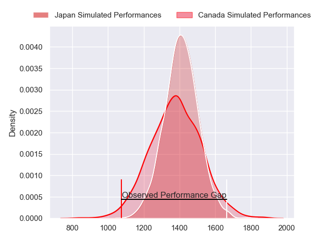
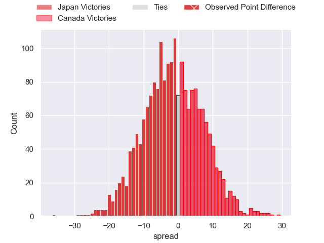
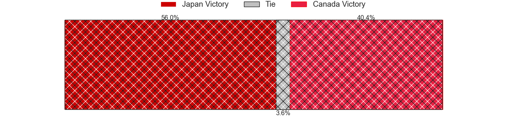
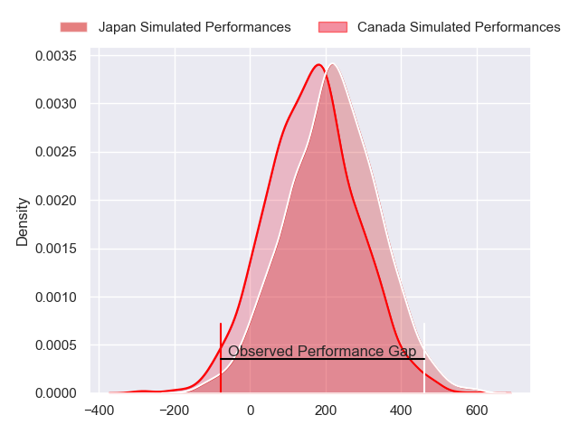
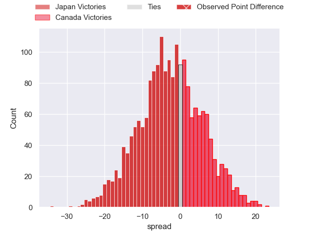
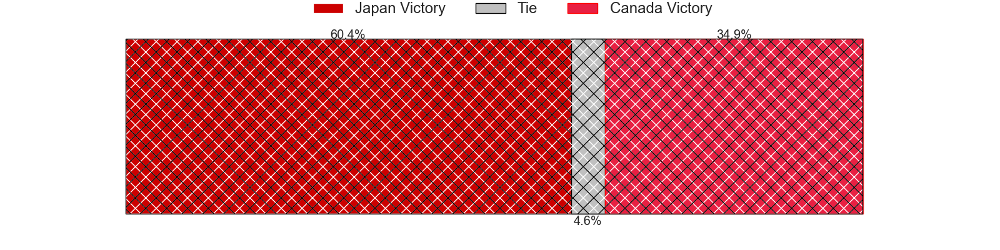

---  
layout: page  
title: Japan at Canada; 55-28  
date: 2024-08-25 18:00:00 -0500  
categories: "Pacific Nations Cup 2024" match review  
---
# Japan at Canada; 55-28

# Club Level Predictions

The first set of predictions treats a club as the smallest object, as the club develops its members, organizes a gameplan, and deploys its players as needed for each match. This club model has a prediction of 0.46, which translates to predicting Japan to win by 1.4.

Our Over/Under is 67.5 - and combined with the spread above, we have a predicted scoreline of 35 to 33

Each club has a rating and a rating deviation (similar to a Glicko rating), and expected performances can be generated. This allows for simulated matches and spreads like the ones below.
## Projected Performances - Club Model

## Projected Spreads - Club Model

## Projected Results - Club Model

# Player Level Predictions

Treating teams instead as an entity made up of the currently active players, I have ratings for each player in an altogether different system. These can be combined to form team ratings once teamsheets are announced, weighting starters a bit higher than the reserves. After the match is played, players can be weighted by their minutes on the field, allowing for an accurate measure of the team's composition. With these compiled team ratings, we can make predictions, measure inaccuracy, and update the individual player ratings.
## Prediction without Player Minutes: Japan by 4.7

Japan by 7.5 on a neutral pitch

## Projected Performances - Player Model

## Projected Spreads - Player Model

## Projected Results - Player Model

|   Away Minutes | Away Player        |   Away Percentile |   Number |   Home Percentile | Home Player         |   Home Minutes |
|---------------:|:-------------------|------------------:|---------:|------------------:|:--------------------|---------------:|
|             68 | Shogo Miura        |             95.88 |        1 |             10.43 | Cali Martinez       |             80 |
|             18 | Atsushi Sakate     |             84.45 |        2 |             25.53 | AJ Quattrin         |             56 |
|             16 | Keijiro Tamefusa   |             63.22 |        3 |             30.64 | Conor Young         |             13 |
|             53 | Sanaila Waqa       |             73.93 |        4 |             24.08 | Izzak Kelly         |             56 |
|             80 | Warner Dearns      |             92.54 |        5 |             28.16 | Kaden Duguid        |             80 |
|             64 | Tiennan Costley    |             63.79 |        6 |              9.32 | Mason Flesch        |             10 |
|             80 | Kanji Shimokawa    |             87.54 |        7 |            nan    | Ethan Fryer         |             80 |
|             80 | Faulua Makisi      |             85.35 |        8 |              1.27 | Lucas Rumball       |             65 |
|             80 | Shinobu Fujiwara   |             70.88 |        9 |             32.41 | Jason Higgins       |             80 |
|             62 | Seungsin Lee       |              2.51 |       10 |              4.8  | Peter Nelson        |             24 |
|             62 | Malo Tuitama       |             83.81 |       11 |             80.78 | Nic Benn            |             80 |
|             46 | Nicholas McCurran  |             87.55 |       12 |             26.93 | Talon McMullin      |             80 |
|             62 | Dylan Riley        |             97.42 |       13 |            nan    | Ben LeSage          |             60 |
|             56 | Jone Naikabula     |             54.36 |       14 |             88.35 | Andrew Coe          |             70 |
|             34 | Yoshitaka Yazaki   |             22.43 |       15 |             34.17 | Cooper Coats        |             24 |
|             34 | Shuhei Takeuchi    |             37.91 |       16 |             88.68 | Cole Keith          |             24 |
|             34 | Takayoshi Mohara   |             25.46 |       17 |             70.05 | Dewald Kotze        |             80 |
|             27 | Mamoru Harada      |             45.83 |       18 |              1.46 | Djustice Sears-Duru |             20 |
|             18 | Isaiah Mapusua     |             91.94 |       19 |             46.14 | Talon McMullin      |             18 |
|             18 | Taiki Koyama       |             32.93 |       20 |            nan    | James Stockwood     |             15 |
|             46 | Tomoki Osada       |             47.35 |       21 |            nan    | Matthew Oworu       |             12 |
|             80 | Harumichi Tatekawa |             82.94 |       22 |            nan    | Mark Balaski        |             46 |
|             80 | Eishin Kuwano      |             35.72 |       23 |            nan    | Brock Gallagher     |             62 |

