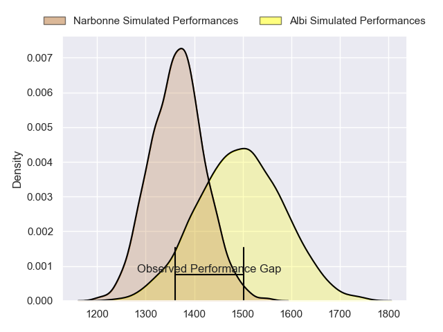
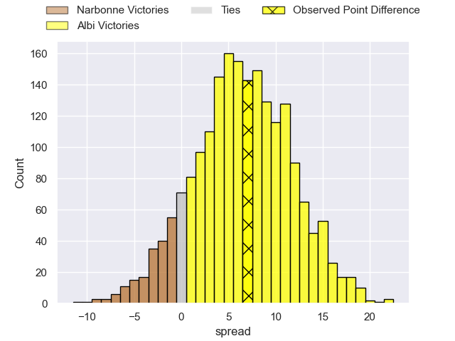
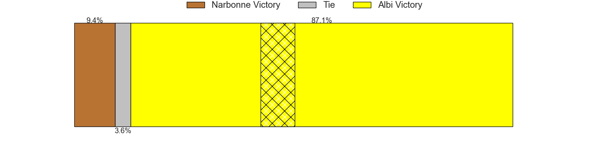
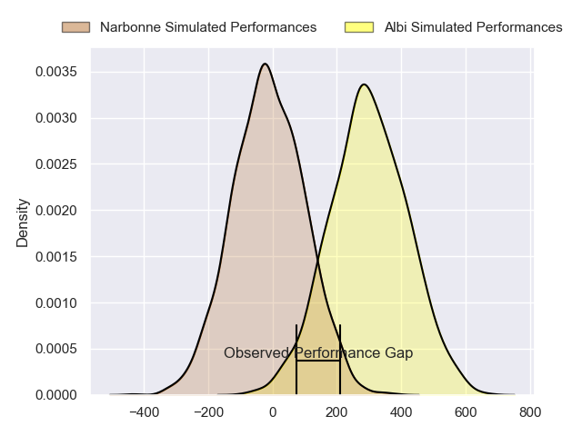
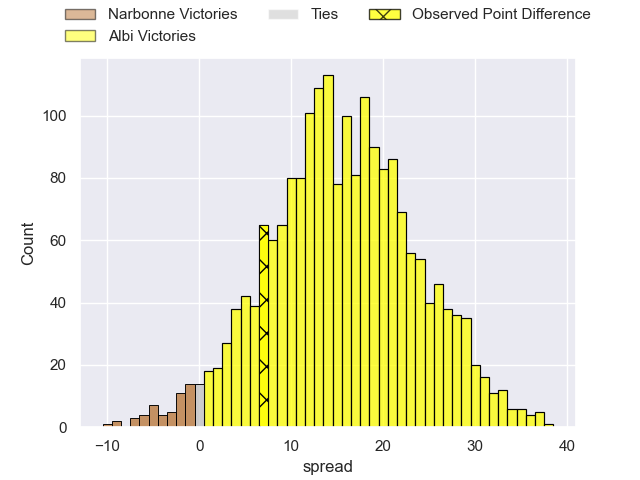
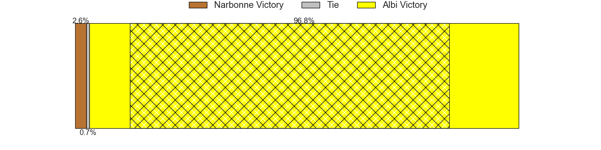

---  
layout: page  
title: Narbonne at Albi; 16-23  
date: 2024-08-30 18:00:00 -0500  
categories: "Nationale 2024" match review  
---
# Narbonne at Albi; 16-23

# Club Level Predictions

The first set of predictions treats a club as the smallest object, as the club develops its members, organizes a gameplan, and deploys its players as needed for each match. This club model has a prediction of 0.677, which translates to predicting Albi to win by 6.5.

Our Over/Under is 39.5 - and combined with the spread above, we have a predicted scoreline of 17 to 23

Each club has a rating and a rating deviation (similar to a Glicko rating), and expected performances can be generated. This allows for simulated matches and spreads like the ones below.
## Projected Performances - Club Model

## Projected Spreads - Club Model

## Projected Results - Club Model

# Player Level Predictions

Treating teams instead as an entity made up of the currently active players, I have ratings for each player in an altogether different system. These can be combined to form team ratings once teamsheets are announced, weighting starters a bit higher than the reserves. After the match is played, players can be weighted by their minutes on the field, allowing for an accurate measure of the team's composition. With these compiled team ratings, we can make predictions, measure inaccuracy, and update the individual player ratings.
## Prediction without Player Minutes: Albi by 13.7

Albi by 6.7 on a neutral pitch

## Projected Performances - Player Model

## Projected Spreads - Player Model

## Projected Results - Player Model

|   Away Minutes | Away Player        |   Away Percentile |   Number |   Home Percentile | Home Player             |   Home Minutes |
|---------------:|:-------------------|------------------:|---------:|------------------:|:------------------------|---------------:|
|              1 | Geoffrey Moise     |             49.96 |        1 |             69.07 | Antoine Soave           |             80 |
|             56 | Clément Esteriola  |             15.08 |        2 |             54.1  | Arthur Castant          |             49 |
|             68 | Jérémy Boyadjis    |             68.66 |        3 |             29.96 | Jean Baptiste De Clercq |             40 |
|             29 | Marius Antonescu   |             74.8  |        4 |             52.09 | Yanis Horvat            |             58 |
|             30 | Leva Fifita        |             11.45 |        5 |             76.29 | Jonathan Kpoku          |             80 |
|             12 | Arthur Christienne |             64.95 |        6 |             12.57 | Mattéo Coustalat        |             80 |
|             50 | Paul Belzons       |              5.15 |        7 |             60.4  | Simon Meka              |             79 |
|             50 | Charles Malet      |             26    |        8 |             57.02 | Camille Jarreau         |             80 |
|             17 | Pablo Barbaste     |             73.54 |        9 |             68.21 | Gilen Queheille         |             80 |
|             80 | Gilles Bosch       |              4.02 |       10 |             69.34 | Thibault Olender        |             80 |
|             51 | Étienne Ducom      |             28.37 |       11 |             46.28 | Antoine Bouzerand       |             58 |
|             25 | Peter Betham       |             99.47 |       12 |             18.36 | Leo Treilles            |             80 |
|             80 | Pierre Nueno       |             53.79 |       13 |             81.32 | Baptiste Couchinave     |             33 |
|             80 | Pierre-Hugo Ducom  |             13.48 |       14 |             73.89 | Simon Hartmann          |             31 |
|             54 | Boris Goutard      |              0.42 |       15 |             43.16 | Téo Dospital            |             80 |
|             80 | Gregory Fichten    |              9.55 |       16 |             44.05 | Lucas Pindor            |             20 |
|             24 | Mehdi Boundjema    |             91.15 |       17 |             22.95 | Reinach Venter          |             51 |
|             30 | Mohammed Loukia    |             21.46 |       18 |             31.26 | Thomas Cretu            |             40 |
|             30 | Darrell Dyer       |             87.05 |       19 |             23.21 | Dion Evrard Oulai       |             22 |
|             24 | Thibault Clauzade  |             56.44 |       20 |             21.65 | Ruben Courties          |             31 |
|             56 | James Hart         |            nan    |       21 |             91.89 | Nasoni Naqiri Kunavore  |             22 |
|             80 | Tom Chauvet        |             53.28 |       22 |             40.17 | Victor Pisano           |              1 |
|             24 | Clément Clavières  |             82.09 |       23 |             52.5  | Kamilieni Raivono       |             34 |

