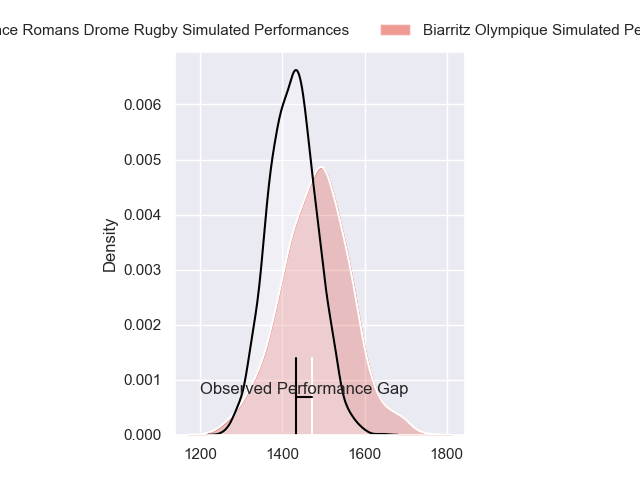
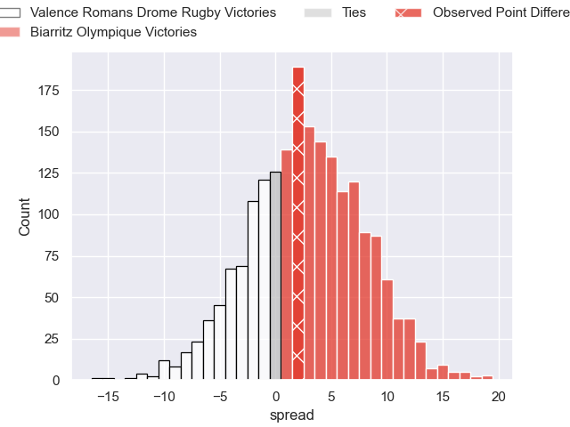
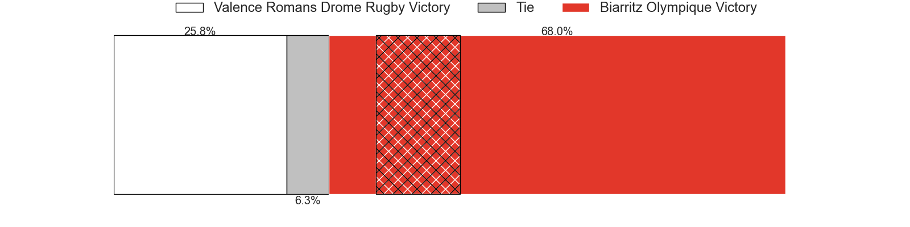
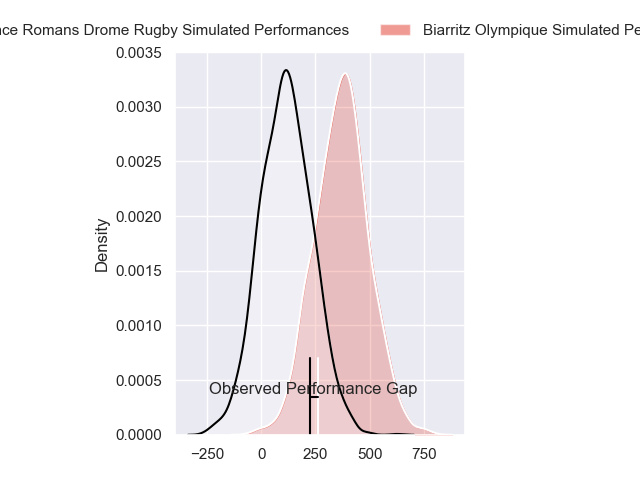
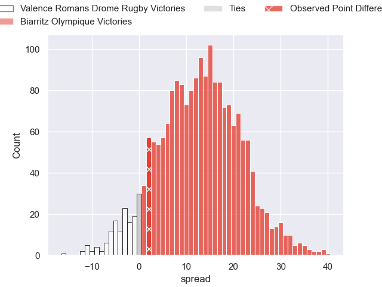
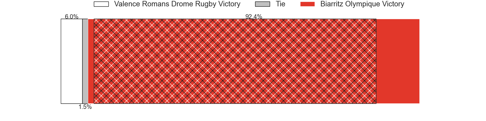

---  
layout: page  
title: Valence Romans Drome Rugby at Biarritz Olympique; 21-23  
date: 2024-08-30 18:00:00 -0500  
categories: "Pro D2 2024" match review  
---
# Valence Romans Drome Rugby at Biarritz Olympique; 21-23

# Club Level Predictions

The first set of predictions treats a club as the smallest object, as the club develops its members, organizes a gameplan, and deploys its players as needed for each match. This club model has a prediction of 0.579, which translates to predicting Biarritz Olympique to win by 2.8.

Our Over/Under is 47.5 - and combined with the spread above, we have a predicted scoreline of 23 to 25

Each club has a rating and a rating deviation (similar to a Glicko rating), and expected performances can be generated. This allows for simulated matches and spreads like the ones below.
## Projected Performances - Club Model

## Projected Spreads - Club Model

## Projected Results - Club Model

# Player Level Predictions

Treating teams instead as an entity made up of the currently active players, I have ratings for each player in an altogether different system. These can be combined to form team ratings once teamsheets are announced, weighting starters a bit higher than the reserves. After the match is played, players can be weighted by their minutes on the field, allowing for an accurate measure of the team's composition. With these compiled team ratings, we can make predictions, measure inaccuracy, and update the individual player ratings.
## Prediction without Player Minutes: Biarritz Olympique by 14.5

Biarritz Olympique by 5.5 on a neutral pitch

## Projected Performances - Player Model

## Projected Spreads - Player Model

## Projected Results - Player Model

|   Away Minutes | Away Player         |   Away Percentile |   Number |   Home Percentile | Home Player         |   Home Minutes |
|---------------:|:--------------------|------------------:|---------:|------------------:|:--------------------|---------------:|
|             80 | Anthony Aléo        |             51.26 |        1 |             48.5  | Alexandre Plantier  |             80 |
|             33 | Cyril Deligny       |              2.46 |        2 |             18.36 | Clement Martinez    |             47 |
|             31 | Gareth Milasinovich |             27.45 |        3 |             63.64 | Nikoloz Narmania    |             57 |
|             28 | Ryan McCauley       |             42.63 |        4 |             44.42 | Charlie Matthews    |             45 |
|             80 | Yassine Maamry      |             50.3  |        5 |             67.53 | Piula Faasalele     |             80 |
|             80 | Axel Bruchet        |             24.16 |        6 |             23.66 | Simon Augry         |             20 |
|             39 | Mathieu Vachon      |             73.96 |        7 |             19.6  | Thomas Hebert       |             80 |
|             21 | Ilia Spanderashvili |             18.45 |        8 |             64.57 | Masivesi Dakuwaqa   |             45 |
|             80 | Thomas Lhusero      |             82.13 |        9 |             39.86 | Kerman Aurrekoetxea |             65 |
|             80 | Lucas Meret         |             29.81 |       10 |             33.62 | Thomas Dolhagaray   |             80 |
|             53 | Thomas Roziere      |             17.44 |       11 |             20.26 | Gervais Cordin      |             45 |
|             80 | Anatole Pauvert     |             82.28 |       12 |             32.12 | Nathan Van de Ven   |             80 |
|             80 | Louis Marrou        |             87.83 |       13 |             93.28 | Mathieu Acebes      |             80 |
|             15 | Owen Lane           |              2.07 |       14 |             82.85 | Arthur Bonneval     |             80 |
|             52 | Joris De Moura      |             44.42 |       15 |             78.74 | Kylian Jaminet      |             55 |
|             31 | Éloi Massot         |              5.18 |       16 |             90.99 | Cornell du Preez    |             80 |
|             31 | Dorian Marco Pena   |             71.8  |       17 |              3.24 | Giorgi Nutsubidze   |             63 |
|             30 | Adam Vargas         |             97.27 |       18 |             58.52 | Yohan Beheregaray   |             15 |
|             30 | Kevin Goze          |             90.53 |       19 |             18.04 | Pierre Pages        |             49 |
|             27 | Thembelani Bholi    |             84.85 |       20 |             73.75 | Tyler Morgan        |             23 |
|             19 | Ben Neiceru         |             89.22 |       21 |              2.19 | Adrian Motoc        |             27 |
|             80 | Julien Royer        |              2.19 |       22 |            nan    | François Mur        |             59 |
|             22 | Tim Menzel          |             84.54 |       23 |             51.16 | Edgar Retiere       |             35 |

