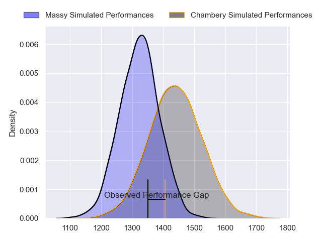
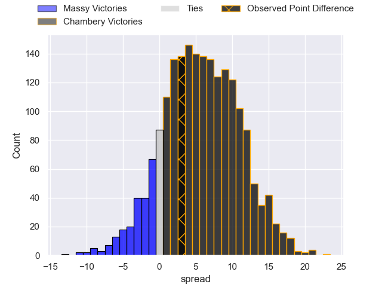
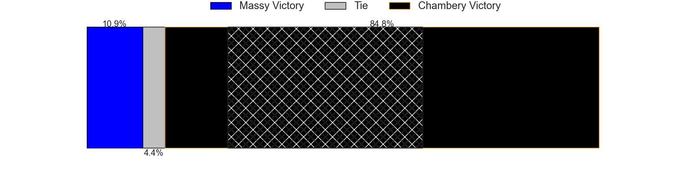
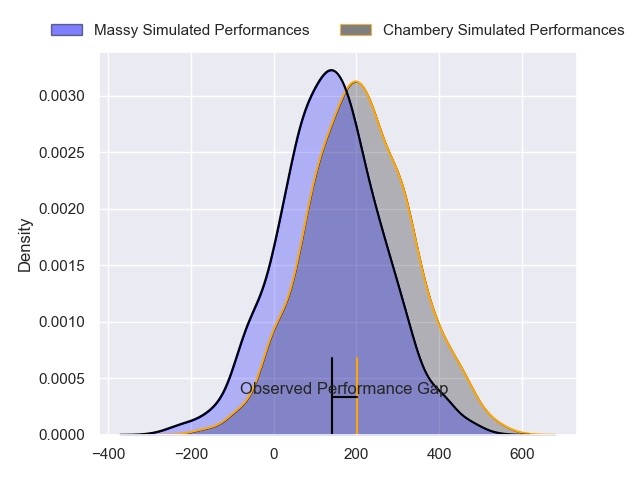
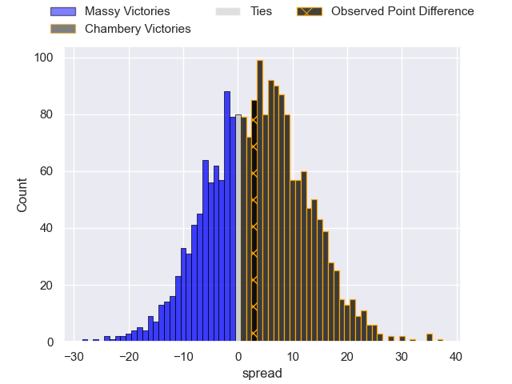
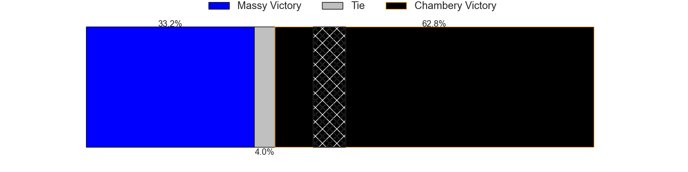

---  
layout: page  
title: Massy at Chambery; 26-29  
date: 2024-08-30 18:00:00 -0500  
categories: "Nationale 2024" match review  
---
# Massy at Chambery; 26-29

# Club Level Predictions

The first set of predictions treats a club as the smallest object, as the club develops its members, organizes a gameplan, and deploys its players as needed for each match. This club model has a prediction of 0.658, which translates to predicting Chambery to win by 5.8.

Our Over/Under is 52.5 - and combined with the spread above, we have a predicted scoreline of 23 to 29

Each club has a rating and a rating deviation (similar to a Glicko rating), and expected performances can be generated. This allows for simulated matches and spreads like the ones below.
## Projected Performances - Club Model

## Projected Spreads - Club Model

## Projected Results - Club Model

# Player Level Predictions

Treating teams instead as an entity made up of the currently active players, I have ratings for each player in an altogether different system. These can be combined to form team ratings once teamsheets are announced, weighting starters a bit higher than the reserves. After the match is played, players can be weighted by their minutes on the field, allowing for an accurate measure of the team's composition. With these compiled team ratings, we can make predictions, measure inaccuracy, and update the individual player ratings.
## Prediction without Player Minutes: Chambery by 3.1

Chambery by 0.3 on a neutral pitch

## Projected Performances - Player Model

## Projected Spreads - Player Model

## Projected Results - Player Model

|   Away Minutes | Away Player         |   Away Percentile |   Number |   Home Percentile | Home Player                  |   Home Minutes |
|---------------:|:--------------------|------------------:|---------:|------------------:|:-----------------------------|---------------:|
|             56 | Robin Poipy         |             56.52 |        1 |             80.08 | Nugzar Somkhishvili          |             26 |
|             46 | Pierre Trassoudaine |             92.13 |        2 |              1.97 | Yan Tabarot                  |             54 |
|             80 | Tijde Visser        |             69.55 |        3 |             64.53 | Lasha Tabidze                |             51 |
|             54 | Saba Pesvianidze    |             43.92 |        4 |             52.79 | Fabien Witz                  |             67 |
|             55 | Andrei Mahu         |             25.7  |        5 |             37.95 | Taniela Matakaiongo          |             67 |
|             19 | Tony Tissot         |             29.7  |        6 |             87.92 | Matheo Triki                 |             55 |
|             80 | Clément Vidoni      |             74.85 |        7 |             53.96 | Colin Lebian                 |             68 |
|             80 | Simon Cowley        |             45.91 |        8 |             83.86 | Tui Uru                      |             80 |
|             48 | Julien Blanc        |             57.39 |        9 |             38.66 | Mateo Guerret                |             80 |
|             47 | Christian Lacombe   |             18.39 |       10 |             44.61 | Thibault Moreno              |             60 |
|             80 | Martin Carre        |             79.55 |       11 |             81.34 | Arthur Nennig                |             60 |
|             48 | Luca Mignot         |             61.9  |       12 |             66.92 | Bastien Reymond              |             80 |
|             80 | Anthony Favier      |             43.76 |       13 |             41.73 | Joseph Exshaw                |             50 |
|             41 | Giorgi Gogoladze    |             34.87 |       14 |             67.3  | Paul Baptiste Florent Altier |             80 |
|             14 | Alexandre Borie     |             18.53 |       15 |             47.79 | Enzo Marzocca                |             80 |
|             80 | Fernandez Correa    |              0.97 |       16 |            nan    | Gela Murusidze               |             80 |
|             26 | Adrien Sonzogni     |            nan    |       17 |             42.13 | Quentin Beaudaux             |             24 |
|             29 | Nicolas Ferrer      |             78.7  |       18 |             32.15 | Osman Dimen                  |             24 |
|             26 | Lilian Rousset      |             52.69 |       19 |            nan    | Antoine Ferreira             |             74 |
|              6 | Diego Pinheiro Ruiz |             39.6  |       20 |             76.2  | Ahmed Tidiane Kane           |             54 |
|             78 | Lucas Rubio         |             40.55 |       21 |              9.62 | Sonatane Takulua             |             23 |
|             80 | Arthur Seigneuret   |             83.35 |       22 |            nan    | Arwel Robson                 |             60 |
|             51 | Alfred Mouandjo     |            nan    |       23 |             39.59 | Youenn Floch                 |             80 |

