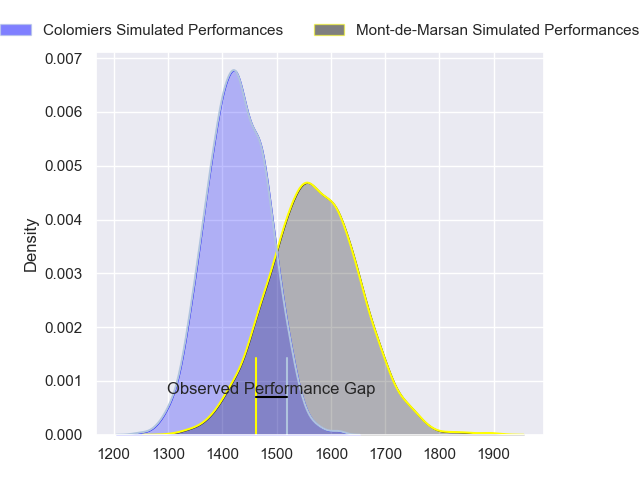
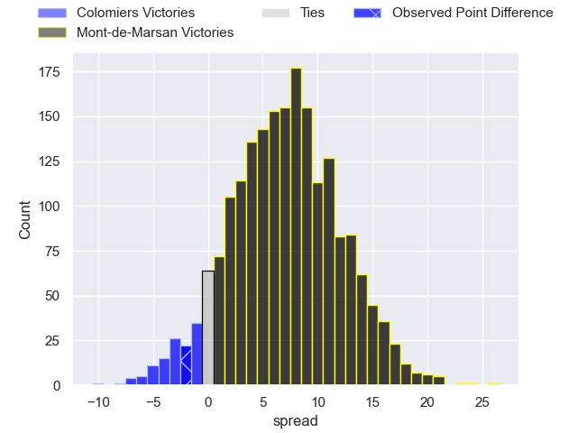
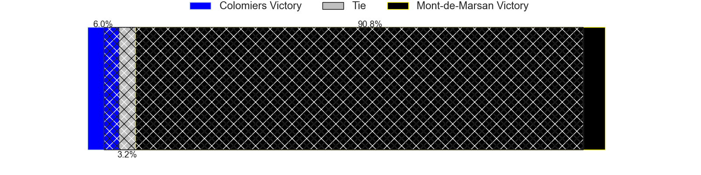
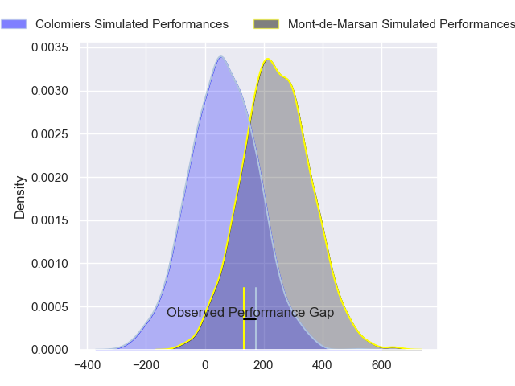
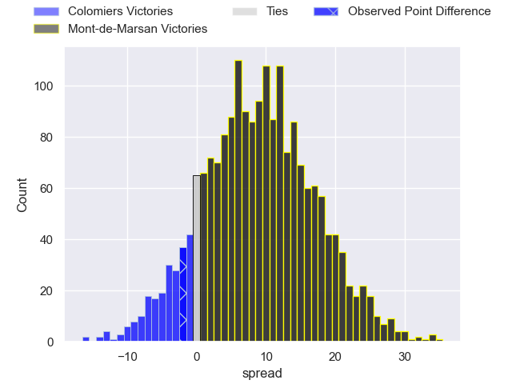
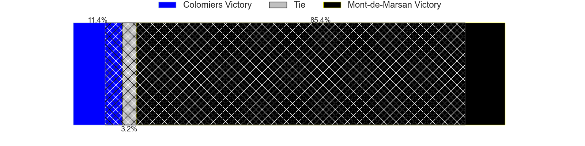

---  
layout: page  
title: Colomiers at Mont-de-Marsan; 18-16  
date: 2024-08-30 18:00:00 -0500  
categories: "Pro D2 2024" match review  
---
# Colomiers at Mont-de-Marsan; 18-16

# Club Level Predictions

The first set of predictions treats a club as the smallest object, as the club develops its members, organizes a gameplan, and deploys its players as needed for each match. This club model has a prediction of 0.692, which translates to predicting Mont-de-Marsan to win by 7.1.

Our Over/Under is 40.5 - and combined with the spread above, we have a predicted scoreline of 17 to 24

Each club has a rating and a rating deviation (similar to a Glicko rating), and expected performances can be generated. This allows for simulated matches and spreads like the ones below.
## Projected Performances - Club Model

## Projected Spreads - Club Model

## Projected Results - Club Model

# Player Level Predictions

Treating teams instead as an entity made up of the currently active players, I have ratings for each player in an altogether different system. These can be combined to form team ratings once teamsheets are announced, weighting starters a bit higher than the reserves. After the match is played, players can be weighted by their minutes on the field, allowing for an accurate measure of the team's composition. With these compiled team ratings, we can make predictions, measure inaccuracy, and update the individual player ratings.
## Prediction without Player Minutes: Mont-de-Marsan by 7.8

Colomiers by 0.1 on a neutral pitch

## Projected Performances - Player Model

## Projected Spreads - Player Model

## Projected Results - Player Model

|   Away Minutes | Away Player               |   Away Percentile |   Number |   Home Percentile | Home Player          |   Home Minutes |
|---------------:|:--------------------------|------------------:|---------:|------------------:|:---------------------|---------------:|
|             56 | Guillaume Tartas          |             75.61 |        1 |             22.22 | Thomas Bultel        |             52 |
|             39 | Thomas Larrieu            |             23.22 |        2 |             18.47 | Florian Dufour       |             41 |
|             51 | Michael Simutoga          |             83.71 |        3 |              1.59 | Anthony Alves        |             80 |
|             58 | Jean Thomas               |             41.68 |        4 |             47.98 | Nicolas Garrault     |             41 |
|             80 | Janse Roux                |             51.81 |        5 |              7.96 | Myles Edwards        |             30 |
|             56 | Anthony Coletta           |             26.23 |        6 |             24.18 | Aurélien Laforgue    |             46 |
|             30 | Aldric Lescure            |             86.21 |        7 |             20.58 | Waël Ponpon          |             49 |
|             80 | Caleb Timu                |             53.49 |        8 |              9.39 | Mike Faleafa         |             80 |
|             25 | Ugo Seguela               |             30.67 |        9 |             16.49 | Nicolas Darquier     |             52 |
|             80 | Joaquin de la Vega Mendia |             23.79 |       10 |             82.82 | Willie du Plessis    |             47 |
|             34 | Rodrigo Marta             |             90.83 |       11 |             28.59 | Semi Lagivala        |             80 |
|             80 | Baptiste Serrano          |             17.73 |       12 |             73.02 | Nacani Wakaya        |             80 |
|             52 | Enzo Salles               |             53.74 |       13 |             17.29 | Gatien Masse         |             80 |
|             60 | Valentin Saurs            |              3.71 |       14 |             23.61 | Alexandre de Nardi   |             80 |
|             31 | Ugo Pacome                |             39.35 |       15 |             48.26 | Simao Bento          |             80 |
|             28 | Pablo Dimcheff            |             25.25 |       16 |             73.77 | Luka Goginava        |             80 |
|             28 | Hugo Pirlet               |             53.72 |       17 |             59.23 | Mattéo Lalanne       |             39 |
|             28 | Robin Bellemand           |            nan    |       18 |             35.47 | Aston Fortuin        |             24 |
|             61 | Ray Nu'u                  |             66.63 |       19 |             63.32 | Raphaël Robic        |             39 |
|             19 | Gregoire Bazin            |             22.74 |       20 |             42.88 | Luka Begic           |             28 |
|             30 | Louis Descoux             |            nan    |       21 |             55.5  | Christophe Loustalot |             28 |
|             46 | Arthur Diaz               |             47.16 |       22 |             24.23 | Patricio Fernandez   |             24 |
|             65 | Max Auriac                |             19.35 |       23 |            nan    | nan                  |            nan |

