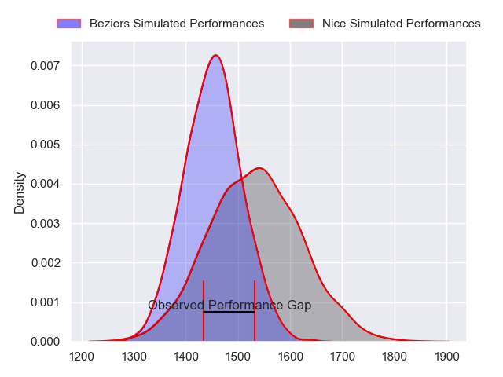
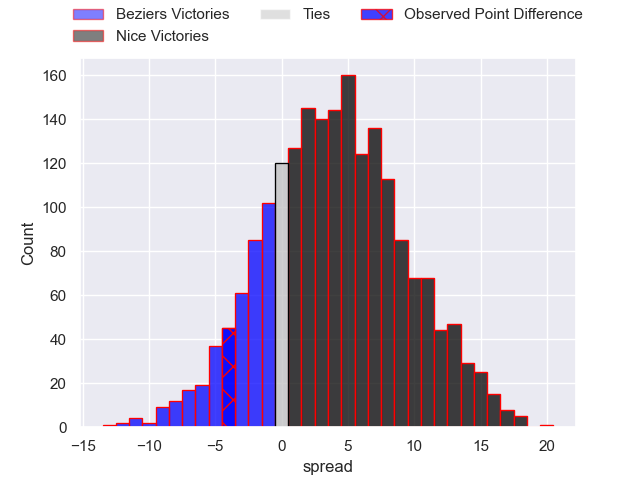
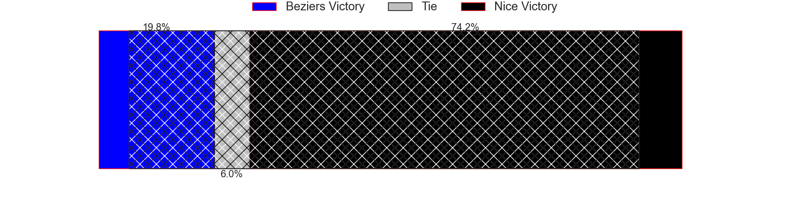
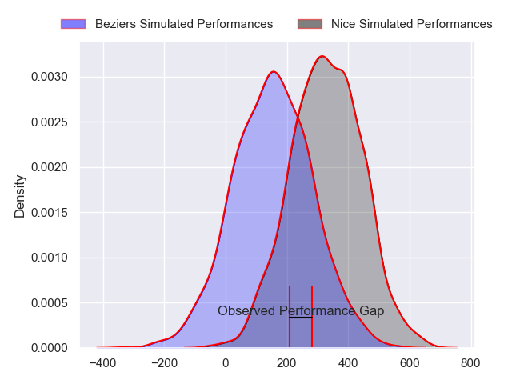
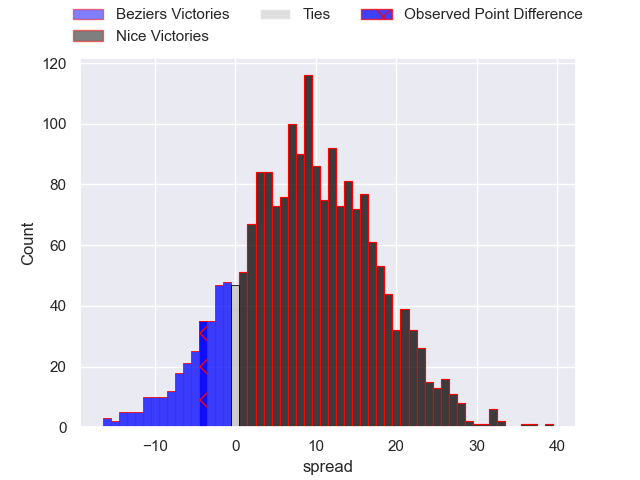
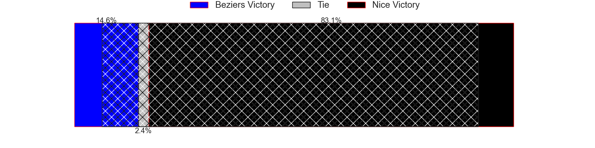

---  
layout: page  
title: Beziers at Nice; 13-9  
date: 2024-08-30 18:00:00 -0500  
categories: "Pro D2 2024" match review  
---
# Beziers at Nice; 13-9

# Club Level Predictions

The first set of predictions treats a club as the smallest object, as the club develops its members, organizes a gameplan, and deploys its players as needed for each match. This club model has a prediction of 0.612, which translates to predicting Nice to win by 4.0.

Our Over/Under is 54.5 - and combined with the spread above, we have a predicted scoreline of 25 to 29

Each club has a rating and a rating deviation (similar to a Glicko rating), and expected performances can be generated. This allows for simulated matches and spreads like the ones below.
## Projected Performances - Club Model

## Projected Spreads - Club Model

## Projected Results - Club Model

# Player Level Predictions

Treating teams instead as an entity made up of the currently active players, I have ratings for each player in an altogether different system. These can be combined to form team ratings once teamsheets are announced, weighting starters a bit higher than the reserves. After the match is played, players can be weighted by their minutes on the field, allowing for an accurate measure of the team's composition. With these compiled team ratings, we can make predictions, measure inaccuracy, and update the individual player ratings.
## Prediction without Player Minutes: Nice by 12.4

Nice by 9.6 on a neutral pitch

## Projected Performances - Player Model

## Projected Spreads - Player Model

## Projected Results - Player Model

|   Away Minutes | Away Player            |   Away Percentile |   Number |   Home Percentile | Home Player              |   Home Minutes |
|---------------:|:-----------------------|------------------:|---------:|------------------:|:-------------------------|---------------:|
|             53 | Francisco Fernandes    |             10.85 |        1 |             81.62 | Sunia Vola               |             27 |
|             60 | Jose Luis Gonzalez     |             86.07 |        2 |             23.77 | Pierre Strippoli         |             80 |
|             53 | Christian Judge        |             68.99 |        3 |             19.76 | Luvuyo Pupuma            |             27 |
|             80 | Cam Dodson             |             82.87 |        4 |             99.9  | Tom Murday               |             27 |
|             51 | Hans N'kinsi           |              4.18 |        5 |             39.54 | Clément Chartier         |             80 |
|             27 | William van Bost       |             17.62 |        6 |             83.17 | Arthur Vignolles         |             58 |
|             80 | Clement Ancely         |             82.18 |        7 |             96.14 | Louis Suaud              |             80 |
|             53 | Otonuku Jr Pauta       |             73.58 |        8 |             53.67 | Ramiha Tarrel Tia Smiler |             64 |
|             75 | Samuel Marques         |             90.55 |        9 |             71.82 | Jules Solinas            |             80 |
|             49 | Charly Malie           |             57.51 |       10 |             58.77 | Tanguy Ménoret           |             80 |
|             53 | Nicolas Plazy          |             79.26 |       11 |              6.13 | Baptiste Lafond          |             53 |
|             80 | Taylor Gontineac       |             82.82 |       12 |             42.58 | Luca Cutayar             |             53 |
|             27 | Paul Recor             |             53.9  |       13 |             59.55 | Romain Riguet            |             80 |
|             80 | Pierre Courtaud        |             20.64 |       14 |             89.82 | Andrzej Charlat          |             27 |
|             31 | Gabin Lorre            |             89.68 |       15 |             95.37 | David Odiete             |             58 |
|             53 | Damien Añon            |             25.05 |       16 |             34.01 | Facundo Gigena           |             16 |
|             80 | Yahnis El Maslouhi     |            nan    |       17 |             82.17 | Yann Tivoli              |             80 |
|             39 | Yanis Boulassel        |             18.52 |       18 |             83.27 | Martin Freytes           |             27 |
|             27 | Pierre Gayraud         |             12.35 |       19 |              4.65 | Bastien Berenguel        |             22 |
|             53 | Baptiste Abescat-Leroy |             61.09 |       20 |             62.13 | Santiago Ovejero Abdala  |             22 |
|             80 | Gillian Benoy          |             26    |       21 |             14.82 | Tom Ross                 |             21 |
|             20 | Taleta Tupuola         |             66.17 |       22 |             68    | Paul Auradou             |             41 |
|             80 | Yannick Arroyo         |             78.46 |       23 |             75.43 | Thibault Dufau           |             59 |

