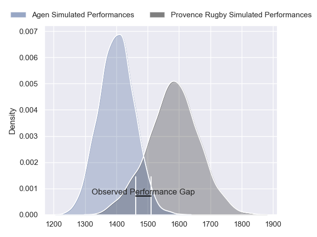
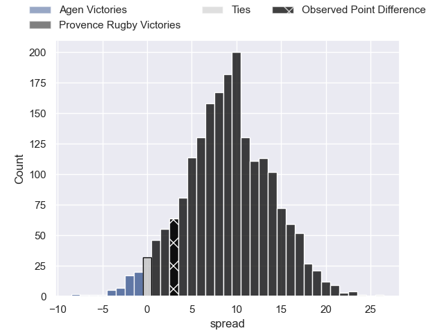
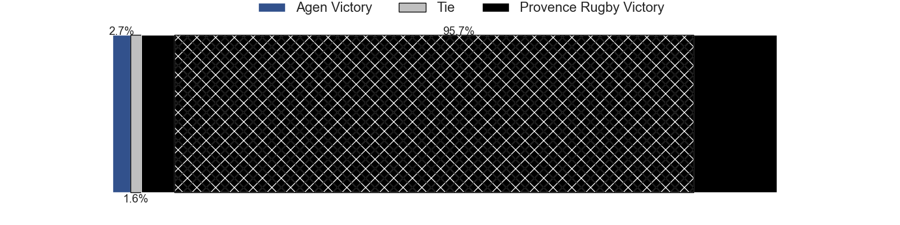
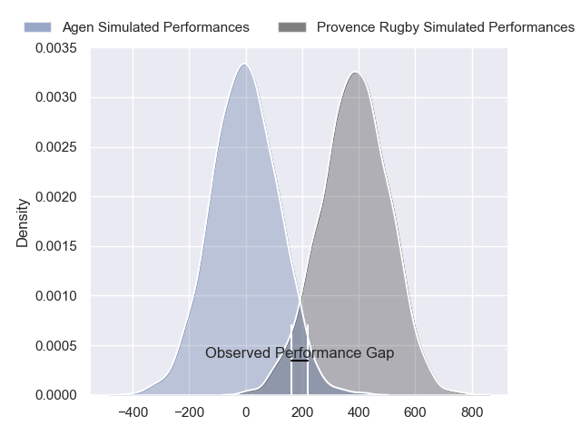
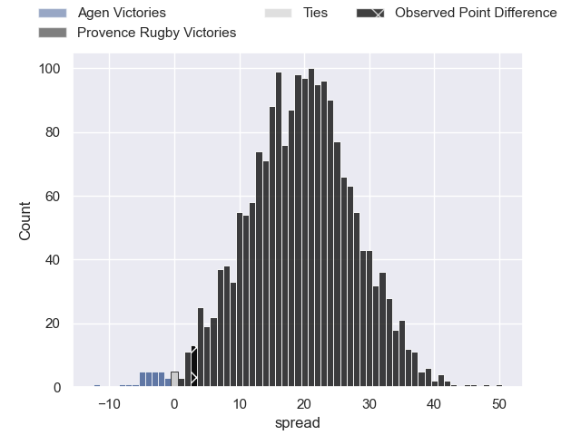
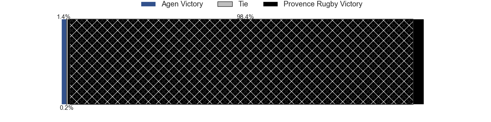

---  
layout: page  
title: Agen at Provence Rugby; 18-21  
date: 2024-08-30 18:00:00 -0500  
categories: "Pro D2 2024" match review  
---
# Agen at Provence Rugby; 18-21

# Club Level Predictions

The first set of predictions treats a club as the smallest object, as the club develops its members, organizes a gameplan, and deploys its players as needed for each match. This club model has a prediction of 0.74, which translates to predicting Provence Rugby to win by 9.2.

Our Over/Under is 50.5 - and combined with the spread above, we have a predicted scoreline of 20 to 30

Each club has a rating and a rating deviation (similar to a Glicko rating), and expected performances can be generated. This allows for simulated matches and spreads like the ones below.
## Projected Performances - Club Model

## Projected Spreads - Club Model

## Projected Results - Club Model

# Player Level Predictions

Treating teams instead as an entity made up of the currently active players, I have ratings for each player in an altogether different system. These can be combined to form team ratings once teamsheets are announced, weighting starters a bit higher than the reserves. After the match is played, players can be weighted by their minutes on the field, allowing for an accurate measure of the team's composition. With these compiled team ratings, we can make predictions, measure inaccuracy, and update the individual player ratings.
## Prediction without Player Minutes: Provence Rugby by 18.9

Provence Rugby by 13.1 on a neutral pitch

## Projected Performances - Player Model

## Projected Spreads - Player Model

## Projected Results - Player Model

|   Away Minutes | Away Player          |   Away Percentile |   Number |   Home Percentile | Home Player           |   Home Minutes |
|---------------:|:---------------------|------------------:|---------:|------------------:|:----------------------|---------------:|
|             47 | Hans Lombard-Buret   |             57.12 |        1 |             88.92 | Julius Nostadt        |             30 |
|             61 | Santiago Socino      |             77.5  |        2 |             65.02 | Thomas Sauveterre     |             50 |
|             22 | Alex Burin           |             35.36 |        3 |             99.43 | Tomas Francis         |             19 |
|             61 | Evan Olmstead        |              1.79 |        4 |             87.54 | Charly Gambini        |             57 |
|             58 | John Madigan         |             16.75 |        5 |             82.15 | Josh Tyrell           |             19 |
|             80 | Julien Lebian        |             12.8  |        6 |             83.23 | Guillaume Piazzoli    |             80 |
|             23 | Arnaud Duputs        |             79.66 |        7 |             24.8  | Ned Hanigan           |             80 |
|             22 | Matthieu Bonnet      |             24.48 |        8 |             80.54 | Teimana Harrison      |             30 |
|             80 | Jack Maunder         |             52.92 |        9 |             53.44 | Arthur Coville        |             80 |
|             22 | Franck Pourteau      |             90.06 |       10 |             70.19 | Jules Plisson         |             58 |
|             80 | Iban Etcheverry      |             39.34 |       11 |             68.53 | Léo Drouet            |             50 |
|             80 | Kolinio Ramoka       |             63.3  |       12 |             91.81 | Kaveinga Finau        |             80 |
|             30 | Peyo Muscarditz      |             73.51 |       13 |             32.34 | Eto Bainivalu         |             80 |
|             61 | Henry Purdy          |             91.18 |       14 |             17.82 | Adrien Lapegue-Lafaye |             58 |
|             33 | Jean-Marcelin Buttin |             36.84 |       15 |             65.05 | Mathias Colombet      |             22 |
|             30 | Pierre Jouvin        |             12.15 |       16 |             47.9  | Nicolas Toth          |             80 |
|             50 | Mamuka Mstoiani      |            nan    |       17 |             56.93 | Malohi Suta           |             30 |
|             30 | William Demotte      |             84.85 |       18 |             82.85 | Paul Mallez           |             58 |
|             80 | Loris Tolot          |              0.66 |       19 |             90.48 | Bilel Taieb           |             80 |
|             50 | Valentin Gayraud     |             32.14 |       20 |              3.78 | Loick Jammes          |             80 |
|             30 | Dorian Bellot        |             17.7  |       21 |             24.27 | Tornike Jalagonia     |             50 |
|             19 | Lasha Macharashvili  |             50.4  |       22 |             80.07 | Joris Cazenave        |             50 |
|             80 | Billy Searle         |              5.5  |       23 |             92.39 | Jimmy Gopperth        |             50 |

