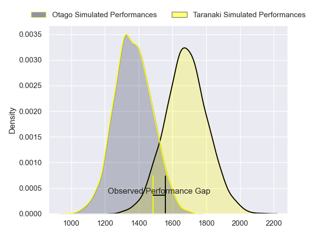
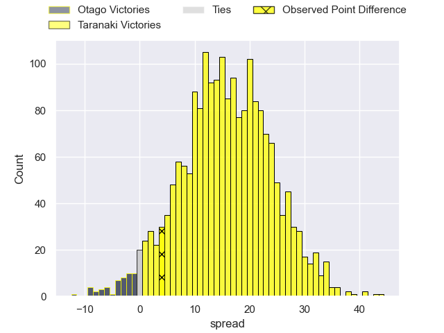
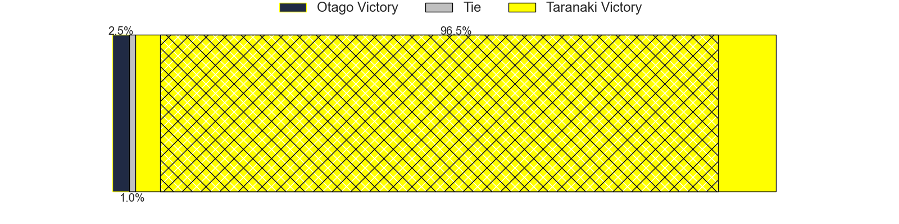
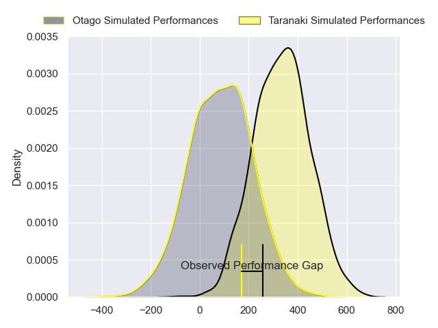
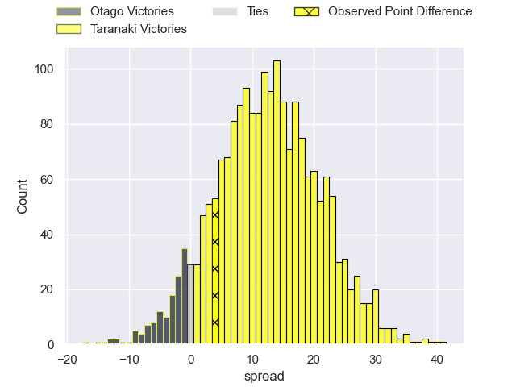
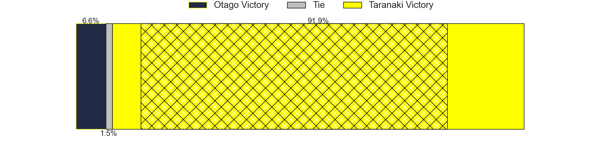

---  
layout: page  
title: Otago at Taranaki; 18-22  
date: 2024-08-30 18:00:00 -0500  
categories: "NPC 2024" match review  
---
# Otago at Taranaki; 18-22

# Club Level Predictions

The first set of predictions treats a club as the smallest object, as the club develops its members, organizes a gameplan, and deploys its players as needed for each match. This club model has a prediction of 0.85, which translates to predicting Taranaki to win by 15.9.

Our Over/Under is 53.5 - and combined with the spread above, we have a predicted scoreline of 19 to 35

Each club has a rating and a rating deviation (similar to a Glicko rating), and expected performances can be generated. This allows for simulated matches and spreads like the ones below.
## Projected Performances - Club Model

## Projected Spreads - Club Model

## Projected Results - Club Model

# Player Level Predictions

Treating teams instead as an entity made up of the currently active players, I have ratings for each player in an altogether different system. These can be combined to form team ratings once teamsheets are announced, weighting starters a bit higher than the reserves. After the match is played, players can be weighted by their minutes on the field, allowing for an accurate measure of the team's composition. With these compiled team ratings, we can make predictions, measure inaccuracy, and update the individual player ratings.
## Prediction without Player Minutes: Taranaki by 15.5

Taranaki by 12.3 on a neutral pitch

## Projected Performances - Player Model

## Projected Spreads - Player Model

## Projected Results - Player Model

|   Away Minutes | Away Player          |   Away Percentile |   Number |   Home Percentile | Home Player                   |   Home Minutes |
|---------------:|:---------------------|------------------:|---------:|------------------:|:------------------------------|---------------:|
|             47 | Rohan Wingham        |             36.08 |        1 |             39.48 | Mitch O'Neill                 |             68 |
|             80 | Henry Bell           |            nan    |        2 |            nan    | Bradley Slater                |             66 |
|             16 | Saula Ma'u           |            nan    |        3 |            nan    | Michael Bent                  |             59 |
|             60 | Sam Fischli          |            nan    |        4 |             38.29 | Jackson Morgan                |             68 |
|             51 | Fabian Holland       |            nan    |        5 |            nan    | Tom Franklin                  |             80 |
|             80 | Oliver Haig          |            nan    |        6 |             44.05 | Arese Poliko                  |             80 |
|             47 | Harry Taylor         |            nan    |        7 |            nan    | Michael Loft                  |             17 |
|             47 | Christian Lio-Willie |             46.86 |        8 |            nan    | Kaylum Boshier                |             16 |
|             80 | James Arscott        |            nan    |        9 |             38.32 | Leone Nawai                   |             68 |
|             80 | Cameron Millar       |            nan    |       10 |            nan    | Jayson Potroz                 |             23 |
|             80 | Jona Nareki          |            nan    |       11 |            nan    | Josh Setu                     |             80 |
|             80 | Thomas Umaga-Jensen  |            nan    |       12 |             83.62 | Daniel Rona                   |             80 |
|             80 | Josh Whaanga         |            nan    |       13 |            nan    | Meihana Grindlay              |             80 |
|             20 | Hudson Creighton     |            nan    |       14 |            nan    | Jacob Ratumaitavuki-Kneepkens |             80 |
|             33 | Finn Hurley          |            nan    |       15 |            nan    | Josh Jacomb                   |             29 |
|             33 | Liam Coltman         |            nan    |       16 |            nan    | Ricky Riccitelli              |             14 |
|             15 | Ben Lopas            |            nan    |       17 |            nan    | Perry Lawrence                |             14 |
|             33 | Moana Takataka       |            nan    |       18 |            nan    | Toby Burkett                  |             33 |
|             56 | Will Tucker          |             11.76 |       19 |            nan    | Jesse Parete                  |             46 |
|             33 | Will Stodart         |            nan    |       20 |            nan    | Scott Jury                    |             33 |
|             60 | Nathan Hastie        |            nan    |       21 |            nan    | Adam Lennox                   |             33 |
|             80 | Kyan Rangitutia      |            nan    |       22 |            nan    | Vereniki Tikoisolomone        |             12 |
|             80 | Lui Naeata           |            nan    |       23 |            nan    | Obey Samate                   |             47 |

