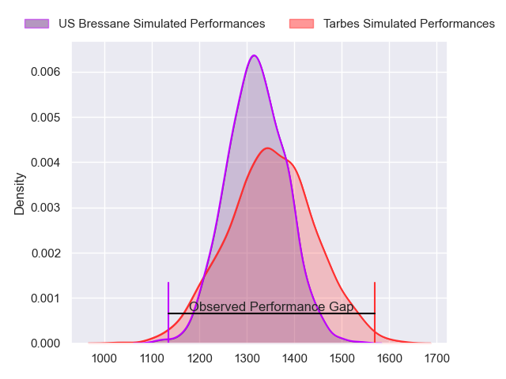
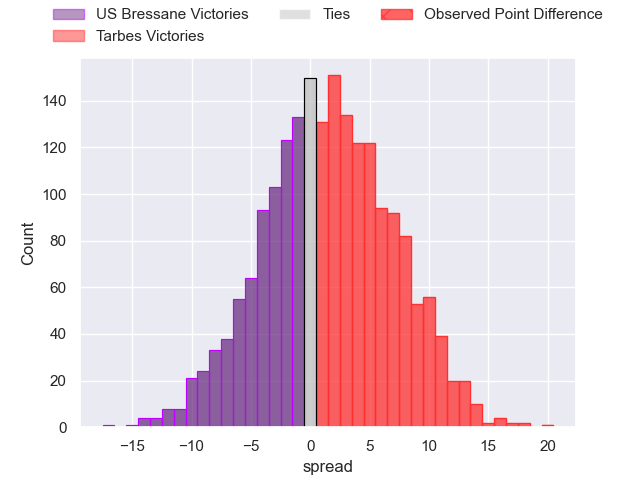
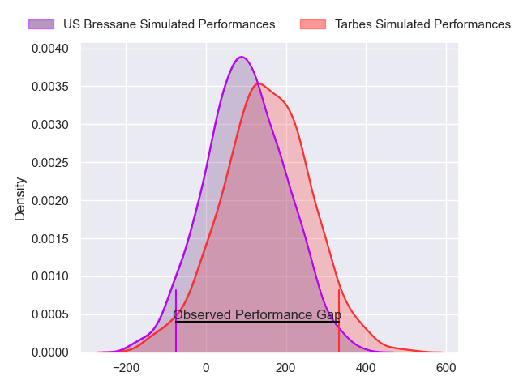
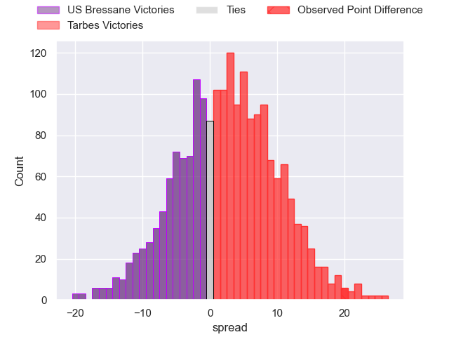
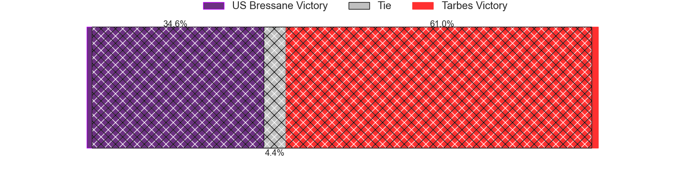

---  
layout: page  
title: US Bressane at Tarbes; 9-29  
date: 2024-08-30 18:00:00 -0500  
categories: "Nationale 2024" match review  
---
# US Bressane at Tarbes; 9-29

# Club Level Predictions

The first set of predictions treats a club as the smallest object, as the club develops its members, organizes a gameplan, and deploys its players as needed for each match. This club model has a prediction of 0.537, which translates to predicting Tarbes to win by 1.3.

Our Over/Under is 41.5 - and combined with the spread above, we have a predicted scoreline of 20 to 21

Each club has a rating and a rating deviation (similar to a Glicko rating), and expected performances can be generated. This allows for simulated matches and spreads like the ones below.
## Projected Performances - Club Model

## Projected Spreads - Club Model

## Projected Results - Club Model

# Player Level Predictions

Treating teams instead as an entity made up of the currently active players, I have ratings for each player in an altogether different system. These can be combined to form team ratings once teamsheets are announced, weighting starters a bit higher than the reserves. After the match is played, players can be weighted by their minutes on the field, allowing for an accurate measure of the team's composition. With these compiled team ratings, we can make predictions, measure inaccuracy, and update the individual player ratings.
## Prediction without Player Minutes: US Bressane by 1.6

US Bressane by 8.1 on a neutral pitch

## Projected Performances - Player Model

## Projected Spreads - Player Model

## Projected Results - Player Model

|   Away Minutes | Away Player          |   Away Percentile |   Number |   Home Percentile | Home Player         |   Home Minutes |
|---------------:|:---------------------|------------------:|---------:|------------------:|:--------------------|---------------:|
|             41 | Vazha Kapanadze      |             36.84 |        1 |             11.34 | Ximun Bessonart     |             46 |
|             60 | Arnaud Feltrin       |              8.52 |        2 |             42.62 | Florian Lamothe     |             51 |
|             51 | Atonio Ulutuipalelei |              6.96 |        3 |             89.47 | Irakli Mirtskhulava |             58 |
|             54 | Thomas Déliance      |             35.36 |        4 |             42.73 | Léo Estaque         |             32 |
|             56 | Josh Peters          |              9.66 |        5 |             19.82 | Baptiste Peytavi    |             80 |
|             13 | Florian Burlet       |             40.59 |        6 |             84.06 | Alexis Armary       |             80 |
|             60 | Pierre Reynaud       |             36.24 |        7 |             48.61 | Léo Saint-Guilhem   |             13 |
|             80 | Quentin Witt         |              5.87 |        8 |              1.05 | Filipe Manu         |              2 |
|             50 | Jeremie Martin       |             24.4  |        9 |             56.87 | Matias Brocal       |             51 |
|             61 | Nathan Azais         |             25.16 |       10 |             24.31 | Alexandre Perez     |             29 |
|             55 | Élie De Fleurian     |             54.29 |       11 |              1.51 | Jone Tuva           |             33 |
|             49 | Benjamin Doy         |             54.86 |       12 |             13.55 | Savenaca Rawaca     |             80 |
|             28 | Joe Margetts         |             48.24 |       13 |             20.17 | Johan Paulet        |             60 |
|             80 | Thibaut Perrette     |             36.85 |       14 |             35.44 | Jonathan Duffau     |             80 |
|             20 | Florent Massip       |             82.32 |       15 |              3.58 | Mathieu Berbizier   |             61 |
|             29 | Nicolas Lemaire      |             31.82 |       16 |             30.85 | Enzo Baggiani       |             34 |
|             26 | Clement Jullien      |             88.52 |       17 |             83.28 | Vincent Dolier      |             29 |
|             29 | Erich de Jager       |             77.49 |       18 |            nan    | Luka Vea            |             20 |
|             26 | Grégoire Demangel    |             67.03 |       19 |            nan    | Mathieu Soufflet    |             25 |
|             29 | Louis Dasalmartini   |             56.39 |       20 |              9.82 | Maile Mamao         |             80 |
|             19 | Aaron Stafford       |            nan    |       21 |             39.16 | Tiaan Swanepoel     |             46 |
|             29 | Jeremy Valencot      |             60.14 |       22 |             38.14 | Mickael Thébault    |             80 |
|             51 | Jules Margarit       |             14.95 |       23 |             90.1  | Spike Salman        |             32 |

