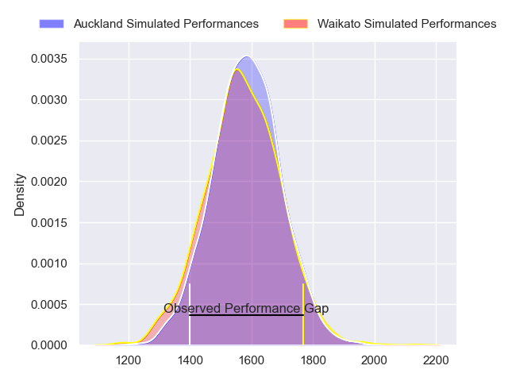
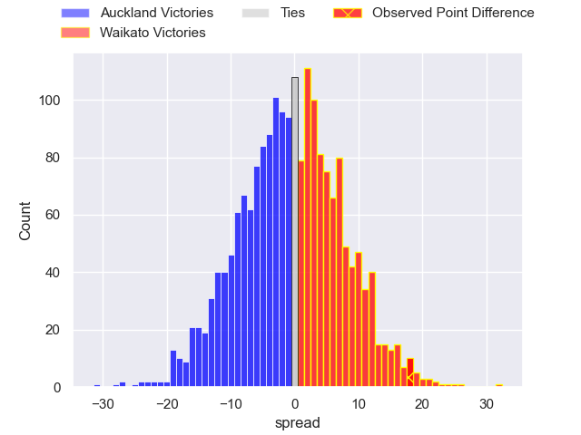
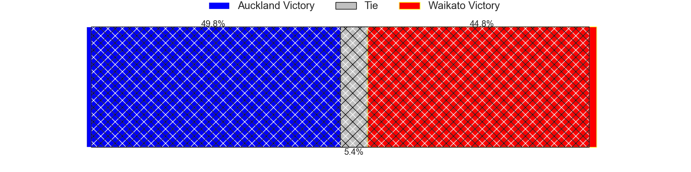
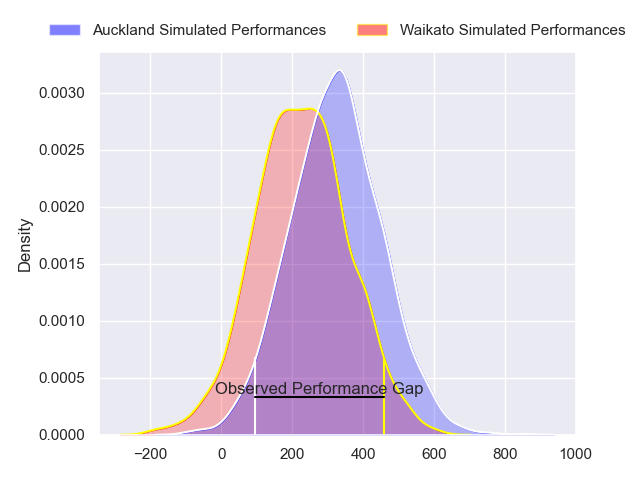
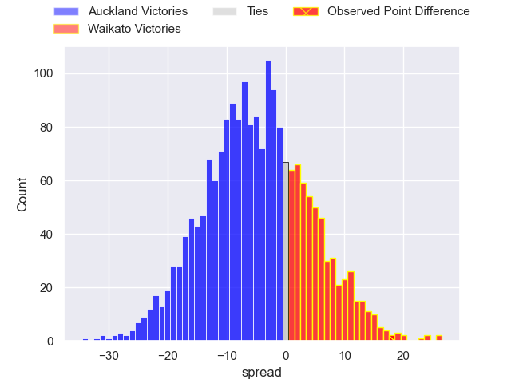
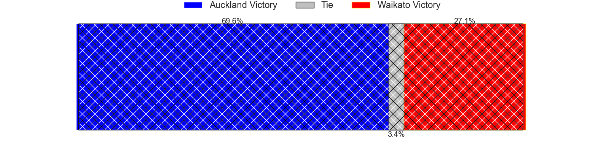

---  
layout: page  
title: Auckland at Waikato; 21-39  
date: 2024-08-30 18:00:00 -0500  
categories: "NPC 2024" match review  
---
# Auckland at Waikato; 21-39

# Club Level Predictions

The first set of predictions treats a club as the smallest object, as the club develops its members, organizes a gameplan, and deploys its players as needed for each match. This club model has a prediction of 0.489, which translates to predicting Auckland to win by 0.4.

Our Over/Under is 52.5 - and combined with the spread above, we have a predicted scoreline of 26 to 26

Each club has a rating and a rating deviation (similar to a Glicko rating), and expected performances can be generated. This allows for simulated matches and spreads like the ones below.
## Projected Performances - Club Model

## Projected Spreads - Club Model

## Projected Results - Club Model

# Player Level Predictions

Treating teams instead as an entity made up of the currently active players, I have ratings for each player in an altogether different system. These can be combined to form team ratings once teamsheets are announced, weighting starters a bit higher than the reserves. After the match is played, players can be weighted by their minutes on the field, allowing for an accurate measure of the team's composition. With these compiled team ratings, we can make predictions, measure inaccuracy, and update the individual player ratings.
## Prediction without Player Minutes: Auckland by 6.7

Auckland by 9.9 on a neutral pitch

## Projected Performances - Player Model

## Projected Spreads - Player Model

## Projected Results - Player Model

|   Away Minutes | Away Player            |   Away Percentile |   Number |   Home Percentile | Home Player            |   Home Minutes |
|---------------:|:-----------------------|------------------:|---------:|------------------:|:-----------------------|---------------:|
|             64 | Josh Fusitu'a          |            nan    |        1 |             85.52 | Ollie Norris           |             33 |
|             80 | Mills Sanerivi         |             23.97 |        2 |             56.81 | Manaaki Boyle-Tiatia   |             60 |
|             60 | Angus Ta'avao          |            nan    |        3 |             86.17 | George Dyer            |             51 |
|             80 | Josh Beehre            |            nan    |        4 |             75.87 | Tai Cribb              |             64 |
|             70 | Tuaina Taii Tualima    |            nan    |        5 |            nan    | Laghlan McWhannell     |             80 |
|             80 | Adrian Choat           |            nan    |        6 |             57.94 | Malachi Wrampling-Alec |             80 |
|             80 | Anton Segner           |            nan    |        7 |            nan    | Senita Lauaki          |             75 |
|             20 | Akira Ioane            |            nan    |        8 |             38.08 | Patrick McCurran       |             59 |
|             80 | Kemara Hauiti-Parapara |            nan    |        9 |             69.24 | Xavier Roe             |             80 |
|             29 | Rico Simpson           |             24.95 |       10 |             58.77 | Aaron Cruden           |             75 |
|             80 | Tanielu Tele'a         |            nan    |       11 |            nan    | Aki Tuivailala         |             55 |
|             80 | Bryce Heem             |             99.04 |       12 |            nan    | Austin Anderson        |             80 |
|             80 | Xavi Taele             |            nan    |       13 |             33.19 | Bailyn Sullivan        |             68 |
|             64 | Caleb Tangitau         |            nan    |       14 |            nan    | Dan Sinkinson          |             68 |
|             16 | Zarn Sullivan          |            nan    |       15 |            nan    | Joshua Moorby          |             80 |
|             20 | Soane Vikena           |            nan    |       16 |            nan    | Sean Ralph             |             80 |
|             10 | Sika Pole              |            nan    |       17 |            nan    | Mason Tupaea           |             78 |
|             20 | Sione Ahio             |            nan    |       18 |            nan    | Solomone Tukuafu       |              5 |
|             10 | Ola Tauelangi          |             35.79 |       19 |            nan    | Josh Balme             |             20 |
|              2 | Niko Jones             |              8.73 |       20 |            nan    | Oli Mathis             |              5 |
|             16 | Sam Howling            |            nan    |       21 |            nan    | Quintony Ngatai        |             25 |
|             46 | Xavier Tito-Harris     |            nan    |       22 |            nan    | Tepaea Cook-Savage     |             12 |
|             80 | Nigel Ah Wong          |            nan    |       23 |            nan    | Jole Naufahu           |             80 |

