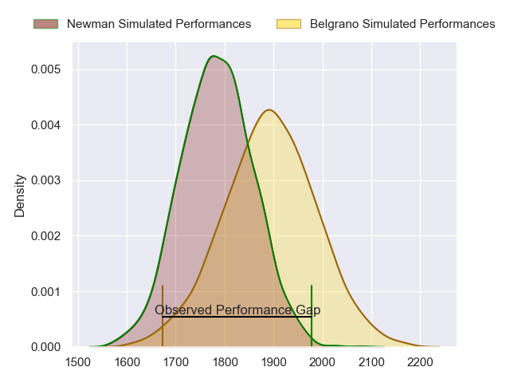
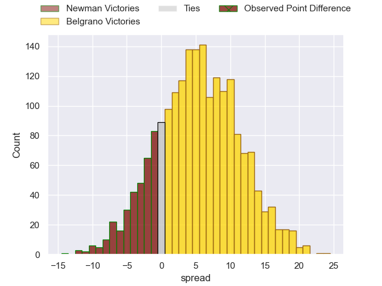
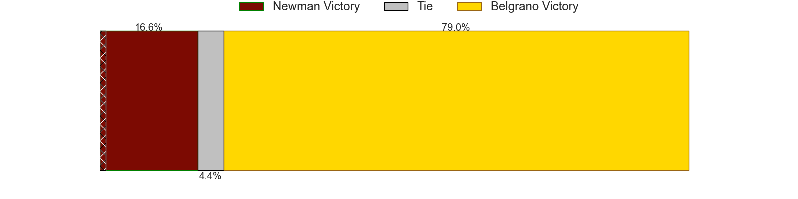
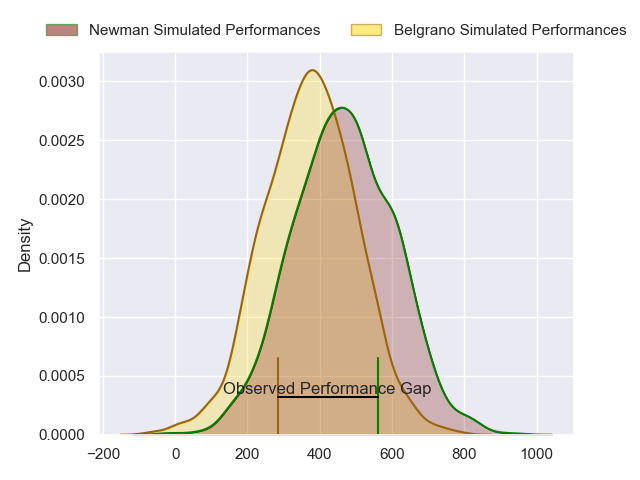
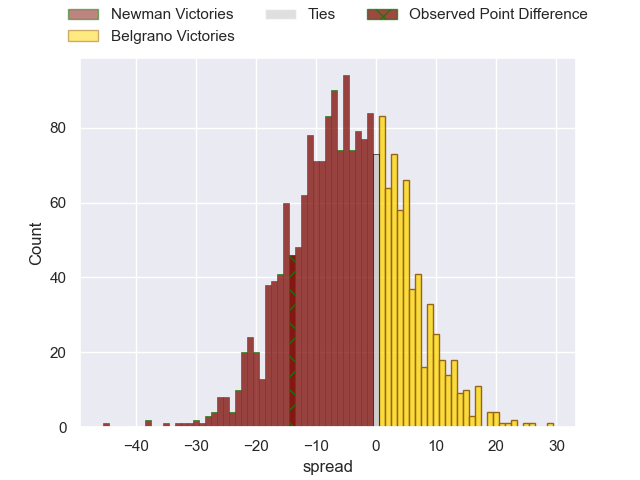
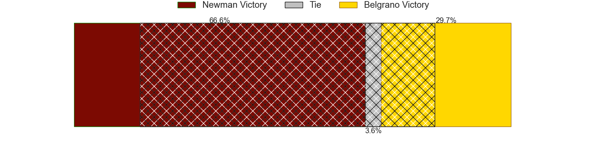

---  
layout: page  
title: Newman at Belgrano; 23-9  
date: 2024-08-31 18:00:00 -0500  
categories: "URBA Top 13 2024" match review  
---
# Newman at Belgrano; 23-9

# Club Level Predictions

The first set of predictions treats a club as the smallest object, as the club develops its members, organizes a gameplan, and deploys its players as needed for each match. This club model has a prediction of 0.644, which translates to predicting Belgrano to win by 5.3.

Our Over/Under is 51.5 - and combined with the spread above, we have a predicted scoreline of 23 to 29

Each club has a rating and a rating deviation (similar to a Glicko rating), and expected performances can be generated. This allows for simulated matches and spreads like the ones below.
## Projected Performances - Club Model

## Projected Spreads - Club Model

## Projected Results - Club Model

# Player Level Predictions

Treating teams instead as an entity made up of the currently active players, I have ratings for each player in an altogether different system. These can be combined to form team ratings once teamsheets are announced, weighting starters a bit higher than the reserves. After the match is played, players can be weighted by their minutes on the field, allowing for an accurate measure of the team's composition. With these compiled team ratings, we can make predictions, measure inaccuracy, and update the individual player ratings.
## Prediction without Player Minutes: Newman by 1.7

Newman by 5.7 on a neutral pitch

## Projected Performances - Player Model

## Projected Spreads - Player Model

## Projected Results - Player Model

|   Away Minutes | Away Player               |   Away Percentile |   Number |   Home Percentile | Home Player            |   Home Minutes |
|---------------:|:--------------------------|------------------:|---------:|------------------:|:-----------------------|---------------:|
|             80 | Miguel Prince             |             95.66 |        1 |             80.45 | Francisco Ferronato    |             80 |
|             80 | Marcelo Brandi            |             93.73 |        2 |             86.78 | Francisco Lusarreta    |             80 |
|             80 | Bautista Bosch            |             96.83 |        3 |             65.16 | Lisandro Garcia Dragui |             80 |
|             80 | Pablo Cardinal            |             95.35 |        4 |             79.94 | Luciano Tecca          |             80 |
|             80 | Alejandro Urtubey         |             87.9  |        5 |             37.33 | Ramon Duggan           |             80 |
|             80 | Joaquin de la Vega        |             91.15 |        6 |             78.91 | Joaquin de la Serna    |             80 |
|             80 | Mateo Delia               |             64.92 |        7 |             82.2  | Franco Vega            |             80 |
|             80 | Rodrigo Diaz de Vivar     |             94.32 |        8 |             19    | Mauro Rebussone        |             80 |
|             80 | Lucas Marguery            |             94.86 |        9 |             73.76 | Ignacio Marino         |             80 |
|             80 | Gonzalo Guiterrez Taboada |             92.95 |       10 |             42.73 | Joaquin Mihura         |             80 |
|             80 | Jeronimo Ulloa            |             74.73 |       11 |             27.41 | Pedro Arana            |             80 |
|             80 | Tomas Keena               |             93.83 |       12 |             63.77 | Ramon Arana            |             80 |
|             80 | Benjamin Lanfranco        |             80.18 |       13 |             72.14 | Tomas Etchepare        |             80 |
|             80 | Justo Ortiz Basualdo      |             96.88 |       14 |             76.1  | Ignacio Diaz           |             80 |
|             80 | Santiago Marolda          |             92.17 |       15 |             67.83 | Juan Lando             |             80 |
|              0 | Fermin Perkins            |             66.27 |       16 |            nan    | Santiago Villegas      |              0 |
|              0 | Isidro Bosch              |             49.04 |       17 |             97.16 | Santiago Garcia Botta  |              0 |
|              0 | Manuel Lozano             |             56.31 |       18 |            nan    | Eliseo Marchetti       |              0 |
|              0 | Tomas Ureta               |             14.48 |       19 |             67.94 | Mikael Quesada         |              0 |
|              0 | Faustino Santarelli       |             69.34 |       20 |             66.16 | Augusto Vaccarino      |              0 |
|              0 | Felix Branca              |             40.78 |       21 |             14.18 | Tomas Cubelli          |              0 |
|              0 | Silvestre Casa            |             75.11 |       22 |            nan    | Santiago Ruzzante      |              0 |
|              0 | Francisco Ulloa           |            nan    |       23 |             82.83 | Tobias Bernabe         |              0 |

