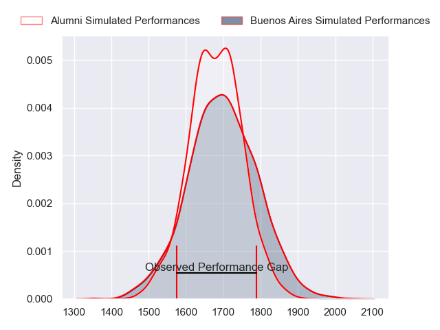
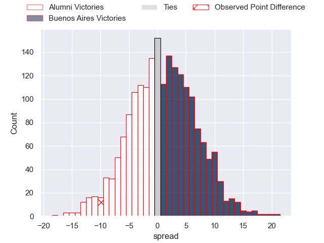
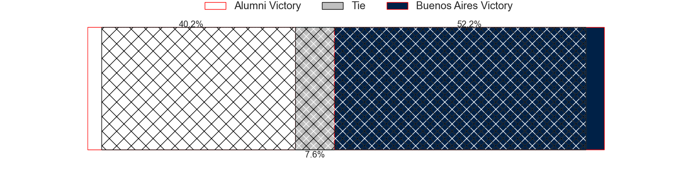
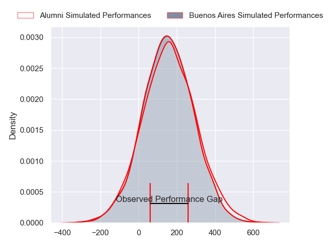
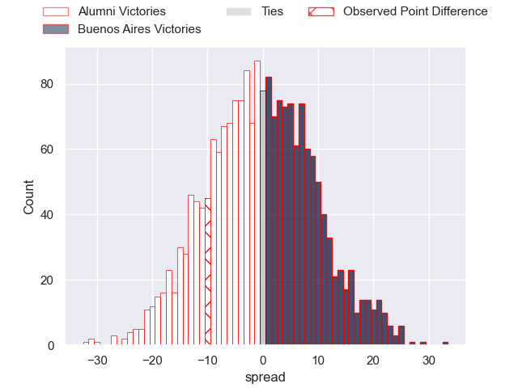

---  
layout: page  
title: Alumni at Buenos Aires; 27-17  
date: 2024-08-31 18:00:00 -0500  
categories: "URBA Top 13 2024" match review  
---
# Alumni at Buenos Aires; 27-17

# Club Level Predictions

The first set of predictions treats a club as the smallest object, as the club develops its members, organizes a gameplan, and deploys its players as needed for each match. This club model has a prediction of 0.526, which translates to predicting Buenos Aires to win by 0.9.

Our Over/Under is 55.5 - and combined with the spread above, we have a predicted scoreline of 27 to 28

Each club has a rating and a rating deviation (similar to a Glicko rating), and expected performances can be generated. This allows for simulated matches and spreads like the ones below.
## Projected Performances - Club Model

## Projected Spreads - Club Model

## Projected Results - Club Model

# Player Level Predictions

Treating teams instead as an entity made up of the currently active players, I have ratings for each player in an altogether different system. These can be combined to form team ratings once teamsheets are announced, weighting starters a bit higher than the reserves. After the match is played, players can be weighted by their minutes on the field, allowing for an accurate measure of the team's composition. With these compiled team ratings, we can make predictions, measure inaccuracy, and update the individual player ratings.
## Prediction without Player Minutes: Alumni by 0.8

Alumni by 3.7 on a neutral pitch

## Projected Performances - Player Model

## Projected Spreads - Player Model

## Projected Results - Player Model

|   Away Minutes | Away Player                |   Away Percentile |   Number |   Home Percentile | Home Player            |   Home Minutes |
|---------------:|:---------------------------|------------------:|---------:|------------------:|:-----------------------|---------------:|
|             80 | Maximo Castillo            |             76.11 |        1 |             31.24 | Tomas Vaca             |             80 |
|             80 | Tomas Bivort               |             88.98 |        2 |             16.44 | Tomas Rosasco          |             80 |
|             80 | Bautista Vidal             |             91.98 |        3 |             38.1  | Blas Armando Coria     |             80 |
|             80 | Manuel Mora                |             90.59 |        4 |             21.72 | Francisco Jose Sluga   |             80 |
|             80 | Santiago Alduncin          |             85.52 |        5 |             14.68 | Bautista Duranona      |             80 |
|             80 | Ignacio Cubilla            |             83.44 |        6 |             15.33 | Simon Mimessi          |             80 |
|             80 | Juan Anderson              |             89.81 |        7 |             13.68 | Matias Espina          |             80 |
|             80 | Santiago Montagner         |             80.35 |        8 |             46.72 | Jordi Dieguez          |             80 |
|             80 | Tomas Passerotti           |             82.27 |        9 |             32.8  | Joaquin Pellandini     |             80 |
|             80 | Joaquin Luzzi              |             89.65 |       10 |             30.18 | Francisco Lamensa      |             80 |
|             80 | Ramon Fuentes              |             84.2  |       11 |             59.02 | Alfonso Latorre        |             80 |
|             80 | Santiago Gonzalez Iglesias |             51.32 |       12 |             16.63 | Agustin Lamensa Sanudo |             80 |
|             80 | Tomas Cubilla              |             67.51 |       13 |             24.78 | Tobias Diaz Borda      |             80 |
|             80 | Filipo Testoni             |             81.46 |       14 |             17.76 | Julian Quetglas Bojar  |             80 |
|             80 | Santiago Pernas            |             78.26 |       15 |             28.7  | Juan Pablo Barzi       |             80 |
|              0 | Maximo Lamelas             |             39.49 |       16 |             42.03 | Valentino Minoyetti    |              0 |
|              0 | Ezequiel Oliva             |             23.06 |       17 |             14.45 | Tomas Gallo            |              0 |
|              0 | Tomas Rapetti              |             47.45 |       18 |             11.19 | Tomas Herrador         |              0 |
|              0 | Nicolas Promanzio          |             46.64 |       19 |             25.41 | Valentin Arauz         |              0 |
|              0 | Tobias Moyano              |             72.49 |       20 |             17.9  | Tomas Etcheverry       |              0 |
|              0 | Santiago Ambroa            |            nan    |       21 |             10.82 | Mateo Freire           |              0 |
|              0 | Franco Battezzati          |             75.33 |       22 |             13.22 | Tomas Bunge            |              0 |
|              0 | Tobias Wade                |            nan    |       23 |            nan    | Marcos Deges           |              0 |

