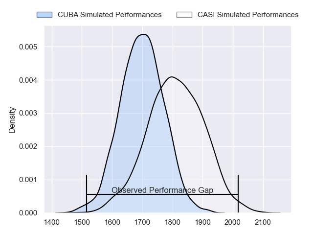
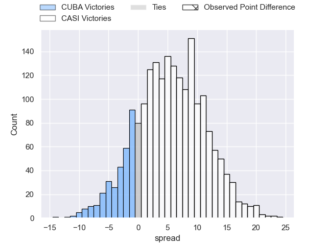
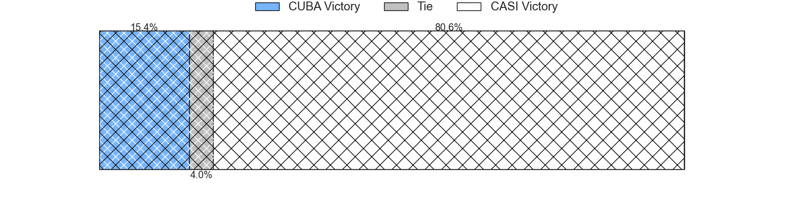
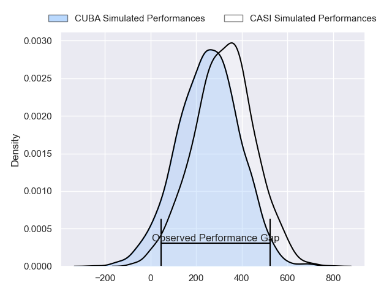
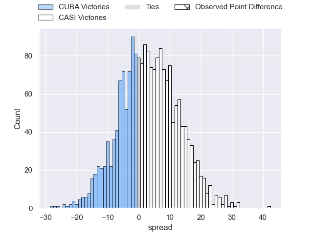
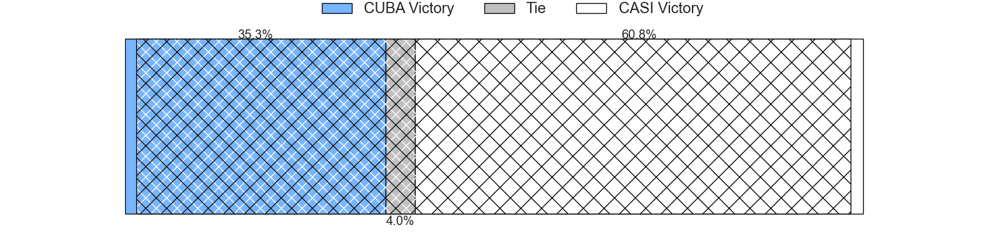

---  
layout: page  
title: CUBA at CASI; 3-27  
date: 2024-08-31 18:00:00 -0500  
categories: "URBA Top 13 2024" match review  
---
# CUBA at CASI; 3-27

# Club Level Predictions

The first set of predictions treats a club as the smallest object, as the club develops its members, organizes a gameplan, and deploys its players as needed for each match. This club model has a prediction of 0.655, which translates to predicting CASI to win by 5.7.

Our Over/Under is 65.5 - and combined with the spread above, we have a predicted scoreline of 30 to 36

Each club has a rating and a rating deviation (similar to a Glicko rating), and expected performances can be generated. This allows for simulated matches and spreads like the ones below.
## Projected Performances - Club Model

## Projected Spreads - Club Model

## Projected Results - Club Model

# Player Level Predictions

Treating teams instead as an entity made up of the currently active players, I have ratings for each player in an altogether different system. These can be combined to form team ratings once teamsheets are announced, weighting starters a bit higher than the reserves. After the match is played, players can be weighted by their minutes on the field, allowing for an accurate measure of the team's composition. With these compiled team ratings, we can make predictions, measure inaccuracy, and update the individual player ratings.
## Prediction without Player Minutes: CASI by 3.9

CUBA by 0.3 on a neutral pitch

## Projected Performances - Player Model

## Projected Spreads - Player Model

## Projected Results - Player Model

|   Away Minutes | Away Player             |   Away Percentile |   Number |   Home Percentile | Home Player                |   Home Minutes |
|---------------:|:------------------------|------------------:|---------:|------------------:|:---------------------------|---------------:|
|             80 | Joaquin Yakiche         |              8.6  |        1 |             37.93 | Facundo Scaiano            |             80 |
|             80 | Tomas Anderlic          |              6.44 |        2 |             77.12 | Juan Torres Obeid          |             80 |
|             80 | Facundo Aguirre         |             80.53 |        3 |             79.53 | Juan Ignacio Nieto Sanchez |             80 |
|             80 | Santiago Uriarte        |             69.49 |        4 |             57.39 | Leo Mazzini                |             80 |
|             80 | Felipe Mendonca         |             23.37 |        5 |             62.25 | Ignacio Larrague           |             80 |
|             80 | Lucas Campion           |             12.86 |        6 |             83.33 | Eugenio Sartori            |             80 |
|             80 | Segundo Pisani          |             63.27 |        7 |             49.59 | Ignacio Torrado            |             80 |
|             80 | Benito Ortiz de Rozas   |             60.04 |        8 |             53.28 | Luis Briatore              |             80 |
|             80 | Rafael Iriarte          |             50.18 |        9 |             74.11 | Luca Canzani               |             80 |
|             80 | Valentin Mastroizi      |             73.57 |       10 |             64.98 | Felipe Hileman             |             80 |
|             80 | Pedro Mesones           |             10.54 |       11 |             66.34 | Benjamin Belaga            |             80 |
|             80 | Felipe de la Vega       |             48.24 |       12 |             84.25 | Bruno Devoto               |             80 |
|             80 | Bautista Casaurang      |             76.76 |       13 |             69.82 | Jeronimo Solveyra          |             80 |
|             80 | Marcos Young            |             24.68 |       14 |             53.76 | Jeronimo Tumbarello        |             80 |
|             80 | Simon Benitez Cruz      |             11.96 |       15 |             66.3  | Juan Akemeier              |             80 |
|              0 | Esteban Iribarne        |            nan    |       16 |            nan    | Facundo Andreotti          |              0 |
|              0 | Francisco Garoby        |             81.37 |       17 |            nan    | Felix Paolucci             |              0 |
|              0 | Felipe Perdomo          |             75.44 |       18 |            nan    | Hugo Garcia                |              0 |
|              0 | Francisco Sied          |             87.35 |       19 |             57.19 | Salvador Ochoa             |              0 |
|              0 | Marcos Elicagaray       |             53.52 |       20 |             44.15 | Tobias Casaurang           |              0 |
|              0 | Hilario Casado          |            nan    |       21 |             28.08 | Tomas Phelan               |              0 |
|              0 | Emilio Perez Maraviglia |            nan    |       22 |             48.5  | Agustin Posleman           |              0 |
|              0 | Felipe Casuarang        |            nan    |       23 |             38.17 | Benjamin Rocca Rivarola    |              0 |

