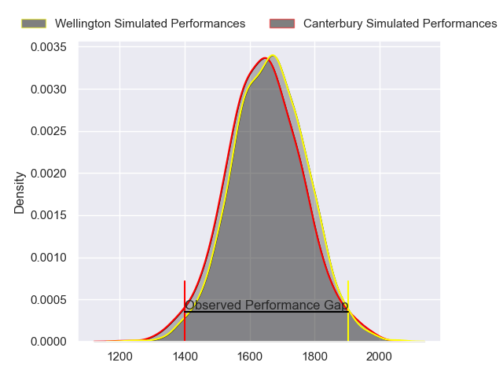
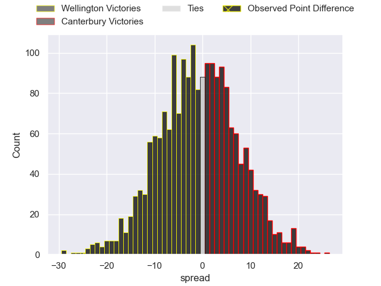
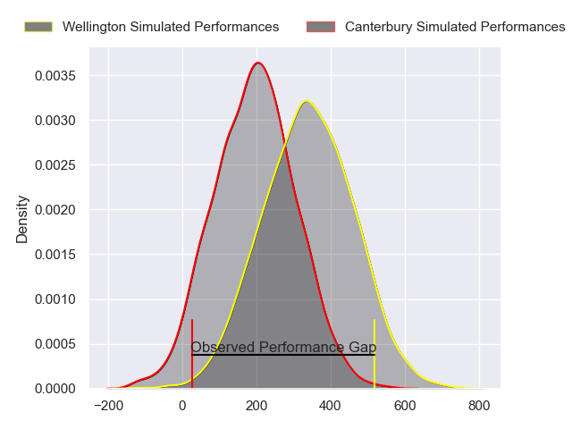
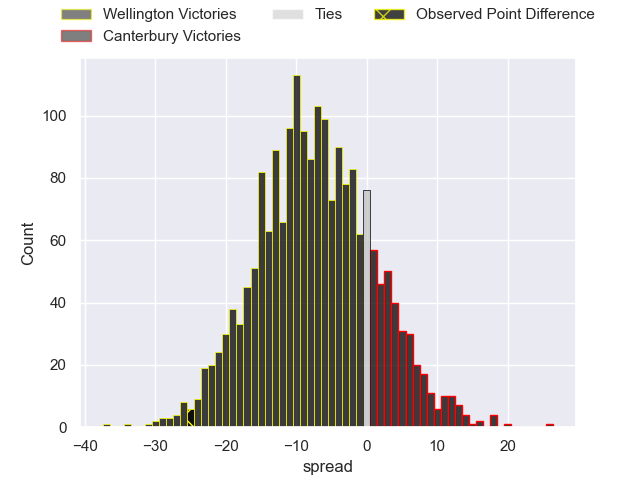
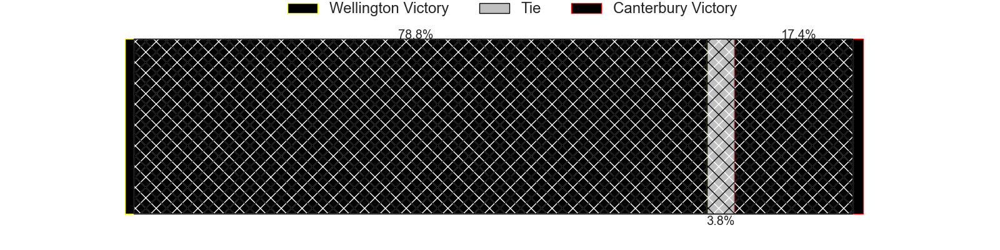

---  
layout: page  
title: Wellington at Canterbury; 46-21  
date: 2024-08-31 18:00:00 -0500  
categories: "NPC 2024" match review  
---
# Wellington at Canterbury; 46-21

# Club Level Predictions

The first set of predictions treats a club as the smallest object, as the club develops its members, organizes a gameplan, and deploys its players as needed for each match. This club model has a prediction of 0.479, which translates to predicting Wellington to win by 0.8.

Our Over/Under is 46.5 - and combined with the spread above, we have a predicted scoreline of 24 to 23

Each club has a rating and a rating deviation (similar to a Glicko rating), and expected performances can be generated. This allows for simulated matches and spreads like the ones below.
## Projected Performances - Club Model

## Projected Spreads - Club Model

## Projected Results - Club Model

# Player Level Predictions

Treating teams instead as an entity made up of the currently active players, I have ratings for each player in an altogether different system. These can be combined to form team ratings once teamsheets are announced, weighting starters a bit higher than the reserves. After the match is played, players can be weighted by their minutes on the field, allowing for an accurate measure of the team's composition. With these compiled team ratings, we can make predictions, measure inaccuracy, and update the individual player ratings.
## Prediction without Player Minutes: Wellington by 8.4

Wellington by 11.6 on a neutral pitch

## Projected Performances - Player Model

## Projected Spreads - Player Model

## Projected Results - Player Model

|   Away Minutes | Away Player           |   Away Percentile |   Number |   Home Percentile | Home Player        |   Home Minutes |
|---------------:|:----------------------|------------------:|---------:|------------------:|:-------------------|---------------:|
|             49 | Xavier Numia          |            nan    |        1 |             73.28 | Joe Moody          |             19 |
|             49 | Leni Apisai           |             80.49 |        2 |            nan    | James Mullan       |             35 |
|             80 | Siale Lauaki          |            nan    |        3 |            nan    | Jaiden Christian   |             54 |
|             59 | Hugo Plummer          |            nan    |        4 |            nan    | Jamie Hannah       |             35 |
|             80 | Caleb Delany          |            nan    |        5 |            nan    | Zach Gallagher     |             69 |
|             26 | Brad Shields          |            nan    |        6 |            nan    | Billy Harmon       |             80 |
|             78 | Sione Halalilo        |             70.99 |        7 |            nan    | Corey Kellow       |             80 |
|             80 | Peter Lakai           |            nan    |        8 |            nan    | Torian Barnes      |             45 |
|             57 | Kyle Preston          |            nan    |        9 |             31.27 | Tyson Belworthy    |             80 |
|             49 | Callum Harkin         |            nan    |       10 |            nan    | Shun Miyake        |             40 |
|             80 | Pepesana Patafilo     |            nan    |       11 |            nan    | Ngatungane Punivai |             29 |
|             80 | Riley Higgins         |            nan    |       12 |            nan    | Jone Rova          |             42 |
|             59 | Peter Umaga-Jensen    |            nan    |       13 |            nan    | Braydon Ennor      |             80 |
|             80 | Julian Savea          |            nan    |       14 |            nan    | Chay Fihaki        |             80 |
|             31 | Tjay Clarke           |            nan    |       15 |            nan    | James White        |             62 |
|             21 | Penieli Poasa         |            nan    |       16 |            nan    | Ben Funnell        |             40 |
|             31 | Yota Kamimori         |            nan    |       17 |            nan    | Finlay Brewis      |             45 |
|             21 | PJ Sheck              |            nan    |       18 |            nan    | Seb Calder         |             11 |
|             23 | Akira Ieremia         |            nan    |       19 |             25    | Liam Jack          |             18 |
|             54 | Dominic Ropeti        |            nan    |       20 |            nan    | Tom Christie       |             40 |
|             24 | Nui Muriwai           |            nan    |       21 |            nan    | Nic Shearer        |             40 |
|             26 | Stanley Solomon       |             25.35 |       22 |            nan    | Dallas McLeod      |             40 |
|             51 | Jackson Garden-Bachop |            nan    |       23 |            nan    | Issac Hutchinson   |             59 |

