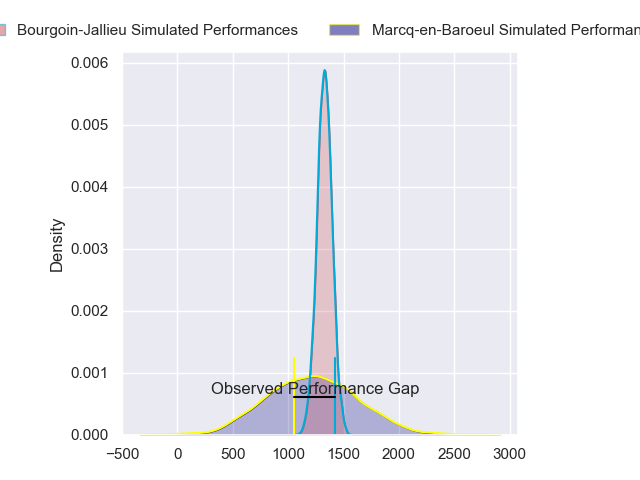
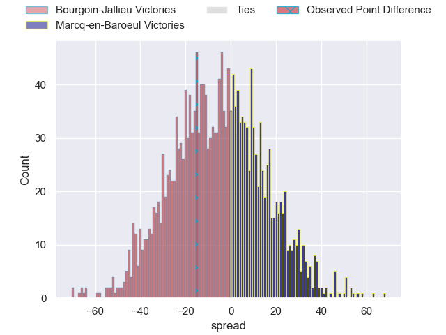
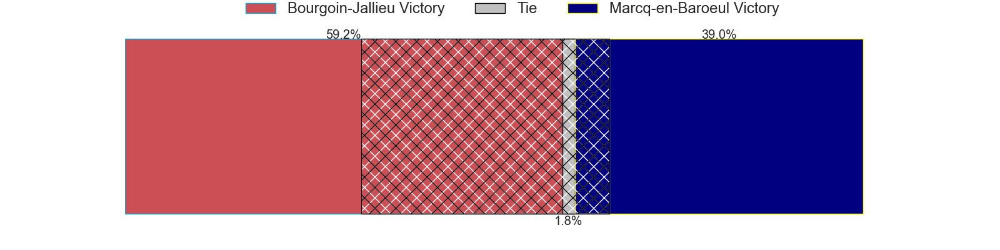
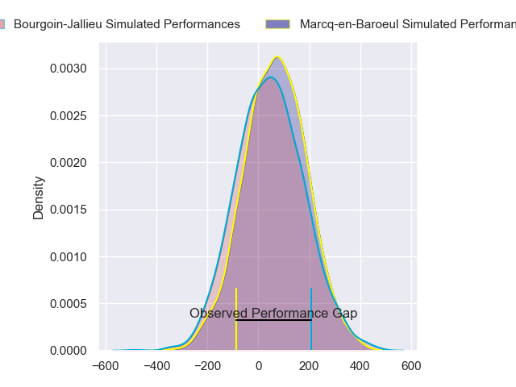
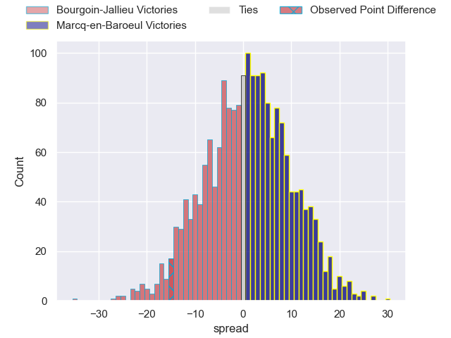
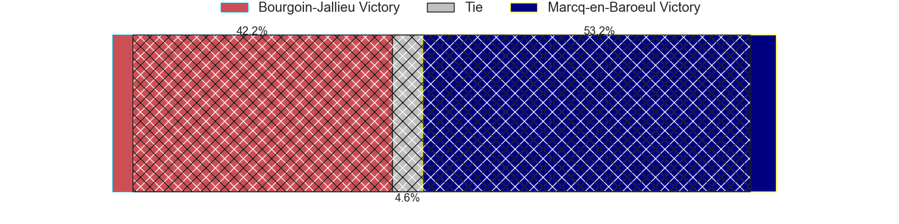

---  
layout: page  
title: Bourgoin-Jallieu at Marcq-en-Baroeul; 33-18  
date: 2024-08-31 18:00:00 -0500  
categories: "Nationale 2024" match review  
---
# Bourgoin-Jallieu at Marcq-en-Baroeul; 33-18

# Club Level Predictions

The first set of predictions treats a club as the smallest object, as the club develops its members, organizes a gameplan, and deploys its players as needed for each match. This club model has a prediction of 0.337, which translates to predicting Bourgoin-Jallieu to win by 6.0.

Our Over/Under is 46.5 - and combined with the spread above, we have a predicted scoreline of 26 to 20

Each club has a rating and a rating deviation (similar to a Glicko rating), and expected performances can be generated. This allows for simulated matches and spreads like the ones below.
## Projected Performances - Club Model

## Projected Spreads - Club Model

## Projected Results - Club Model

# Player Level Predictions

Treating teams instead as an entity made up of the currently active players, I have ratings for each player in an altogether different system. These can be combined to form team ratings once teamsheets are announced, weighting starters a bit higher than the reserves. After the match is played, players can be weighted by their minutes on the field, allowing for an accurate measure of the team's composition. With these compiled team ratings, we can make predictions, measure inaccuracy, and update the individual player ratings.
## Prediction without Player Minutes: Marcq-en-Baroeul by 2.3

Marcq-en-Baroeul by 0.1 on a neutral pitch

## Projected Performances - Player Model

## Projected Spreads - Player Model

## Projected Results - Player Model

|   Away Minutes | Away Player       |   Away Percentile |   Number |   Home Percentile | Home Player                  |   Home Minutes |
|---------------:|:------------------|------------------:|---------:|------------------:|:-----------------------------|---------------:|
|             25 | Lucas Dycke       |             11.33 |        1 |            nan    | Charles-Édouard Ekwah Elimby |             47 |
|             58 | Maxime Castant    |             80.13 |        2 |            nan    | Santiago Iglesias Valdez     |             80 |
|             56 | Keynan Knox       |             29.77 |        3 |            nan    | Sive Mazosiwe                |             57 |
|             54 | Robin Gascou      |             39.28 |        4 |            nan    | Antoine Delaporte            |             52 |
|             80 | Thomas Adélaïde   |             63.71 |        5 |            nan    | Nino Maso                    |             57 |
|             33 | Sam Daly          |             23.21 |        6 |            nan    | Thomas Simonet               |             80 |
|             80 | Kamil Bouregba    |             59.03 |        7 |            nan    | Cedric Yonkeu                |             55 |
|             66 | Poutasi Luafutu   |              9    |        8 |            nan    | Otilo Kafotamaki             |             80 |
|             80 | Martin Doan       |             54.81 |        9 |            nan    | Geoffrey Cazanave            |             80 |
|             80 | Tom Danovaro      |             42.07 |       10 |            nan    | Paul Decavel                 |             59 |
|             80 | Joe Ravouvou      |             85.12 |       11 |            nan    | Ervin Muric                  |             50 |
|             63 | Isaiah Leota      |             79.47 |       12 |            nan    | Louis Decavel                |             50 |
|             22 | Christopher Bosch |              4.26 |       13 |             24.36 | Mark Erasmus                 |             80 |
|             45 | Paul-Hugo Champ   |             36.78 |       14 |            nan    | Hugues Crespo                |             80 |
|             80 | Antoine Renaud    |              1.47 |       15 |            nan    | Serafin Bordoli              |             80 |
|             80 | Aviata Silago     |             10.53 |       16 |            nan    | Lewys Jones                  |             55 |
|             80 | Adrien Mallet     |            nan    |       17 |            nan    | Dylan Nocete                 |             56 |
|             26 | Morgan Eames      |              1.1  |       18 |              5.02 | Dany Antunes                 |             80 |
|             24 | Louis Ponton      |             33    |       19 |              5.85 | Joachim Beaumont             |             23 |
|             24 | Dimitri Tchapnga  |             88.67 |       20 |            nan    | Jean-Baptiste Rende          |             23 |
|             14 | Tala Gray         |             42.89 |       21 |            nan    | Mateo Saint-Germain          |             25 |
|             79 | Liam Rimet        |             46.39 |       22 |            nan    | nan                          |            nan |
|             54 | Merlin Bully      |            nan    |       23 |            nan    | nan                          |            nan |

