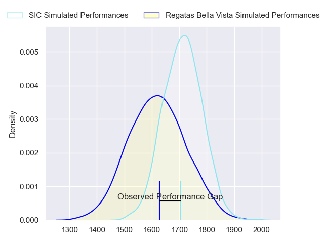
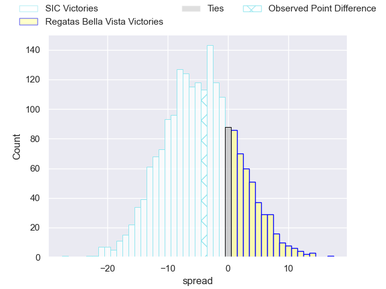
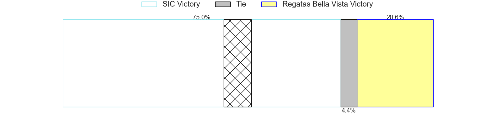
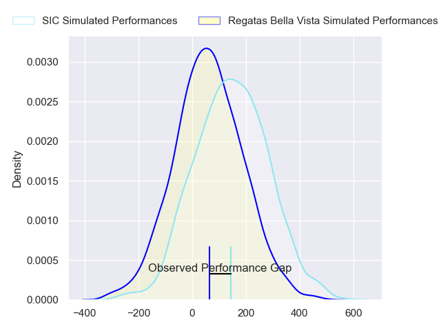
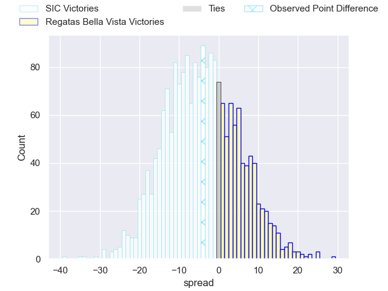
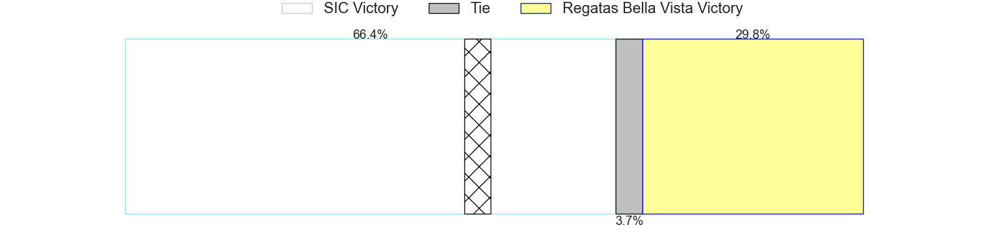

---  
layout: page  
title: SIC at Regatas Bella Vista; 16-12  
date: 2024-08-31 18:00:00 -0500  
categories: "URBA Top 13 2024" match review  
---
# SIC at Regatas Bella Vista; 16-12

# Club Level Predictions

The first set of predictions treats a club as the smallest object, as the club develops its members, organizes a gameplan, and deploys its players as needed for each match. This club model has a prediction of 0.37, which translates to predicting SIC to win by 4.8.

Our Over/Under is 45.5 - and combined with the spread above, we have a predicted scoreline of 25 to 20

Each club has a rating and a rating deviation (similar to a Glicko rating), and expected performances can be generated. This allows for simulated matches and spreads like the ones below.
## Projected Performances - Club Model

## Projected Spreads - Club Model

## Projected Results - Club Model

# Player Level Predictions

Treating teams instead as an entity made up of the currently active players, I have ratings for each player in an altogether different system. These can be combined to form team ratings once teamsheets are announced, weighting starters a bit higher than the reserves. After the match is played, players can be weighted by their minutes on the field, allowing for an accurate measure of the team's composition. With these compiled team ratings, we can make predictions, measure inaccuracy, and update the individual player ratings.
## Prediction without Player Minutes: SIC by 4.1

SIC by 7.9 on a neutral pitch

## Projected Performances - Player Model

## Projected Spreads - Player Model

## Projected Results - Player Model

|   Away Minutes | Away Player                  |   Away Percentile |   Number |   Home Percentile | Home Player         |   Home Minutes |
|---------------:|:-----------------------------|------------------:|---------:|------------------:|:--------------------|---------------:|
|             80 | Marcos Piccinini             |             86.8  |        1 |             76.69 | Matias Medrano      |             80 |
|             80 | Ignacio Bottazzini           |             84.07 |        2 |             78.81 | Marcos Camerlinckx  |             80 |
|             80 | Juan Pedro Olcese            |             54.55 |        3 |             51.8  | Juan Gobet          |             80 |
|             80 | Bautista Viero               |             84.07 |        4 |             55.02 | Marcelo Toledo      |             80 |
|             80 | Tomas Borghi                 |             86.25 |        5 |             55.22 | Tomas Sanguinetti   |             80 |
|             80 | Alejo Daireaux               |             67.18 |        6 |             31.07 | Lucas Gobet         |             80 |
|             80 | Franco Delger                |             88.68 |        7 |             51.54 | Pedro Vega          |             80 |
|             80 | Tomas Meyrelles              |             65.5  |        8 |             47.82 | Felipe Camerlinckx  |             80 |
|             80 | Marcos Rodriguez Gauxax      |             45.74 |        9 |             47.7  | Marcos Joseph       |             80 |
|             80 | Santiago Pavlovsky           |             79.74 |       10 |             59.25 | Justo Camerlinckx   |             80 |
|             80 | Bernabe Lopez Fleming        |             51.32 |       11 |             19.9  | Francisco Pisani    |             80 |
|             80 | Santos Rubio                 |             80.29 |       12 |             32.49 | Mateo Camerlinckx   |             80 |
|             80 | Nicanor Acosta               |             70.93 |       13 |             42.95 | Alejo Barrera       |             80 |
|             80 | Timoteo Silva                |             47.22 |       14 |             56.49 | Rafael Santana      |             80 |
|             80 | Francisco González Capdevila |             59.78 |       15 |             53.91 | Cruz Camerlinckx    |             80 |
|              0 | Ricardo Alberto Macchiavello |             35.08 |       16 |             48.15 | Marcos Ferro        |              0 |
|              0 | Lucas Rocha                  |             67.8  |       17 |             16.21 | Tomas Barbaccia     |              0 |
|              0 | Ignacio Noel                 |            nan    |       18 |            nan    | Felipe Galli        |              0 |
|              0 | Lucas Sommer                 |            nan    |       19 |             67.43 | Francisco Ploder    |              0 |
|              0 | Andrea Panzarini             |             80.25 |       20 |             36.44 | Beltran Landivar    |              0 |
|              0 | Ramon Martinez Tomietto      |            nan    |       21 |            nan    | Esteban De La Torre |              0 |
|              0 | Agustin Sascaro              |            nan    |       22 |            nan    | Agustin Medrano     |              0 |
|              0 | Franco Moneta                |             69.07 |       23 |             44.78 | Enrique Camerlinckx |              0 |

