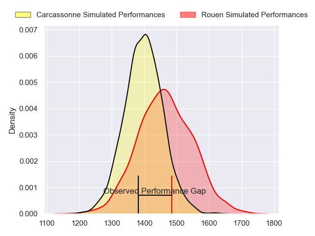
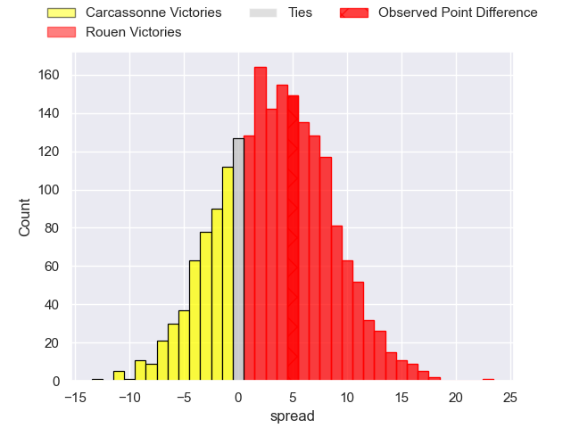
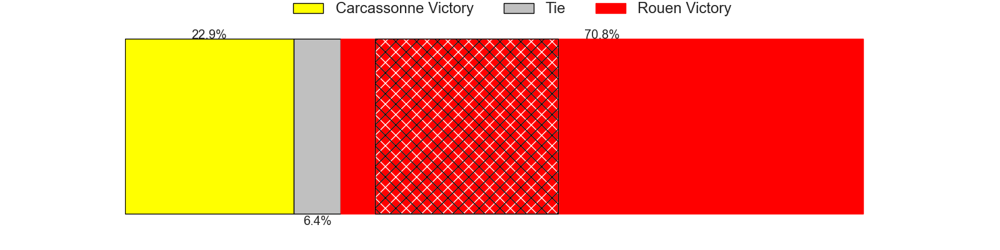
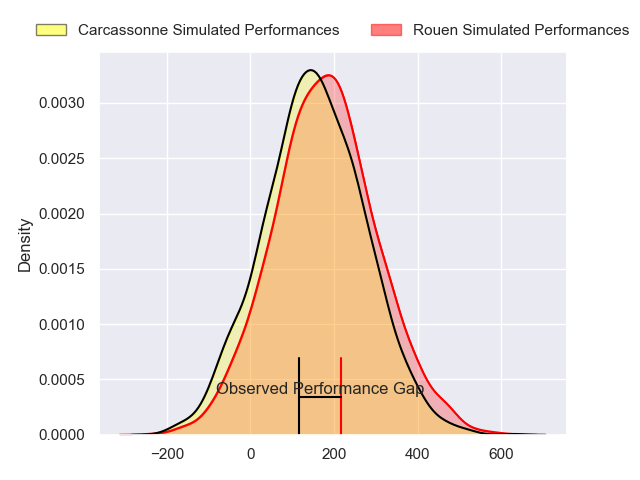
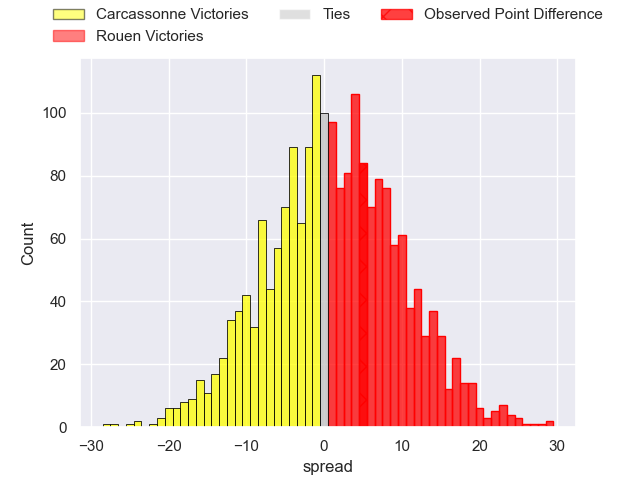
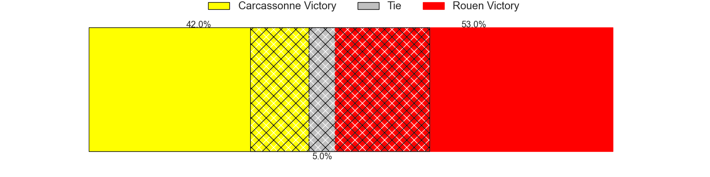

---  
layout: page  
title: Carcassonne at Rouen; 8-13  
date: 2024-08-31 18:00:00 -0500  
categories: "Nationale 2024" match review  
---
# Carcassonne at Rouen; 8-13

# Club Level Predictions

The first set of predictions treats a club as the smallest object, as the club develops its members, organizes a gameplan, and deploys its players as needed for each match. This club model has a prediction of 0.595, which translates to predicting Rouen to win by 3.4.

Our Over/Under is 51.5 - and combined with the spread above, we have a predicted scoreline of 24 to 28

Each club has a rating and a rating deviation (similar to a Glicko rating), and expected performances can be generated. This allows for simulated matches and spreads like the ones below.
## Projected Performances - Club Model

## Projected Spreads - Club Model

## Projected Results - Club Model

# Player Level Predictions

Treating teams instead as an entity made up of the currently active players, I have ratings for each player in an altogether different system. These can be combined to form team ratings once teamsheets are announced, weighting starters a bit higher than the reserves. After the match is played, players can be weighted by their minutes on the field, allowing for an accurate measure of the team's composition. With these compiled team ratings, we can make predictions, measure inaccuracy, and update the individual player ratings.
## Prediction without Player Minutes: Rouen by 4.6

Rouen by 1.3 on a neutral pitch

## Projected Performances - Player Model

## Projected Spreads - Player Model

## Projected Results - Player Model

|   Away Minutes | Away Player         |   Away Percentile |   Number |   Home Percentile | Home Player           |   Home Minutes |
|---------------:|:--------------------|------------------:|---------:|------------------:|:----------------------|---------------:|
|             20 | Yan Arnold          |             57.89 |        1 |             87.69 | Alexis Decaux         |             76 |
|             80 | Raphael Carbou      |             78.36 |        2 |             81.15 | Mathieu Bonnot        |             45 |
|             68 | Vakhtangi Akhobadze |              2.11 |        3 |             81.86 | Soso Bekoshvili       |             30 |
|             56 | Romain Manchia      |             40.04 |        4 |             62.55 | John-Charles Astle    |             50 |
|             25 | Clément Fontaine    |             51.1  |        5 |             60.56 | Will Witty            |             80 |
|             26 | Corentin Bousquet   |             31.39 |        6 |              5.25 | Willy N'Diaye         |             80 |
|             80 | Etienne Herjean     |             86.63 |        7 |             90.59 | Tienie Burger         |             20 |
|             62 | Romain Guyot        |             77.57 |        8 |             71.49 | Abdelkarim Fofana     |             56 |
|             24 | Gaetan Pichon       |             18.21 |        9 |              6.53 | Ilan El Khattabi      |             35 |
|             80 | Nils Chalies        |             41.86 |       10 |             56.24 | Maxime Javaux         |             54 |
|             60 | Clement Egiziano    |             86.9  |       11 |             73.04 | Benjamin Descamps     |             60 |
|             69 | Jordan Puletua      |             42.05 |       12 |             81.11 | Benjamin Pehau        |             72 |
|             80 | Mathys Barka        |             73.21 |       13 |             57.2  | Joaquin Riera         |             80 |
|              4 | Paul Gadea          |              1.41 |       14 |             57.49 | Sakiusa Bureitakiyaca |             20 |
|             18 | Naim Ben Alla       |             42.32 |       15 |             43.79 | Benjamin Debetz       |             80 |
|             12 | Marius Iftimiciuc   |              6.47 |       16 |             44.13 | Diego Arbelo          |             80 |
|             80 | Maxime Gianet       |             91.16 |       17 |             28.98 | Corentin Vernet       |             80 |
|             64 | Florent Lorenzon    |             38.38 |       18 |            nan    | Noe Khier             |              8 |
|             60 | Fabien Lorenzon     |             86.23 |       19 |             70.27 | Florent Campeggia     |             80 |
|             11 | Ferdinand Dreno     |             68.97 |       20 |              6.08 | Theo Dachary          |             16 |
|             80 | Baptiste Moreno     |            nan    |       21 |             24.9  | Jean Leleu            |             80 |
|             60 | Lukas Doyhenard     |              0.32 |       22 |             54.1  | Nicolas Nieto         |             20 |
|            nan | nan                 |            nan    |       23 |            nan    | Lucas Poisson         |             24 |

