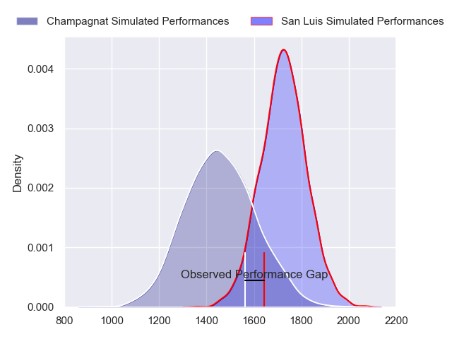
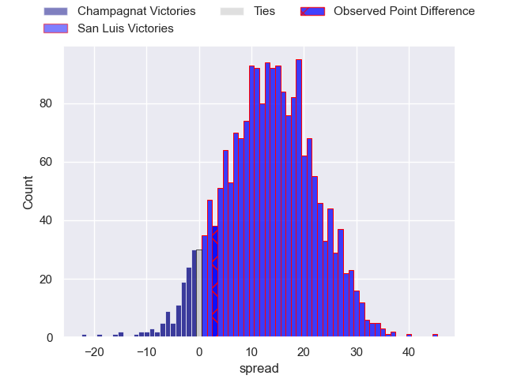
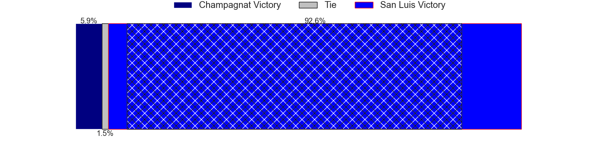
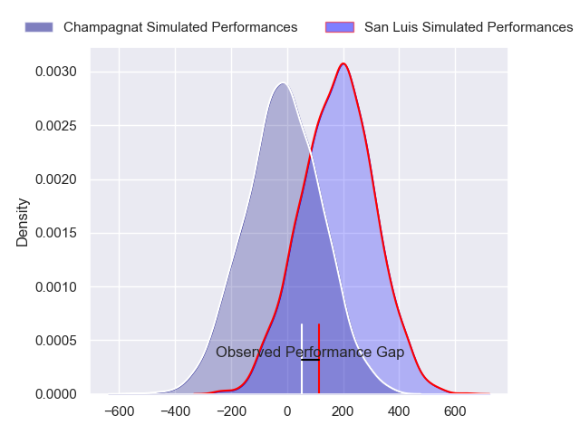
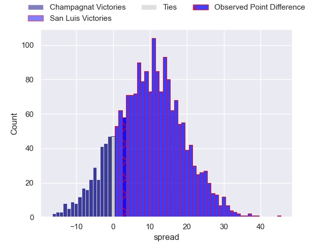
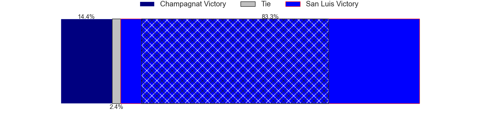

---  
layout: page  
title: Champagnat at San Luis; 14-17  
date: 2024-08-31 18:00:00 -0500  
categories: "URBA Top 13 2024" match review  
---
# Champagnat at San Luis; 14-17

# Club Level Predictions

The first set of predictions treats a club as the smallest object, as the club develops its members, organizes a gameplan, and deploys its players as needed for each match. This club model has a prediction of 0.798, which translates to predicting San Luis to win by 13.1.

Our Over/Under is 53.5 - and combined with the spread above, we have a predicted scoreline of 20 to 33

Each club has a rating and a rating deviation (similar to a Glicko rating), and expected performances can be generated. This allows for simulated matches and spreads like the ones below.
## Projected Performances - Club Model

## Projected Spreads - Club Model

## Projected Results - Club Model

# Player Level Predictions

Treating teams instead as an entity made up of the currently active players, I have ratings for each player in an altogether different system. These can be combined to form team ratings once teamsheets are announced, weighting starters a bit higher than the reserves. After the match is played, players can be weighted by their minutes on the field, allowing for an accurate measure of the team's composition. With these compiled team ratings, we can make predictions, measure inaccuracy, and update the individual player ratings.
## Prediction without Player Minutes: San Luis by 10.2

San Luis by 5.9 on a neutral pitch

## Projected Performances - Player Model

## Projected Spreads - Player Model

## Projected Results - Player Model

|   Away Minutes | Away Player                   |   Away Percentile |   Number |   Home Percentile | Home Player                |   Home Minutes |
|---------------:|:------------------------------|------------------:|---------:|------------------:|:---------------------------|---------------:|
|             80 | Tomas Distel                  |            nan    |        1 |             37.26 | Santiago Bonavento         |             80 |
|             80 | Fernando Rodriguez Pascarella |            nan    |        2 |             54.58 | Mateo Caffaro              |             80 |
|             80 | Marcos Magaro                 |            nan    |        3 |             40.18 | Mateo Calistro             |             80 |
|             80 | Inaki Ustariz                 |            nan    |        4 |             40.64 | Felipe Piatti              |             80 |
|             80 | Tobias Rivas Orozco           |            nan    |        5 |             55.53 | Lahuen Argemi              |             80 |
|             80 | Matias Alonso Boto            |            nan    |        6 |             55.04 | Franco Gnecco              |             80 |
|             80 | Lucas Moresco                 |            nan    |        7 |             24.69 | Facundo Alvarez Amado      |             80 |
|             80 | Matias Muniagurria            |            nan    |        8 |             41.92 | Agustin Torello            |             80 |
|             80 | Martin Graciarena             |            nan    |        9 |             17.91 | Martin Aereboe             |             80 |
|             80 | Santos Panela                 |            nan    |       10 |             26.21 | Isidro Lazzarini           |             80 |
|             80 | Tomas Baca Castex             |            nan    |       11 |             35.61 | Eduardo Ruesta             |             80 |
|             80 | Tobias Imbrosciano            |            nan    |       12 |             59.58 | Segundo Fresco             |             80 |
|             80 | Tomas Cotter                  |            nan    |       13 |             43.61 | Benjamin Marban            |             80 |
|             80 | Tomas Podingo                 |            nan    |       14 |             56.98 | Wilmer Ramirez             |             80 |
|             80 | Gonzalo Costaguta             |            nan    |       15 |             27.83 | Valentino Quattrocchi      |             80 |
|              0 | Manuel Mauvecin               |             25.23 |       16 |             27.12 | Agustin Fitzsimons Herrera |              0 |
|              0 | Alberto Adissi                |             20.3  |       17 |             29.99 | Alejo Garcia               |              0 |
|              0 | Joaquin Guerra                |            nan    |       18 |             43.19 | Facundo Suarez             |              0 |
|              0 | Santiago Escuti               |            nan    |       19 |             38.47 | Martin Etchanchu           |              0 |
|              0 | Tomas Alonso Boto             |             36.01 |       20 |            nan    | Lautaro Grys Arana         |              0 |
|              0 | Pedro Del Piano               |            nan    |       21 |             67.38 | Juan Vaca                  |              0 |
|              0 | Marcos Lafuente               |             33.15 |       22 |             22.63 | Nahuel Curti               |              0 |
|              0 | Geronimo Tomasella            |             14.05 |       23 |            nan    | Corey Te Whata-Colley      |              0 |

