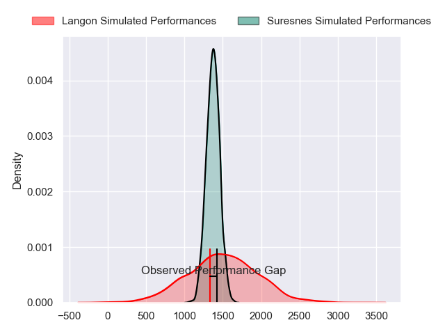
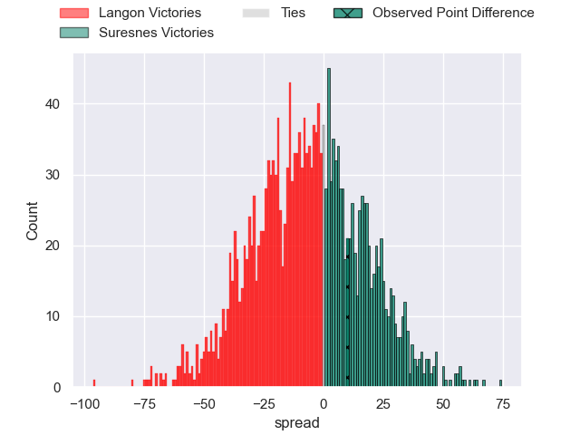
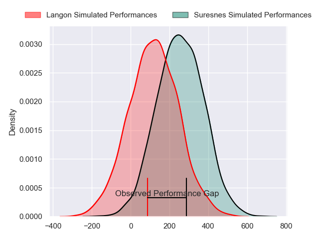
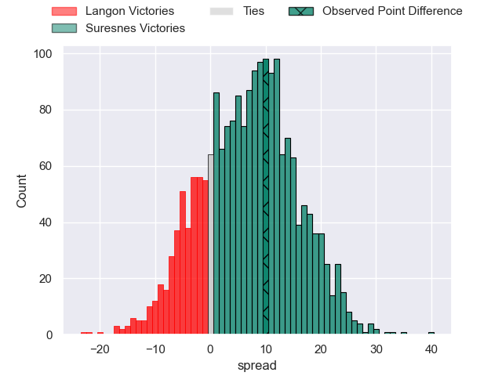
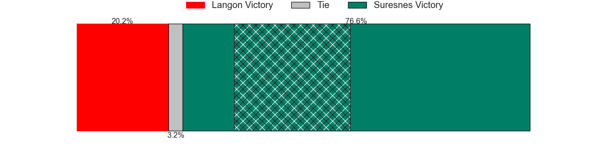

---  
layout: page  
title: Langon at Suresnes; 24-34  
date: 2024-08-31 18:00:00 -0500  
categories: "Nationale 2024" match review  
---
# Langon at Suresnes; 24-34

# Club Level Predictions

The first set of predictions treats a club as the smallest object, as the club develops its members, organizes a gameplan, and deploys its players as needed for each match. This club model has a prediction of 0.391, which translates to predicting Langon to win by 6.6.

Our Over/Under is 50.5 - and combined with the spread above, we have a predicted scoreline of 29 to 22

Each club has a rating and a rating deviation (similar to a Glicko rating), and expected performances can be generated. This allows for simulated matches and spreads like the ones below.
## Projected Performances - Club Model

## Projected Spreads - Club Model

## Projected Results - Club Model

# Player Level Predictions

Treating teams instead as an entity made up of the currently active players, I have ratings for each player in an altogether different system. These can be combined to form team ratings once teamsheets are announced, weighting starters a bit higher than the reserves. After the match is played, players can be weighted by their minutes on the field, allowing for an accurate measure of the team's composition. With these compiled team ratings, we can make predictions, measure inaccuracy, and update the individual player ratings.
## Prediction without Player Minutes: Suresnes by 7.4

Suresnes by 4.5 on a neutral pitch

## Projected Performances - Player Model

## Projected Spreads - Player Model

## Projected Results - Player Model

|   Away Minutes | Away Player                    |   Away Percentile |   Number |   Home Percentile | Home Player             |   Home Minutes |
|---------------:|:-------------------------------|------------------:|---------:|------------------:|:------------------------|---------------:|
|             17 | Jose Novak                     |             42.83 |        1 |             70.12 | Thibaud Sebire          |             80 |
|             35 | Clement Renaud                 |            nan    |        2 |             11.15 | Jean-Étienne Lesueur    |             63 |
|             54 | Maxime Gau                     |            nan    |        3 |             31.66 | Guiterembi Vickos       |             80 |
|             44 | Simon Lobjoit                  |             46.02 |        4 |             74.3  | Nikita Bekov            |             23 |
|              1 | Vincent Bouet                  |             47.51 |        5 |             91.04 | Marvin Woki             |             47 |
|             35 | Thomas Bishop                  |             42.48 |        6 |             62.28 | Simon Veyrac            |             47 |
|             80 | Ludovic Sempé                  |             41.09 |        7 |             80.69 | Wian Vosloo             |             80 |
|             44 | Jules Depoortere               |             41.72 |        8 |             46.54 | Boaventura Almeida      |             57 |
|             52 | Paul Castera                   |             45.02 |        9 |             11.34 | Thomas Lacroix          |             33 |
|             56 | Baptiste Castanier             |            nan    |       10 |             77.59 | Jean Chezeau            |             79 |
|             80 | Thomas Wallraf                 |             78.23 |       11 |             96.8  | Faraj Fartass           |             80 |
|             80 | Guillaume Christophe           |             46.53 |       12 |             83.88 | Petero Tuwai            |             80 |
|             80 | Sionasa Vunisa                 |            nan    |       13 |             44.29 | Gauthier Wolf           |             63 |
|             80 | Jean-Baptiste Bretagnolle      |             43.36 |       14 |             18.19 | Yohan Fournier          |             80 |
|             80 | Nathan Gagnac                  |            nan    |       15 |             12.84 | Thomas Baudy            |             33 |
|             36 | Ratu Nailoma Vatubua           |            nan    |       16 |             23.26 | Tanguy Lacoste          |             26 |
|             36 | Isikili Seva Davetawalu        |            nan    |       17 |             81.13 | Leandro Mario Assi      |             40 |
|             30 | Thomas Geffré                  |            nan    |       18 |             17.63 | Yakine Djebarri         |             30 |
|             80 | Meryll Ech Chalka Roumazeilles |            nan    |       19 |             89.51 | Gauthier Brute de Remur |             50 |
|             50 | Aurelien Tamagnan              |            nan    |       20 |             52.72 | Jean Delbecq            |             80 |
|             45 | Christel Bertrand              |            nan    |       21 |            nan    | Yanis Trabelsi          |             17 |
|             80 | Lucas Hernandez                |            nan    |       22 |            nan    | Germain de Borda        |             59 |
|             54 | Julien Graffouillère           |            nan    |       23 |            nan    | nan                     |            nan |

