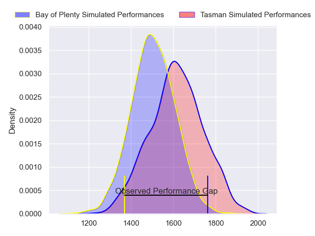
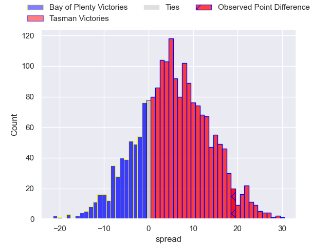
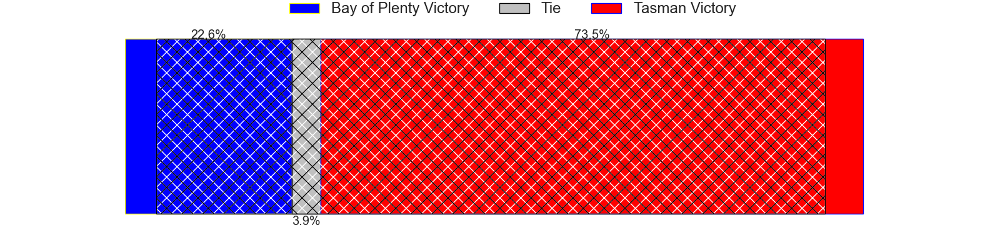
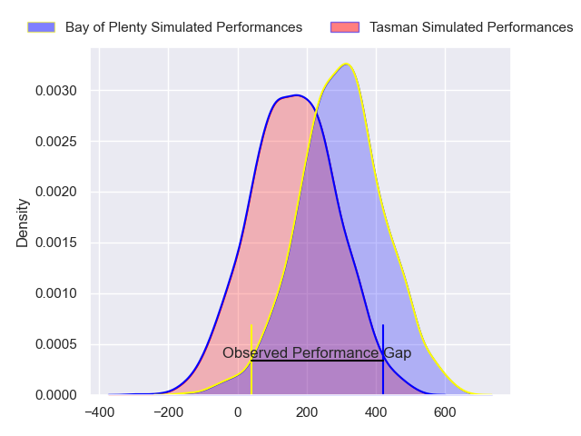
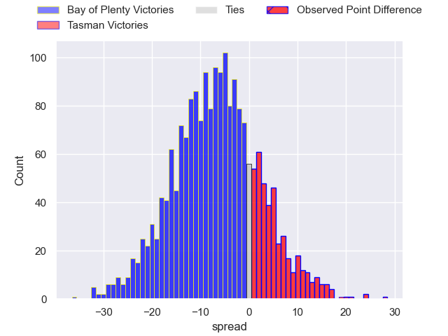
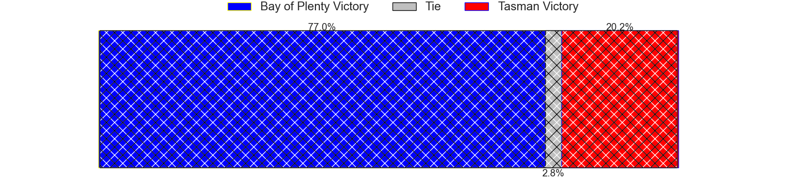

---  
layout: page  
title: Bay of Plenty at Tasman; 15-34  
date: 2024-08-31 18:00:00 -0500  
categories: "NPC 2024" match review  
---
# Bay of Plenty at Tasman; 15-34

# Club Level Predictions

The first set of predictions treats a club as the smallest object, as the club develops its members, organizes a gameplan, and deploys its players as needed for each match. This club model has a prediction of 0.647, which translates to predicting Tasman to win by 5.5.

Our Over/Under is 46.5 - and combined with the spread above, we have a predicted scoreline of 20 to 26

Each club has a rating and a rating deviation (similar to a Glicko rating), and expected performances can be generated. This allows for simulated matches and spreads like the ones below.
## Projected Performances - Club Model

## Projected Spreads - Club Model

## Projected Results - Club Model

# Player Level Predictions

Treating teams instead as an entity made up of the currently active players, I have ratings for each player in an altogether different system. These can be combined to form team ratings once teamsheets are announced, weighting starters a bit higher than the reserves. After the match is played, players can be weighted by their minutes on the field, allowing for an accurate measure of the team's composition. With these compiled team ratings, we can make predictions, measure inaccuracy, and update the individual player ratings.
## Prediction without Player Minutes: Bay of Plenty by 7.3

Bay of Plenty by 10.2 on a neutral pitch

## Projected Performances - Player Model

## Projected Spreads - Player Model

## Projected Results - Player Model

|   Away Minutes | Away Player            |   Away Percentile |   Number |   Home Percentile | Home Player          |   Home Minutes |
|---------------:|:-----------------------|------------------:|---------:|------------------:|:---------------------|---------------:|
|             64 | Aidan Ross             |            nan    |        1 |            nan    | Ryan Coxon           |           61   |
|             16 | Kurt Eklund            |            nan    |        2 |            nan    | Quentin MacDonald    |           58   |
|             80 | Benet Kumeroa          |            nan    |        3 |            nan    | Sam Matenga          |           80   |
|             64 | Naitoa Ah Kuoi         |            nan    |        4 |            nan    | Quinten Strange      |           80   |
|             80 | Justin Sangster        |            nan    |        5 |             26.49 | Antonio Shalfoon     |           62   |
|             80 | Jacob Norris           |            nan    |        6 |            nan    | Max Hicks            |           80   |
|             52 | Joe Johnston           |            nan    |        7 |            nan    | Braden Stewart       |           63   |
|             52 | Nikora Broughton       |            nan    |        8 |            nan    | Fletcher Anderson    |           80   |
|             80 | Te Toiroa Tahuriorangi |            nan    |        9 |            nan    | Finlay Christie      |           74   |
|             31 | Kaleb Trask            |            nan    |       10 |            nan    | William Havili       |           54   |
|             64 | Codemeru Vai           |            nan    |       11 |            nan    | Kyren Taumoefolau    |            6   |
|             61 | Uilisi Halaholo        |            nan    |       12 |            nan    | William Butler       |           31   |
|             52 | Emoni Narawa           |            nan    |       13 |            nan    | Timoci Tavatavanawai |           80   |
|             28 | Leroy Carter           |            nan    |       14 |            nan    | Jack Gray            |           59   |
|             80 | Cole Forbes            |            nan    |       15 |            nan    | Macca Springer       |           80   |
|             80 | Sione Tupou            |            nan    |       16 |            nan    | Samiuela Moli        |            9.5 |
|             80 | Sione Tupou            |            nan    |       16 |            nan    | Samiuela Moli        |           80   |
|             16 | Josh Bartlett          |             38.62 |       17 |            nan    | Monu Moli            |            9.5 |
|             16 | Josh Bartlett          |             38.62 |       17 |            nan    | Monu Moli            |            8.5 |
|             28 | Filipe Vakasiuola      |            nan    |       18 |            nan    | Quinn Harrison-Jones |            8.5 |
|             16 | Semisi Paea            |             68.33 |       19 |            nan    | Tim Sail             |           22   |
|             28 | Kalin Felise           |            nan    |       20 |             38.16 | Johnny Lee           |           18   |
|             28 | Flynn Henderson        |            nan    |       21 |            nan    | Louie Chapman        |           17   |
|             17 | Lucas Cashmore         |            nan    |       22 |            nan    | Campbell Parata      |           21   |
|             80 | Fehi Fineanganofo      |            nan    |       23 |            nan    | Nic Sauira           |           52   |

