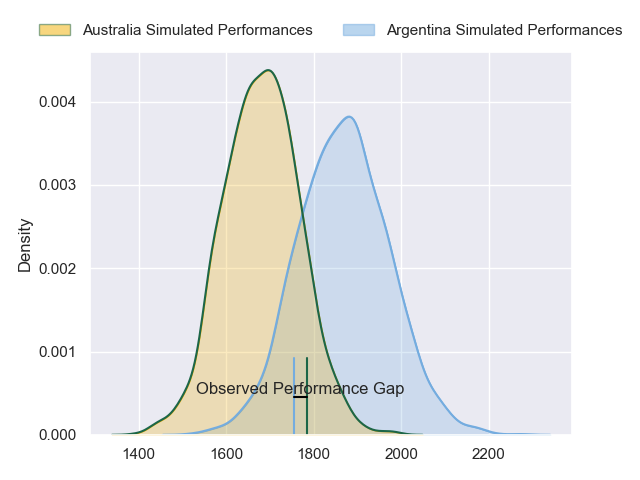
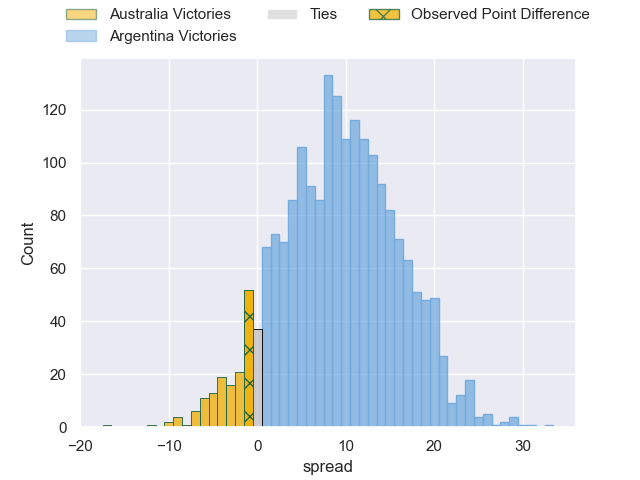
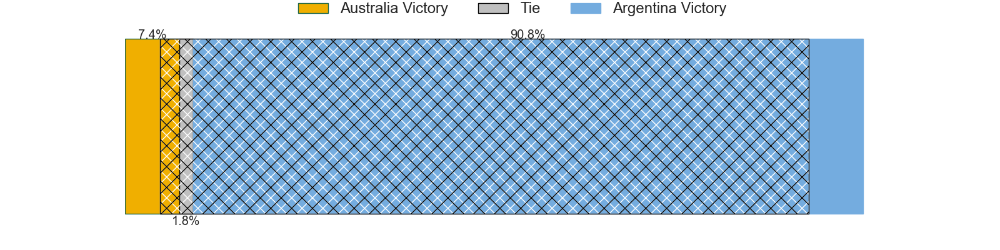
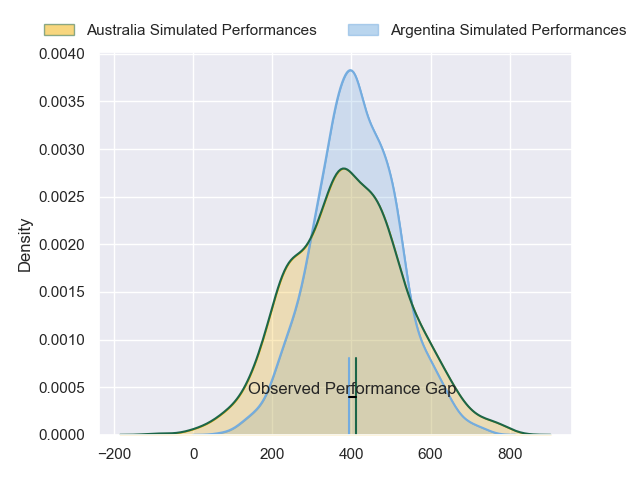
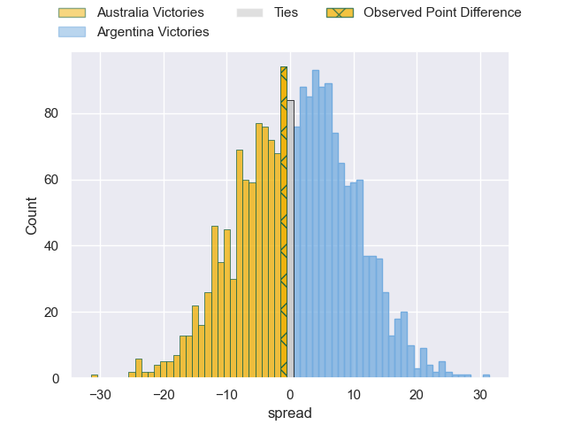
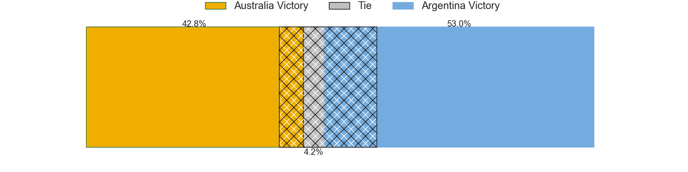

---  
layout: page  
title: Australia at Argentina; 20-19  
date: 2024-09-01 18:00:00 -0500  
categories: "Rugby Championship 2024" match review  
---
# Australia at Argentina; 20-19

# Club Level Predictions

The first set of predictions treats a club as the smallest object, as the club develops its members, organizes a gameplan, and deploys its players as needed for each match. This club model has a prediction of 0.736, which translates to predicting Argentina to win by 9.3.

Our Over/Under is 57.5 - and combined with the spread above, we have a predicted scoreline of 24 to 34

Each club has a rating and a rating deviation (similar to a Glicko rating), and expected performances can be generated. This allows for simulated matches and spreads like the ones below.
## Projected Performances - Club Model

## Projected Spreads - Club Model

## Projected Results - Club Model

# Player Level Predictions

Treating teams instead as an entity made up of the currently active players, I have ratings for each player in an altogether different system. These can be combined to form team ratings once teamsheets are announced, weighting starters a bit higher than the reserves. After the match is played, players can be weighted by their minutes on the field, allowing for an accurate measure of the team's composition. With these compiled team ratings, we can make predictions, measure inaccuracy, and update the individual player ratings.
## Prediction without Player Minutes: Argentina by 12.7

Argentina by 9.3 on a neutral pitch

## Projected Performances - Player Model

## Projected Spreads - Player Model

## Projected Results - Player Model

|   Away Minutes | Away Player          |   Away Percentile |   Number |   Home Percentile | Home Player          |   Home Minutes |
|---------------:|:---------------------|------------------:|---------:|------------------:|:---------------------|---------------:|
|             29 | Angus Bell           |             90.12 |        1 |             92.23 | Thomas Gallo         |             80 |
|             56 | Angus Bell           |             90.12 |        1 |             92.23 | Thomas Gallo         |             80 |
|             35 | Matt Faessler        |             85.41 |        2 |             87.7  | Julian Montoya       |             45 |
|             80 | Taniela Tupou        |             96.19 |        3 |             91.26 | Joel Sclavi          |             45 |
|             80 | Nick Frost           |             71.61 |        4 |             98.71 | Franco Molina        |              1 |
|             80 | Lukhan Salakaia-Loto |             10.76 |        5 |             54.38 | Pedro Rubiolo        |             80 |
|             65 | Rob Valetini         |             98.12 |        6 |             99.41 | Pablo Matera         |             51 |
|             80 | Carlo Tizzano        |              7.72 |        7 |             93.96 | Marcos Kremer        |             80 |
|             68 | Harry Wilson         |             68.13 |        8 |             92.45 | Juan Martin Gonzalez |              6 |
|             76 | Jake Gordon          |             85.57 |        9 |             79.04 | Gonzalo Bertranou    |             48 |
|             80 | Noah Lolesio         |             89.43 |       10 |             85.41 | Santiago Carreras    |             24 |
|             80 | Marika Koroibete     |             96.14 |       11 |             63.43 | Mateo Carreras       |             72 |
|             80 | Hamish Stewart       |             84.1  |       12 |             73.64 | Santiago Chocobares  |             80 |
|             68 | Len Ikitau           |             76.73 |       13 |             60.73 | Lucio Cinti          |             80 |
|             32 | Andrew Kellaway      |             60.98 |       14 |             97.83 | Santiago Cordero     |             19 |
|             48 | Tom Wright           |             88.21 |       15 |             99.58 | Juan Cruz Mallia     |             61 |
|             32 | Allan Alaalatoa      |             98.14 |       16 |              1.38 | Eduardo Bello        |             12 |
|             74 | Jeremy Williams      |             25.9  |       17 |             91.43 | Guido Petti          |             61 |
|             15 | Isaac Aedo Kailea    |             30.53 |       18 |            nan    | Santiago Grondona    |             12 |
|              4 | Josh Nasser          |             75.57 |       19 |             86.26 | Tomas Albornoz       |             19 |
|             80 | Tate McDermott       |             83.85 |       20 |             38.83 | Gonzalo Garcia       |             79 |
|             35 | Max Jorgensen        |             54.53 |       21 |             93.73 | Tomas Lavanini       |             10 |
|             80 | Langi Gleeson        |             61.01 |       22 |              5.67 | Mayco Vivas          |              8 |
|             70 | Ben Donaldson        |             55.6  |       23 |             95.41 | Agustin Creevy       |             56 |

