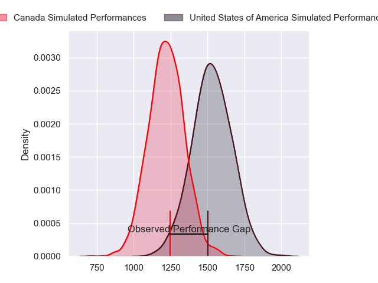
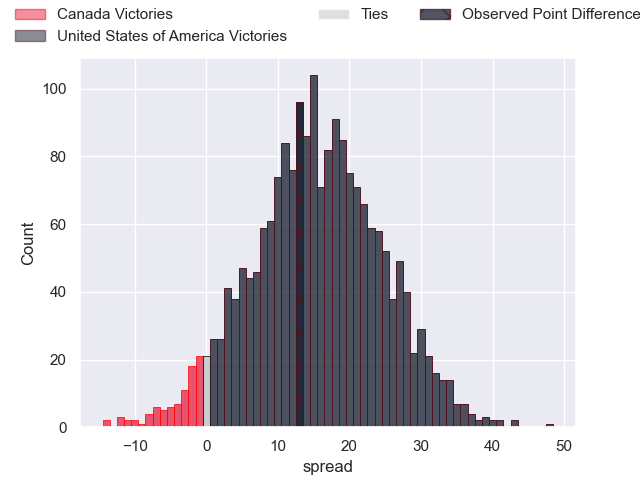
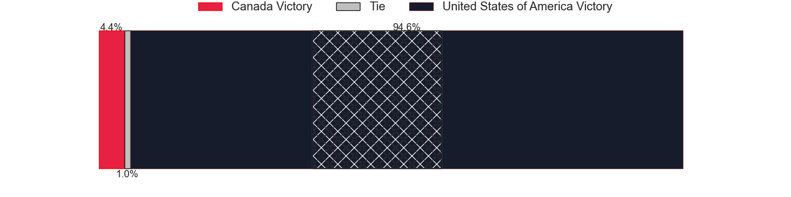
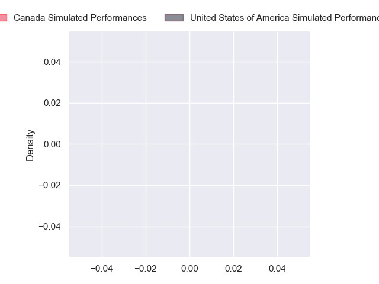
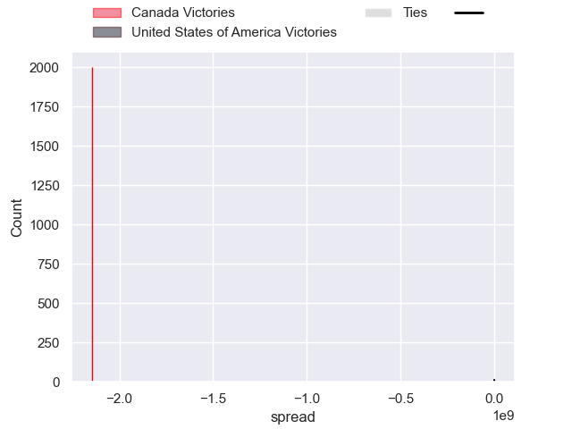

---  
layout: page  
title: Canada at United States of America; 15-28  
date: 2024-09-01 18:00:00 -0500  
categories: "Pacific Nations Cup 2024" match review  
---
# Canada at United States of America; 15-28

# Club Level Predictions

The first set of predictions treats a club as the smallest object, as the club develops its members, organizes a gameplan, and deploys its players as needed for each match. This club model has a prediction of 0.841, which translates to predicting United States of America to win by 15.5.

Our Over/Under is 58.5 - and combined with the spread above, we have a predicted scoreline of 22 to 37

Each club has a rating and a rating deviation (similar to a Glicko rating), and expected performances can be generated. This allows for simulated matches and spreads like the ones below.
## Projected Performances - Club Model

## Projected Spreads - Club Model

## Projected Results - Club Model

# Player Level Predictions

Treating teams instead as an entity made up of the currently active players, I have ratings for each player in an altogether different system. These can be combined to form team ratings once teamsheets are announced, weighting starters a bit higher than the reserves. After the match is played, players can be weighted by their minutes on the field, allowing for an accurate measure of the team's composition. With these compiled team ratings, we can make predictions, measure inaccuracy, and update the individual player ratings.
## Prediction without Player Minutes: United States of America by 7.3

United States of America by 4.6 on a neutral pitch

## Projected Performances - Player Model

## Projected Spreads - Player Model

## Projected Results - Player Model

|   Away Minutes | Away Player         |   Away Percentile |   Number |   Home Percentile | Home Player              |   Home Minutes |
|---------------:|:--------------------|------------------:|---------:|------------------:|:-------------------------|---------------:|
|             24 | Cali Martinez       |            nan    |        1 |            nan    | Jack Iscaro              |             80 |
|             66 | AJ Quattrin         |            nan    |        2 |            nan    | Kapeli Pifeleti          |             76 |
|             68 | Conor Young         |            nan    |        3 |            nan    | Alex Maughan             |             64 |
|             60 | Izzak Kelly         |            nan    |        4 |            nan    | Jason Damm               |             73 |
|             80 | Kaden Duguid        |            nan    |        5 |            nan    | Greg Peterson            |             19 |
|             42 | Mason Flesch        |            nan    |        6 |            nan    | Paddy Ryan               |             80 |
|             14 | Ethan Fryer         |            nan    |        7 |            nan    | Cory Gilliland-Daniel    |             80 |
|             80 | Lucas Rumball       |            nan    |        8 |            nan    | Jamason Fa'anana-Schultz |             61 |
|             80 | Jason Higgins       |            nan    |        9 |            nan    | Juan Philip Smith        |             66 |
|             14 | Peter Nelson        |            nan    |       10 |            nan    | Luke Carty               |             80 |
|             69 | Nic Benn            |            nan    |       11 |            nan    | Nate Augspurger          |             80 |
|             12 | Talon McMullin      |            nan    |       12 |            nan    | Tommaso Boni             |             19 |
|             56 | Ben LeSage          |            nan    |       13 |            nan    | Tavite Lopeti            |             80 |
|             80 | Talon McMullin      |            nan    |       14 |            nan    | Conner Mooneyham         |             80 |
|             11 | Andrew Coe          |            nan    |       15 |            nan    | Mitch Wilson             |             80 |
|             13 | Djustice Sears-Duru |              1.46 |       16 |              8.34 | Jake Turnbull            |             80 |
|             80 | Dewald Kotze        |             69.84 |       17 |             63.61 | Sean McNulty             |              4 |
|             38 | Cole Keith          |             88.58 |       18 |             78.22 | Pono Davis               |             16 |
|             80 | Matthew Oworu       |            nan    |       19 |             86.53 | Vili Helu                |             61 |
|             20 | James Stockwood     |            nan    |       20 |            nan    | Dominic Besag            |             64 |
|             80 | Cooper Coats        |             32.84 |       21 |             73.2  | Ethan McVeigh            |             16 |
|            nan | nan                 |            nan    |       22 |             45.28 | Thomas Tu'avao           |              7 |

