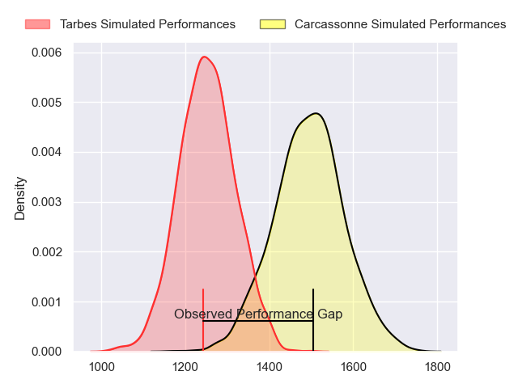
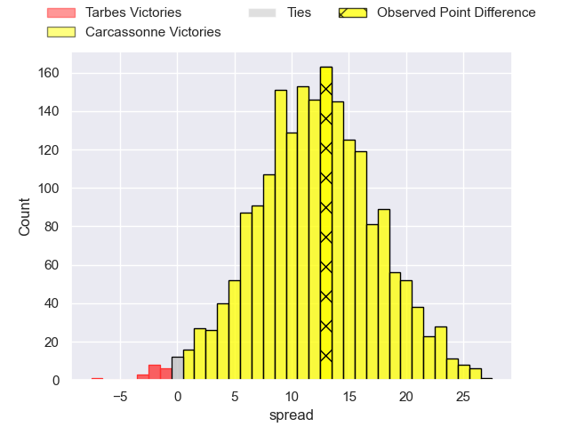
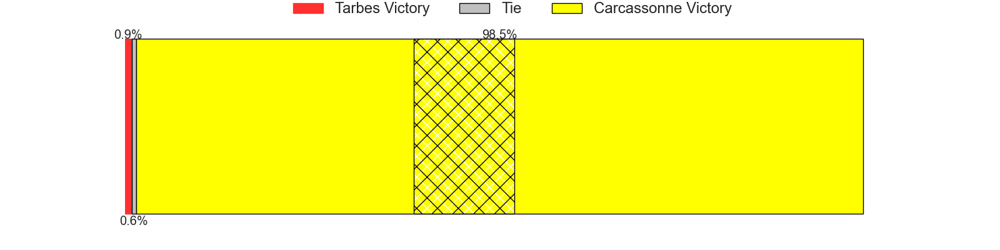
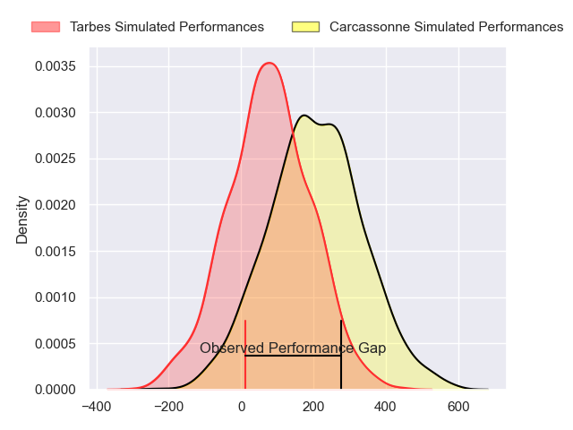
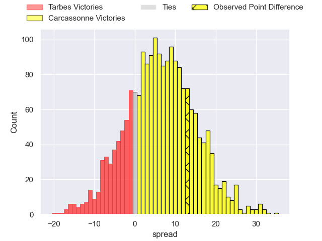
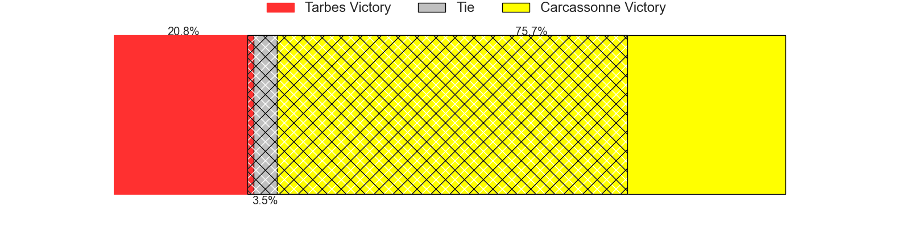

---  
layout: page  
title: Tarbes at Carcassonne; 16-29  
date: 2024-09-06 18:00:00 -0500  
categories: "Nationale 2024" match review  
---
# Tarbes at Carcassonne; 16-29

# Club Level Predictions

The first set of predictions treats a club as the smallest object, as the club develops its members, organizes a gameplan, and deploys its players as needed for each match. This club model has a prediction of 0.796, which translates to predicting Carcassonne to win by 12.1.

Our Over/Under is 29.5 - and combined with the spread above, we have a predicted scoreline of 9 to 21

Each club has a rating and a rating deviation (similar to a Glicko rating), and expected performances can be generated. This allows for simulated matches and spreads like the ones below.
## Projected Performances - Club Model

## Projected Spreads - Club Model

## Projected Results - Club Model

# Player Level Predictions

Treating teams instead as an entity made up of the currently active players, I have ratings for each player in an altogether different system. These can be combined to form team ratings once teamsheets are announced, weighting starters a bit higher than the reserves. After the match is played, players can be weighted by their minutes on the field, allowing for an accurate measure of the team's composition. With these compiled team ratings, we can make predictions, measure inaccuracy, and update the individual player ratings.
## Prediction without Player Minutes: Carcassonne by 5.6

Tarbes by 0.5 on a neutral pitch

## Projected Performances - Player Model

## Projected Spreads - Player Model

## Projected Results - Player Model

|   Away Minutes | Away Player                |   Away Percentile |   Number |   Home Percentile | Home Player         |   Home Minutes |
|---------------:|:---------------------------|------------------:|---------:|------------------:|:--------------------|---------------:|
|             19 | Enzo Baggiani              |             51.79 |        1 |             68.45 | Yan Arnold          |             80 |
|             24 | Vincent Dolier             |             80.42 |        2 |             82.69 | Raphael Carbou      |             19 |
|             52 | Irakli Mirtskhulava        |             87.84 |        3 |             54.51 | Nicolas Fenuafanote |             51 |
|             45 | Mathieu Soufflet           |             44.83 |        4 |             53.35 | Romain Manchia      |             72 |
|             45 | Joeli Matalaweru           |             30.35 |        5 |              7.03 | Marius Iftimiciuc   |             54 |
|             80 | Alexis Armary              |             81.3  |        6 |             43.38 | Corentin Bousquet   |             80 |
|             45 | Spike Salman               |             89.1  |        7 |             89.64 | Etienne Herjean     |             80 |
|             54 | Savenaca Rawaca            |             12.17 |        8 |             74.12 | Ferdinand Dreno     |             80 |
|             54 | Matias Brocal              |             60.91 |        9 |             20.18 | Gaetan Pichon       |              8 |
|             35 | Mathieu Berbizier          |              3.86 |       10 |             51.82 | Nils Chalies        |             56 |
|             22 | Jone Tuva                  |              1.4  |       11 |              1.91 | Paul Gadea          |             80 |
|             80 | Maile Mamao                |              8.06 |       12 |             49.15 | Jordan Puletua      |             26 |
|             80 | Hugo Cellier               |             36.44 |       13 |              0.34 | Lukas Doyhenard     |             80 |
|              2 | Jonathan Duffau            |             34    |       14 |             58.58 | Naim Ben Alla       |             80 |
|             80 | Tiaan Swanepoel            |             37.07 |       15 |             89.7  | Maxime Gianet       |             76 |
|             80 | Ximun Bessonart            |              8.67 |       16 |             40.48 | Florent Lorenzon    |             80 |
|             52 | Florian Lamothe            |             45.1  |       17 |            nan    | Baptiste Moreno     |             58 |
|             28 | Lucas Santamaria Polkowska |            nan    |       18 |              4.34 | Vakhtangi Akhobadze |             45 |
|             22 | Baptiste Peytavi           |             16.72 |       19 |             77.88 | Romain Guyot        |             29 |
|             78 | Jean Guicherd              |             38.46 |       20 |             30.56 | Noe Bedou           |              4 |
|             35 | Mickael Thébault           |             35.09 |       21 |             76.05 | Mathys Barka        |             35 |
|             26 | Alexandre Perez            |             28.41 |       22 |            nan    | Kenjy Bayer         |             61 |
|            nan | nan                        |            nan    |       23 |            nan    | Johnny McPhillips   |             54 |

