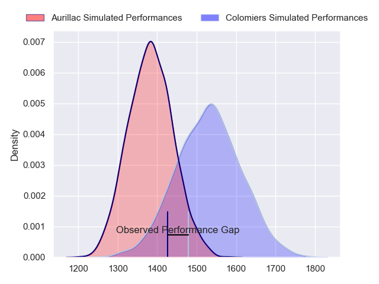
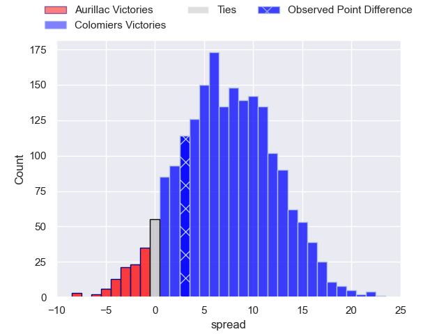
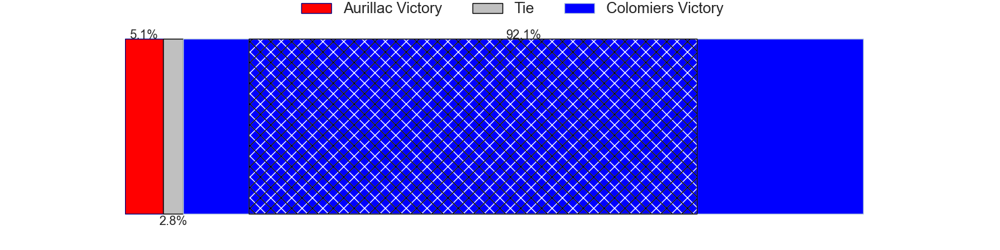
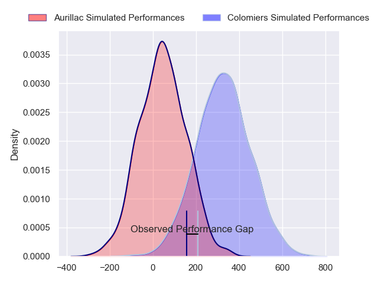
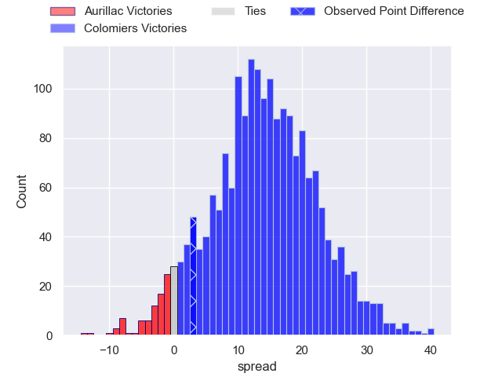
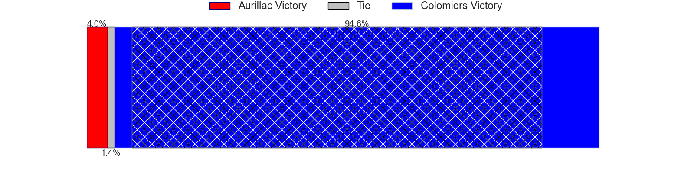

---  
layout: page  
title: Aurillac at Colomiers; 19-22  
date: 2024-09-06 18:00:00 -0500  
categories: "Pro D2 2024" match review  
---
# Aurillac at Colomiers; 19-22

# Club Level Predictions

The first set of predictions treats a club as the smallest object, as the club develops its members, organizes a gameplan, and deploys its players as needed for each match. This club model has a prediction of 0.692, which translates to predicting Colomiers to win by 7.1.

Our Over/Under is 31.5 - and combined with the spread above, we have a predicted scoreline of 12 to 19

Each club has a rating and a rating deviation (similar to a Glicko rating), and expected performances can be generated. This allows for simulated matches and spreads like the ones below.
## Projected Performances - Club Model

## Projected Spreads - Club Model

## Projected Results - Club Model

# Player Level Predictions

Treating teams instead as an entity made up of the currently active players, I have ratings for each player in an altogether different system. These can be combined to form team ratings once teamsheets are announced, weighting starters a bit higher than the reserves. After the match is played, players can be weighted by their minutes on the field, allowing for an accurate measure of the team's composition. With these compiled team ratings, we can make predictions, measure inaccuracy, and update the individual player ratings.
## Prediction without Player Minutes: Colomiers by 15.4

Colomiers by 7.5 on a neutral pitch

## Projected Performances - Player Model

## Projected Spreads - Player Model

## Projected Results - Player Model

|   Away Minutes | Away Player           |   Away Percentile |   Number |   Home Percentile | Home Player               |   Home Minutes |
|---------------:|:----------------------|------------------:|---------:|------------------:|:--------------------------|---------------:|
|             21 | Irakli Mtchedlidze    |             61.31 |        1 |             71.09 | Guillaume Tartas          |             66 |
|             35 | Ronan Loughnane       |             27.27 |        2 |             14.69 | Thomas Larrieu            |             80 |
|             28 | Giorgi Kartvelishvili |             48.38 |        3 |             82.65 | Michael Simutoga          |             26 |
|             56 | Eoghan Masterson      |             77.32 |        4 |             24.71 | Jean Thomas               |             80 |
|             56 | Mehdi Slamani         |             38.02 |        5 |             40.89 | Janse Roux                |             61 |
|             80 | Tim De Jong           |             52.88 |        6 |             17.52 | Anthony Coletta           |             80 |
|             80 | Hugo Huurman          |             74.36 |        7 |             84.4  | Aldric Lescure            |             59 |
|             80 | Abongile Nonkontwana  |              0.88 |        8 |             44.25 | Caleb Timu                |             80 |
|             54 | Mikheil Alania        |             66.91 |        9 |             25.45 | Ugo Seguela               |             69 |
|             80 | Tedo Abzhandadze      |             56.82 |       10 |             15.45 | Joaquin de la Vega Mendia |             80 |
|             11 | Simeli Yabaki         |              3.41 |       11 |             90.27 | Rodrigo Marta             |             80 |
|             56 | Karsen Talalua        |             50.62 |       12 |             63.68 | Ray Nu'u                  |             80 |
|             50 | Karl Martin           |             41.77 |       13 |             56.3  | Enzo Salles               |             14 |
|             24 | Lucas Oudard          |             47.54 |       14 |             85.26 | Vincent Pinto             |             30 |
|             24 | Dachi Papunashvili    |             20.37 |       15 |             32.95 | Ugo Pacome                |             54 |
|             80 | Leo Salvan            |            nan    |       16 |             54.34 | Hugo Pirlet               |             26 |
|             24 | Valentin Welsch       |            nan    |       17 |             35.97 | Elias El Ansari           |             26 |
|             30 | Gymael Jean-Jacques   |             58.25 |       18 |             80.24 | Theo Lachaud              |             80 |
|             24 | Didier Tison          |             31.42 |       19 |            nan    | Louis Descoux             |             29 |
|             19 | Basa Khonelidze       |             55.59 |       20 |             22.65 | Gregoire Bazin            |             54 |
|             30 | Martial Rolland       |             26.73 |       21 |             19.91 | Max Auriac                |             80 |
|             26 | Théo Cambon           |             15.38 |       22 |             70.94 | Dorian Laborde            |             50 |
|             29 | Hugo Bastard          |             57.55 |       23 |            nan    | nan                       |            nan |

