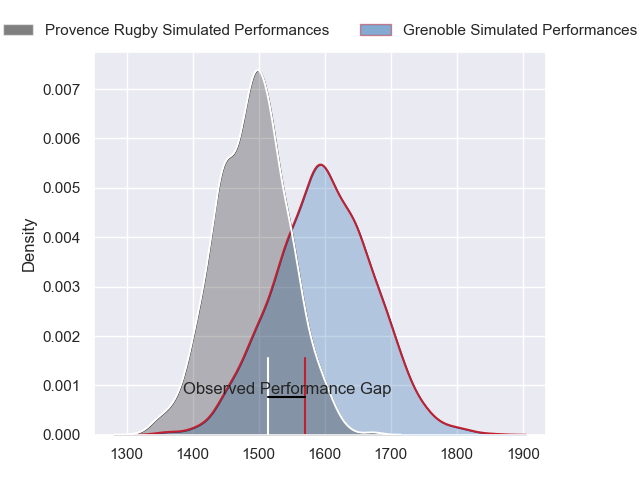
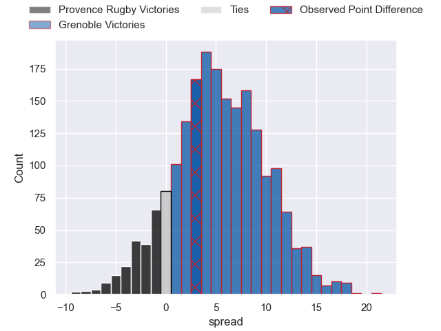
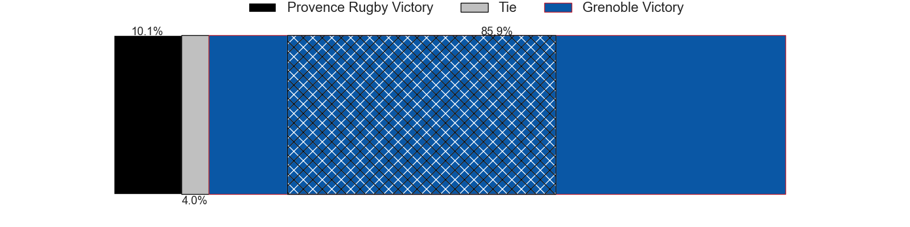

---  
layout: page  
title: Provence Rugby at Grenoble; 12-15  
date: 2024-09-06 18:00:00 -0500  
categories: "Pro D2 2024" match review  
---
# Provence Rugby at Grenoble; 12-15

# Club Level Predictions

The first set of predictions treats a club as the smallest object, as the club develops its members, organizes a gameplan, and deploys its players as needed for each match. This club model has a prediction of 0.649, which translates to predicting Grenoble to win by 5.4.

Our Over/Under is 35.5 - and combined with the spread above, we have a predicted scoreline of 15 to 20

Each club has a rating and a rating deviation (similar to a Glicko rating), and expected performances can be generated. This allows for simulated matches and spreads like the ones below.
## Projected Performances - Club Model

## Projected Spreads - Club Model

## Projected Results - Club Model

