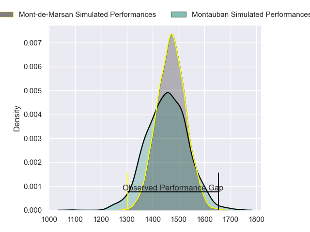
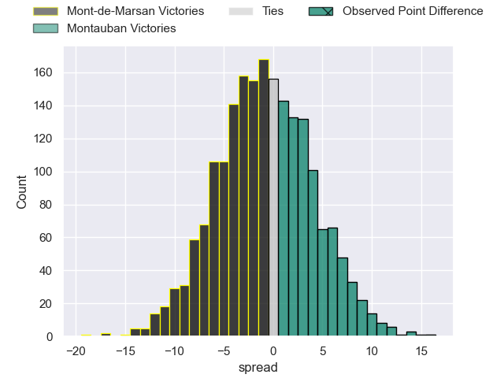
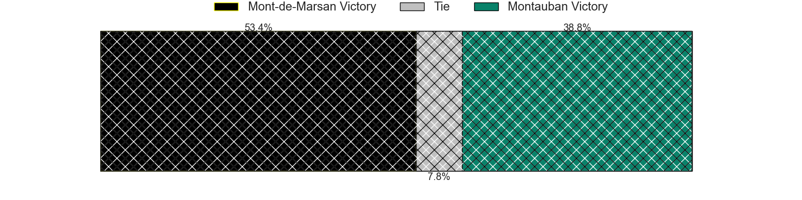
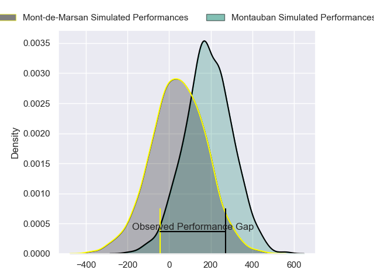
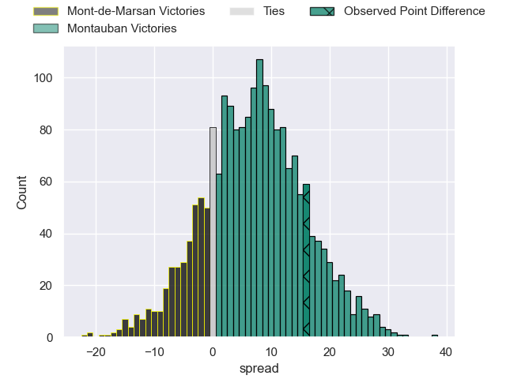
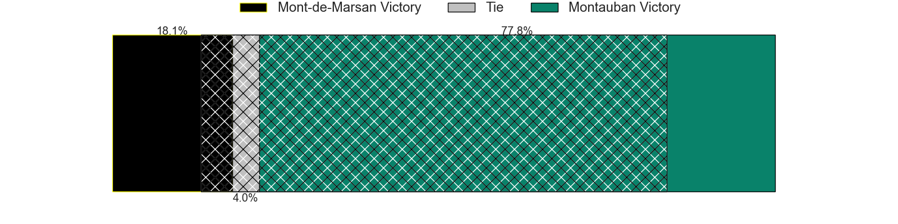

---  
layout: page  
title: Mont-de-Marsan at Montauban; 19-35  
date: 2024-09-06 18:00:00 -0500  
categories: "Pro D2 2024" match review  
---
# Mont-de-Marsan at Montauban; 19-35

# Club Level Predictions

The first set of predictions treats a club as the smallest object, as the club develops its members, organizes a gameplan, and deploys its players as needed for each match. This club model has a prediction of 0.475, which translates to predicting Mont-de-Marsan to win by 0.9.

Our Over/Under is 36.5 - and combined with the spread above, we have a predicted scoreline of 19 to 18

Each club has a rating and a rating deviation (similar to a Glicko rating), and expected performances can be generated. This allows for simulated matches and spreads like the ones below.
## Projected Performances - Club Model

## Projected Spreads - Club Model

## Projected Results - Club Model

# Player Level Predictions

Treating teams instead as an entity made up of the currently active players, I have ratings for each player in an altogether different system. These can be combined to form team ratings once teamsheets are announced, weighting starters a bit higher than the reserves. After the match is played, players can be weighted by their minutes on the field, allowing for an accurate measure of the team's composition. With these compiled team ratings, we can make predictions, measure inaccuracy, and update the individual player ratings.
## Prediction without Player Minutes: Montauban by 7.4

Montauban by 0.7 on a neutral pitch

## Projected Performances - Player Model

## Projected Spreads - Player Model

## Projected Results - Player Model

|   Away Minutes | Away Player          |   Away Percentile |   Number |   Home Percentile | Home Player         |   Home Minutes |
|---------------:|:---------------------|------------------:|---------:|------------------:|:--------------------|---------------:|
|             80 | Luka Goginava        |             33.93 |        1 |             16.92 | Leo Aouf            |             50 |
|             80 | Florian Dufour       |             12.76 |        2 |              8.22 | Kevin Firmin        |             80 |
|             68 | Gheorghe Gajion      |             59.18 |        3 |              3.83 | Mirian Burduli      |             45 |
|             45 | Jules Dussutour      |             47.82 |        4 |              5.54 | Tjuee Uanivi        |             45 |
|             80 | Aston Fortuin        |             22.47 |        5 |             39.62 | Dimitri Vaotoa      |             80 |
|             45 | Ewan Bertheau        |              2.88 |        6 |             84.94 | Sikhumbuzo Notshe   |             80 |
|             45 | Waël Ponpon          |             20.41 |        7 |             54.81 | Kyllian Ringuet     |             50 |
|             45 | Ioane Iashagashvili  |             86.95 |        8 |             14.82 | Tyrone Viiga        |             50 |
|             55 | Christophe Loustalot |             34.36 |        9 |             65.64 | Yoan Cottin         |             26 |
|             80 | Joris Pialot         |              8.64 |       10 |             23.64 | Thomas Fortunel     |             80 |
|             80 | Eroni Sau            |             59.38 |       11 |             72.92 | Paul Vallee         |             54 |
|             80 | Patricio Fernandez   |             13.05 |       12 |             33.94 | JT Jackson          |             56 |
|             80 | Gatien Masse         |             15.55 |       13 |             43.13 | Yvan Reilhac        |             80 |
|             45 | Alexandre de Nardi   |             20.56 |       14 |             92.88 | Stephane Ahmed      |             26 |
|             80 | Théo Cortes          |             29.06 |       15 |             84.9  | Baptiste Mouchous   |             35 |
|             23 | Mike Faleafa         |             10.18 |       16 |             89.56 | Frank Bradshaw      |             80 |
|             35 | Nicolas Garrault     |             48.78 |       17 |             19.02 | Karl Wilkins        |             58 |
|             80 | Anthony Alves        |              3.91 |       18 |             23.64 | Facundo Pomponio    |             80 |
|             35 | Semi Lagivala        |             36.21 |       19 |             14.36 | Hugo Zabalza        |             47 |
|             35 | Jean-Luc Innocente   |              6.55 |       20 |             87.05 | Jérôme Bosviel      |             30 |
|             35 | Willie du Plessis    |             82.5  |       21 |              1.11 | Malino Vanai        |             56 |
|             30 | Nicolas Darquier     |             14.55 |       22 |             73.67 | Simon Renda         |             50 |
|             24 | Samuel Lagrange      |             49.48 |       23 |              9.62 | Badri Alkhazashvili |             35 |

