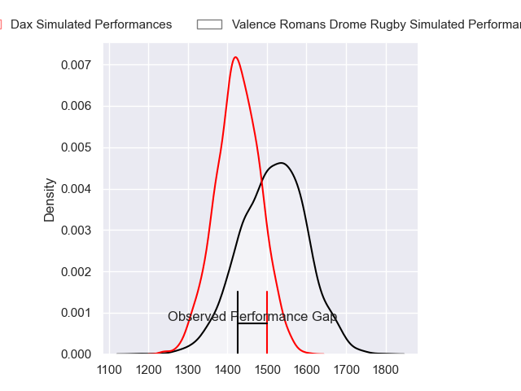
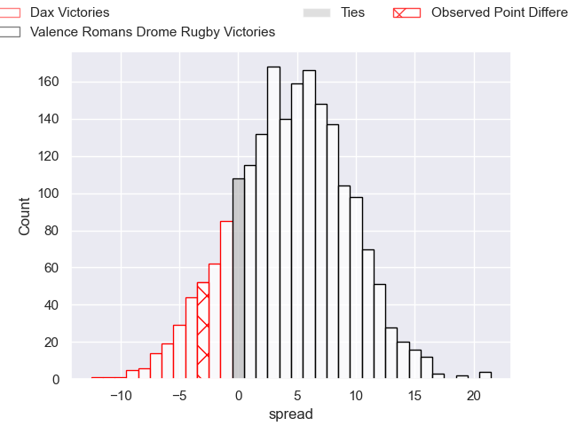
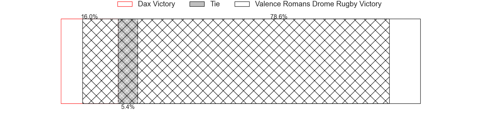
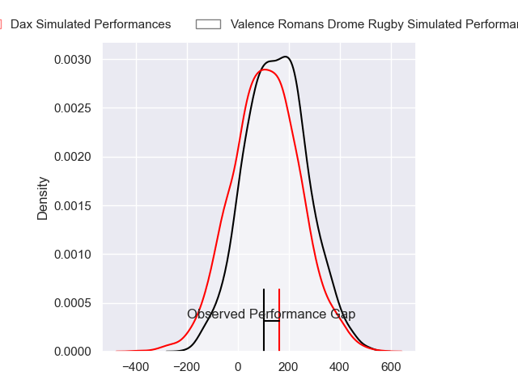
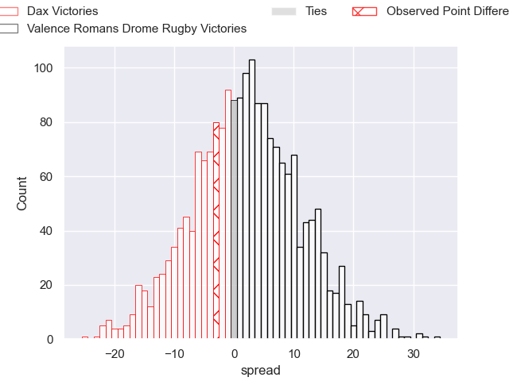
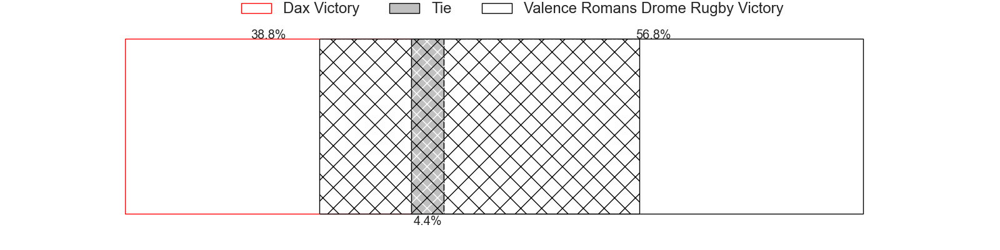

---  
layout: page  
title: Dax at Valence Romans Drome Rugby; 32-29  
date: 2024-09-06 18:00:00 -0500  
categories: "Pro D2 2024" match review  
---
# Dax at Valence Romans Drome Rugby; 32-29

# Club Level Predictions

The first set of predictions treats a club as the smallest object, as the club develops its members, organizes a gameplan, and deploys its players as needed for each match. This club model has a prediction of 0.62, which translates to predicting Valence Romans Drome Rugby to win by 4.3.

Our Over/Under is 31.5 - and combined with the spread above, we have a predicted scoreline of 14 to 18

Each club has a rating and a rating deviation (similar to a Glicko rating), and expected performances can be generated. This allows for simulated matches and spreads like the ones below.
## Projected Performances - Club Model

## Projected Spreads - Club Model

## Projected Results - Club Model

# Player Level Predictions

Treating teams instead as an entity made up of the currently active players, I have ratings for each player in an altogether different system. These can be combined to form team ratings once teamsheets are announced, weighting starters a bit higher than the reserves. After the match is played, players can be weighted by their minutes on the field, allowing for an accurate measure of the team's composition. With these compiled team ratings, we can make predictions, measure inaccuracy, and update the individual player ratings.
## Prediction without Player Minutes: Valence Romans Drome Rugby by 6.5

Valence Romans Drome Rugby by 3.5 on a neutral pitch

## Projected Performances - Player Model

## Projected Spreads - Player Model

## Projected Results - Player Model

|   Away Minutes | Away Player           |   Away Percentile |   Number |   Home Percentile | Home Player         |   Home Minutes |
|---------------:|:----------------------|------------------:|---------:|------------------:|:--------------------|---------------:|
|             46 | David Lolohea         |             17.35 |        1 |             34.69 | Anthony Aléo        |             51 |
|             80 | Iban Hiriart-Urruty   |             84.79 |        2 |             66.08 | Dorian Marco Pena   |             28 |
|             51 | Diogo Hasse Ferreira  |             10.2  |        3 |             88.44 | Kevin Goze          |             80 |
|             34 | Brice Ferrer          |             44.62 |        4 |             41.64 | Ryan McCauley       |             46 |
|             22 | Jean-Baptiste Singer  |             10.86 |        5 |             69.33 | Florian Goumat      |             40 |
|             80 | Jean-Baptiste Barrère |             37.5  |        6 |              1.71 | Éloi Massot         |             80 |
|             80 | Arnaud Aletti         |             81.84 |        7 |             80.13 | Thembelani Bholi    |             58 |
|             80 | Paul Arnaud Ausset    |             67.26 |        8 |             21.46 | Ilia Spanderashvili |             80 |
|             80 | Sylvère Reteau        |             80.73 |        9 |             78.91 | Thomas Lhusero      |             80 |
|             40 | Hugo Cerisier         |             73.41 |       10 |             23.41 | Lucas Meret         |             80 |
|             23 | Diego Miranda         |             48.35 |       11 |             95.89 | Adam Vargas         |             25 |
|             80 | Jale Vatubua          |              0.23 |       12 |              3.06 | Mathieu Guillomot   |             80 |
|             80 | Benjamin Puntous      |             21.79 |       13 |             84.68 | Ben Neiceru         |             52 |
|             26 | Maxime Oltmann        |              7.02 |       14 |              2.61 | Owen Lane           |             80 |
|             74 | Théo Gatelier         |             83.3  |       15 |             13.27 | Thomas Roziere      |             80 |
|             80 | Louis Barrere         |             16.26 |       16 |             72.76 | Mathieu Vachon      |             21 |
|             80 | Louis Mary            |             81.46 |       17 |             43.91 | Adrien Roux         |             80 |
|             80 | Nephi Leatigaga       |             29.76 |       18 |             84.66 | Darren O'Shea       |             58 |
|             34 | Ratu Nacika           |             39.16 |       19 |             77.89 | Andrea Pontanier    |             22 |
|             34 | Étienne Loiret        |             71.67 |       20 |             13.64 | Mattéo Rodor        |             17 |
|             29 | Noah Nene             |             41.2  |       21 |             31.55 | Gareth Milasinovich |             46 |
|             29 | Bastien Daguerre      |             67.65 |       22 |              2.45 | Cyril Deligny       |             46 |
|             46 | Paul Ravier           |             82.18 |       23 |            nan    | nan                 |            nan |

