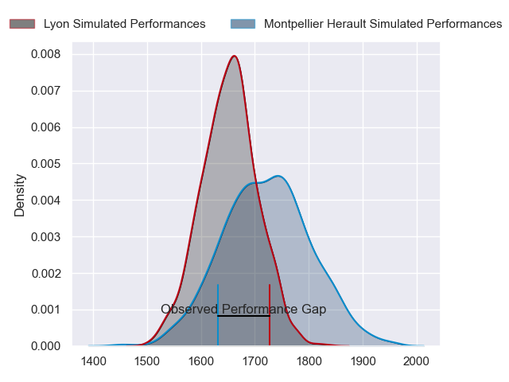
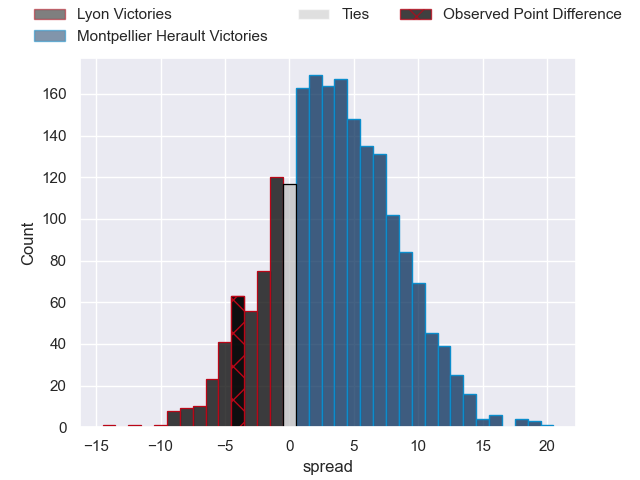
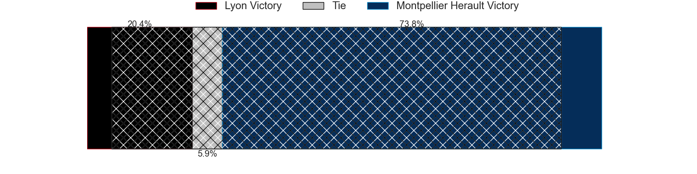
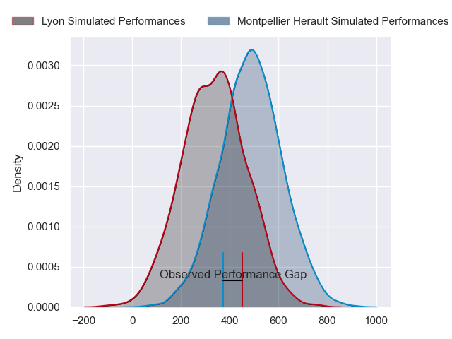
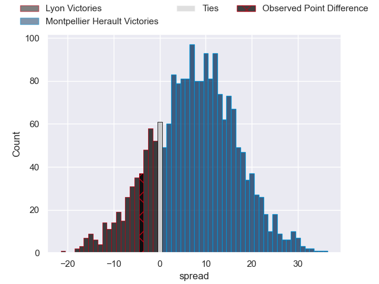

---  
layout: page  
title: Lyon at Montpellier Herault; 26-22  
date: 2024-09-07 18:00:00 -0500  
categories: "Top 14 Orange 2024" match review  
---
# Lyon at Montpellier Herault; 26-22

# Club Level Predictions

The first set of predictions treats a club as the smallest object, as the club develops its members, organizes a gameplan, and deploys its players as needed for each match. This club model has a prediction of 0.597, which translates to predicting Montpellier Herault to win by 3.5.

Our Over/Under is 32.5 - and combined with the spread above, we have a predicted scoreline of 14 to 18

Each club has a rating and a rating deviation (similar to a Glicko rating), and expected performances can be generated. This allows for simulated matches and spreads like the ones below.
## Projected Performances - Club Model

## Projected Spreads - Club Model

## Projected Results - Club Model

# Player Level Predictions

Treating teams instead as an entity made up of the currently active players, I have ratings for each player in an altogether different system. These can be combined to form team ratings once teamsheets are announced, weighting starters a bit higher than the reserves. After the match is played, players can be weighted by their minutes on the field, allowing for an accurate measure of the team's composition. With these compiled team ratings, we can make predictions, measure inaccuracy, and update the individual player ratings.
## Prediction without Player Minutes: Montpellier Herault by 6.7

Lyon by 1.0 on a neutral pitch

## Projected Performances - Player Model

## Projected Spreads - Player Model

## Projected Results - Player Model

|   Away Minutes | Away Player          |   Away Percentile |   Number |   Home Percentile | Home Player         |   Home Minutes |
|---------------:|:---------------------|------------------:|---------:|------------------:|:--------------------|---------------:|
|             53 | Hamza Kaabeche       |              9.35 |        1 |              1.87 | Baptiste Erdocio    |             80 |
|             80 | Sam Matavesi         |             92.13 |        2 |             87.94 | Christopher Tolofua |             80 |
|             51 | Cedate Gomes Sa      |             82.48 |        3 |             49.57 | Wilfrid Hounkpatin  |             80 |
|             53 | Felix Lambey         |             85.41 |        4 |             88.07 | Yacouba Camara      |             60 |
|             47 | Mickael Guillard     |             80.4  |        5 |             39.83 | Tyler Duguid        |             52 |
|             52 | Steeve Blanc-Mappaz  |             73.61 |        6 |             79.7  | Lenni Nouchi        |             80 |
|             80 | Beka Saghinadze      |             86.32 |        7 |             39.64 | Alexandre Becognee  |             20 |
|             61 | Beka Shvangiradze    |             64.82 |        8 |             96.24 | Billy Vunipola      |             66 |
|             80 | Baptiste Couilloud   |             96.36 |        9 |             50.91 | Leo Coly            |             29 |
|             80 | Leo Berdeu           |             85.91 |       10 |             50.91 | Thomas Vincent      |              3 |
|             80 | Monty Ioane          |             98.29 |       11 |              3.31 | Gabriel Ngandebe    |             80 |
|             80 | Theo Millet          |             81.27 |       12 |             57.66 | Arthur Vincent      |             28 |
|             61 | Josiah Maraku        |             11.69 |       13 |             11.92 | Thomas Darmon       |             55 |
|             80 | Davit Niniashvili    |             90.77 |       14 |             92.48 | Madosh Tambwe       |             58 |
|             31 | Davit Niniashvili    |             90.77 |       14 |             92.48 | Madosh Tambwe       |             58 |
|             28 | Alexandre Tchaptchet |             68.65 |       15 |             97.71 | Stuart Hogg         |             55 |
|             45 | Jerome Rey           |             31.89 |       16 |             70.92 | Luca Tabarot        |             53 |
|             25 | Jermaine Ainsley     |             83.59 |       17 |             83.39 | Vano Karkadze       |             80 |
|             14 | Arno Botha           |             92.84 |       18 |             79.42 | Mohamed Haouas      |              7 |
|             19 | Guillaume Marchand   |             20.1  |       19 |             75.29 | Julien Tisseron     |             80 |
|             31 | Dylan Cretin         |             80.88 |       20 |             92.92 | Marco Tauleigne     |             80 |
|             52 | Martin Meliande      |              7.27 |       21 |             80.83 | Bastien Chalureau   |             80 |
|             19 | Vincent Rattez       |             96.79 |       22 |             95.82 | Ryan Louwrens       |             80 |
|            nan | nan                  |            nan    |       23 |             17.48 | Auguste Cadot       |             27 |

