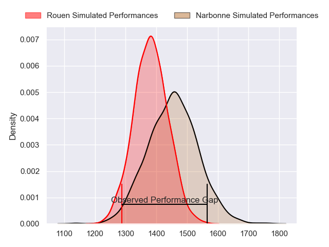
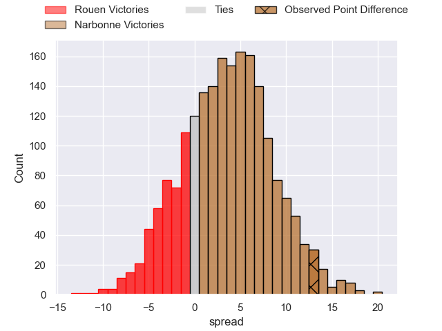
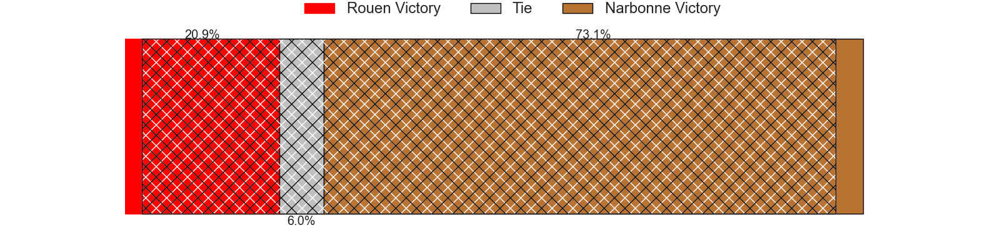
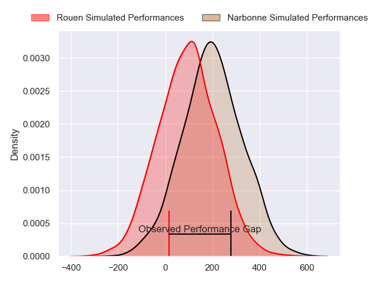
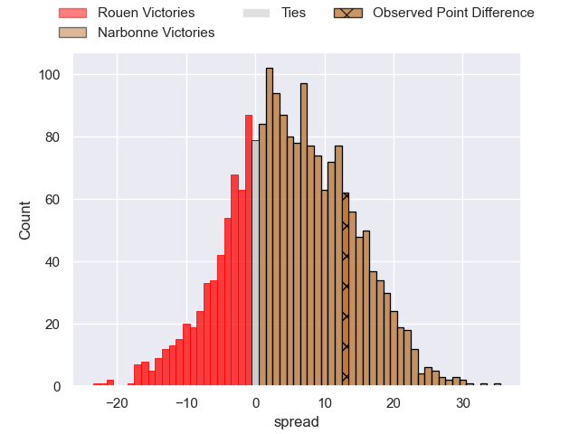
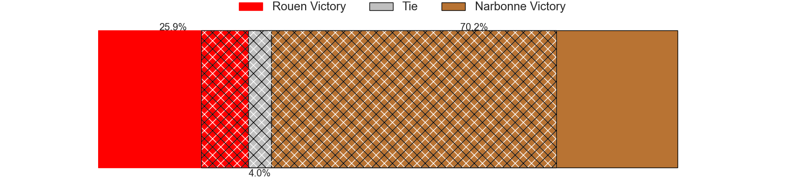

---  
layout: page  
title: Rouen at Narbonne; 23-36  
date: 2024-09-07 18:00:00 -0500  
categories: "Nationale 2024" match review  
---
# Rouen at Narbonne; 23-36

# Club Level Predictions

The first set of predictions treats a club as the smallest object, as the club develops its members, organizes a gameplan, and deploys its players as needed for each match. This club model has a prediction of 0.599, which translates to predicting Narbonne to win by 3.5.

Our Over/Under is 33.5 - and combined with the spread above, we have a predicted scoreline of 15 to 19

Each club has a rating and a rating deviation (similar to a Glicko rating), and expected performances can be generated. This allows for simulated matches and spreads like the ones below.
## Projected Performances - Club Model

## Projected Spreads - Club Model

## Projected Results - Club Model

# Player Level Predictions

Treating teams instead as an entity made up of the currently active players, I have ratings for each player in an altogether different system. These can be combined to form team ratings once teamsheets are announced, weighting starters a bit higher than the reserves. After the match is played, players can be weighted by their minutes on the field, allowing for an accurate measure of the team's composition. With these compiled team ratings, we can make predictions, measure inaccuracy, and update the individual player ratings.
## Prediction without Player Minutes: Narbonne by 7.0

Rouen by 1.2 on a neutral pitch

## Projected Performances - Player Model

## Projected Spreads - Player Model

## Projected Results - Player Model

|   Away Minutes | Away Player           |   Away Percentile |   Number |   Home Percentile | Home Player               |   Home Minutes |
|---------------:|:----------------------|------------------:|---------:|------------------:|:--------------------------|---------------:|
|             80 | Noe Khier             |             38.69 |        1 |             15.31 | Gregory Fichten           |             80 |
|             64 | German Kessler        |              8.92 |        2 |             18.53 | Clément Esteriola         |             80 |
|             25 | Diego Arbelo          |             26.28 |        3 |             29.25 | Mohammed Loukia           |             50 |
|             80 | Corentin Vernet       |             22.58 |        4 |             90.2  | Darrell Dyer              |             47 |
|             68 | Oliver Cooper         |             40.04 |        5 |             16.4  | Leva Fifita               |             80 |
|             80 | Manolo Laffond        |             35.58 |        6 |             56.09 | Thibault Clauzade         |             80 |
|             80 | Lucas Costa           |             45.83 |        7 |              7.8  | Paul Belzons              |             80 |
|             80 | Abdelkarim Fofana     |             63.94 |        8 |             37.17 | Charles Malet             |             80 |
|             80 | Ilan El Khattabi      |              4.73 |        9 |              1.09 | James Hart                |             80 |
|             30 | Benjamin Pehau        |             78.86 |       10 |              5    | Gilles Bosch              |             40 |
|             80 | Marin Boulier         |             38.52 |       11 |             84.95 | Clément Clavières         |             80 |
|             12 | Theo Dachary          |              7.26 |       12 |             64.81 | Parataiso Silafai-Lea'ana |             17 |
|             56 | Nicolas Nieto         |             47.56 |       13 |             99.43 | Peter Betham              |             17 |
|             80 | Sakiusa Bureitakiyaca |             50.75 |       14 |             48.65 | Taqele Naiyaravoro        |             80 |
|             40 | Benjamin Debetz       |             38.44 |       15 |              0.46 | Boris Goutard             |             80 |
|             55 | Axel Malaret          |             50.11 |       16 |             57.4  | Geoffrey Moise            |             16 |
|             63 | Soulemane Camara      |            nan    |       17 |             90.73 | Mehdi Boundjema           |             15 |
|             64 | Sidi-Mohammed Diallo  |            nan    |       18 |             75.6  | Jamie Hagan               |             16 |
|            nan | nan                   |            nan    |       19 |             77.21 | Marius Antonescu          |             63 |
|            nan | nan                   |            nan    |       20 |             81.52 | Luke Nakobukobua          |             40 |
|            nan | nan                   |            nan    |       21 |             75.82 | Pablo Barbaste            |             65 |
|            nan | nan                   |            nan    |       22 |             53.86 | Tom Chauvet               |             80 |
|            nan | nan                   |            nan    |       23 |             55.85 | Pierre Nueno              |             40 |

