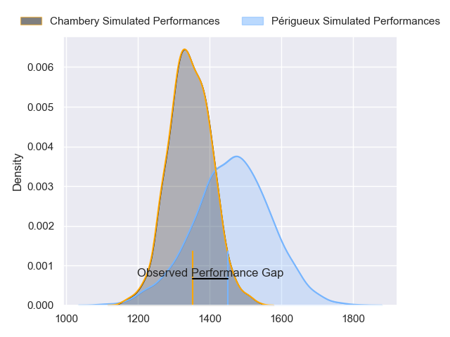
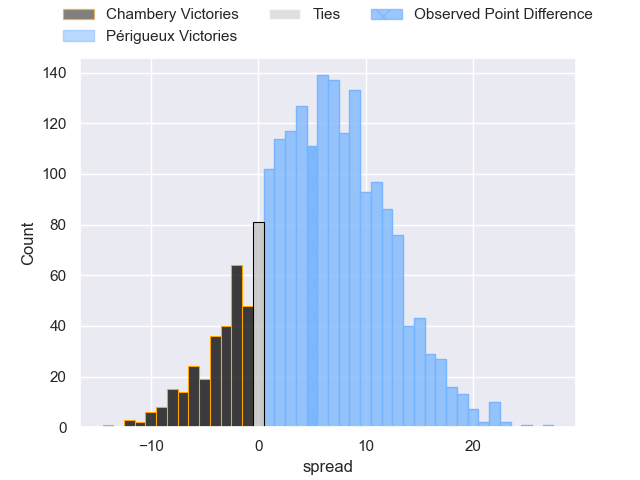
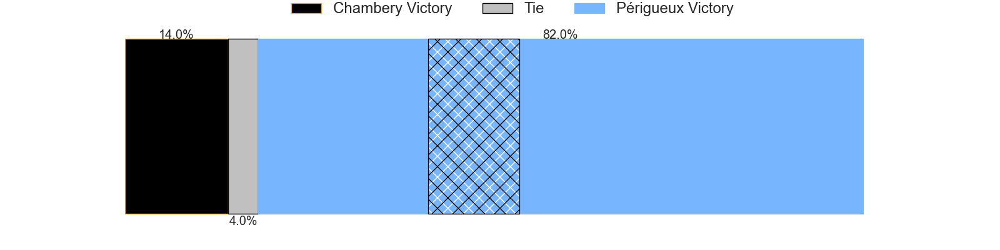
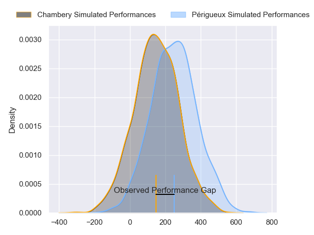
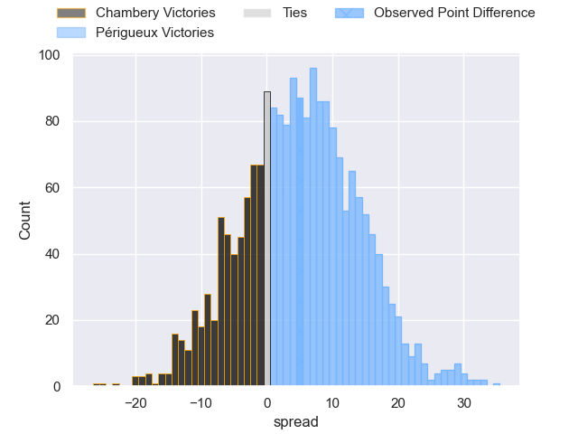
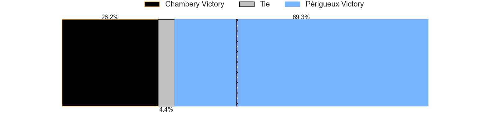

---  
layout: page  
title: Chambery at Perigueux; 13-18  
date: 2024-09-07 18:00:00 -0500  
categories: "Nationale 2024" match review  
---
# Chambery at Perigueux; 13-18

# Club Level Predictions

The first set of predictions treats a club as the smallest object, as the club develops its members, organizes a gameplan, and deploys its players as needed for each match. This club model has a prediction of 0.662, which translates to predicting Périgueux to win by 6.0.

Our Over/Under is 32.5 - and combined with the spread above, we have a predicted scoreline of 13 to 19

Each club has a rating and a rating deviation (similar to a Glicko rating), and expected performances can be generated. This allows for simulated matches and spreads like the ones below.
## Projected Performances - Club Model

## Projected Spreads - Club Model

## Projected Results - Club Model

# Player Level Predictions

Treating teams instead as an entity made up of the currently active players, I have ratings for each player in an altogether different system. These can be combined to form team ratings once teamsheets are announced, weighting starters a bit higher than the reserves. After the match is played, players can be weighted by their minutes on the field, allowing for an accurate measure of the team's composition. With these compiled team ratings, we can make predictions, measure inaccuracy, and update the individual player ratings.
## Prediction without Player Minutes: Périgueux by 4.6

Périgueux by 2.0 on a neutral pitch

## Projected Performances - Player Model

## Projected Spreads - Player Model

## Projected Results - Player Model

|   Away Minutes | Away Player                  |   Away Percentile |   Number |   Home Percentile | Home Player         |   Home Minutes |
|---------------:|:-----------------------------|------------------:|---------:|------------------:|:--------------------|---------------:|
|             17 | Gela Murusidze               |             45.41 |        1 |             69.3  | Emilien Borges      |             28 |
|             75 | Quentin Beaudaux             |             51.05 |        2 |              1.05 | Manu Leiataua       |             80 |
|             50 | Lasha Tabidze                |             67.69 |        3 |             46.09 | Kalaveti Tawake     |             52 |
|             30 | Ahmed Tidiane Kane           |             72.95 |        4 |             44.41 | Clement Lanen       |             52 |
|             50 | Fabien Witz                  |             53.57 |        5 |             35.36 | Damien Lavergne     |             78 |
|             80 | Pierre-Nicolas Dance         |             53.42 |        6 |              8.01 | Madioke Konate      |              5 |
|             30 | Colin Lebian                 |             53.21 |        7 |             93.8  | Afaesetiti Amosa    |             80 |
|             52 | Taniela Matakaiongo          |             32.08 |        8 |             58.85 | Karl Lambert        |             63 |
|             80 | Sonatane Takulua             |              6    |        9 |             28.73 | Nicolas Faltrept    |             79 |
|              1 | Arwel Robson                 |             42.27 |       10 |             66.59 | Juan Kotze          |             61 |
|             61 | Arthur Nennig                |             83.75 |       11 |             82.25 | Axel Muller         |             80 |
|             80 | Youenn Floch                 |             48.92 |       12 |             87.51 | Cyril Couturier     |             80 |
|             80 | Joseph Exshaw                |             44.84 |       13 |             56.87 | Dorian Lavernhe     |             52 |
|             80 | Martin Bonnet                |             46.44 |       14 |             82.65 | Vincent Fouillade   |             41 |
|             80 | Enzo Marzocca                |             48.51 |       15 |             50.8  | Anderson Neisen     |             80 |
|             48 | Paul Baptiste Florent Altier |             69.11 |       16 |             84.34 | Fred Hickes         |             80 |
|             48 | Seru Uru                     |             73.16 |       17 |             65.05 | Anthony Pelmard     |             80 |
|             48 | Emmanuel Vaitulukina         |             82.18 |       18 |             67.63 | Raphaël Vieilledent |             80 |
|             32 | Matheo Triki                 |             87.71 |       19 |             77.1  | Louis Martin        |             39 |
|             32 | Osman Dimen                  |             34.01 |       20 |             78.06 | Thomas Vidal        |             80 |
|             80 | Antoine Ferreira             |            nan    |       21 |             63.89 | Hendri Storm        |             28 |
|             80 | Nugzar Somkhishvili          |             81.55 |       22 |             15.35 | Paul Piveteau       |             28 |
|              2 | Yan Tabarot                  |              1.75 |       23 |             57.82 | Matteo Bordenave    |             28 |

