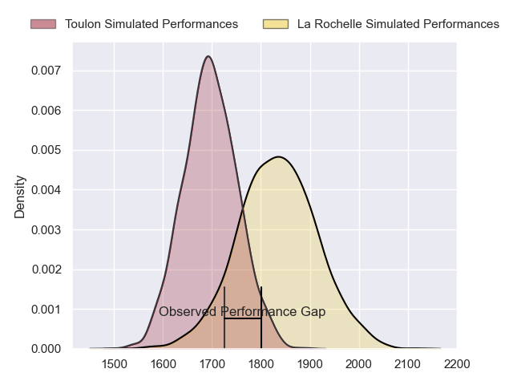
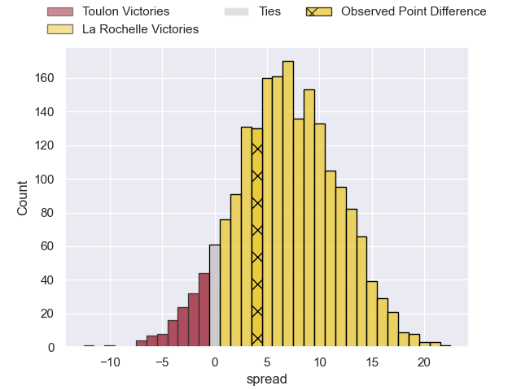
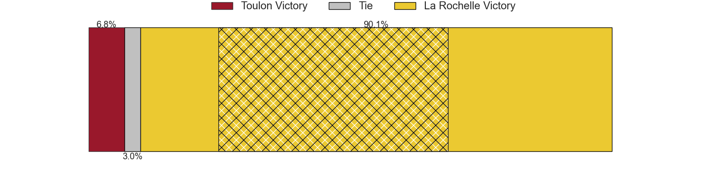
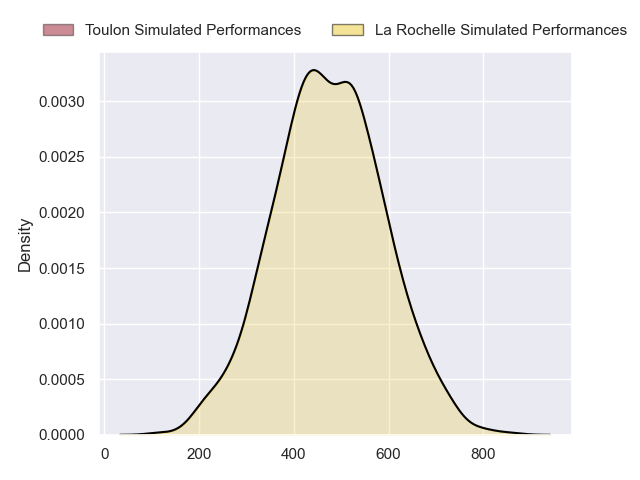
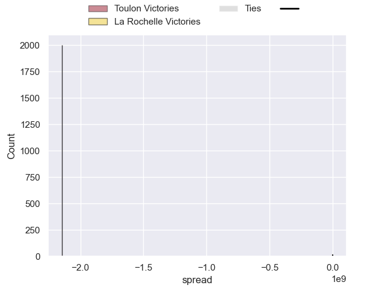

---  
layout: page  
title: Toulon at La Rochelle; 15-19  
date: 2024-09-08 18:00:00 -0500  
categories: "Top 14 Orange 2024" match review  
---
# Toulon at La Rochelle; 15-19

# Club Level Predictions

The first set of predictions treats a club as the smallest object, as the club develops its members, organizes a gameplan, and deploys its players as needed for each match. This club model has a prediction of 0.685, which translates to predicting La Rochelle to win by 6.8.

Our Over/Under is 43.5 - and combined with the spread above, we have a predicted scoreline of 18 to 25

Each club has a rating and a rating deviation (similar to a Glicko rating), and expected performances can be generated. This allows for simulated matches and spreads like the ones below.
## Projected Performances - Club Model

## Projected Spreads - Club Model

## Projected Results - Club Model

# Player Level Predictions

Treating teams instead as an entity made up of the currently active players, I have ratings for each player in an altogether different system. These can be combined to form team ratings once teamsheets are announced, weighting starters a bit higher than the reserves. After the match is played, players can be weighted by their minutes on the field, allowing for an accurate measure of the team's composition. With these compiled team ratings, we can make predictions, measure inaccuracy, and update the individual player ratings.
## Prediction without Player Minutes: La Rochelle by 8.8

La Rochelle by 1.5 on a neutral pitch

## Projected Performances - Player Model

## Projected Spreads - Player Model

## Projected Results - Player Model

|   Away Minutes | Away Player            |   Away Percentile |   Number |   Home Percentile | Home Player           |   Home Minutes |
|---------------:|:-----------------------|------------------:|---------:|------------------:|:----------------------|---------------:|
|             48 | Dany Priso             |             92.77 |        1 |            nan    | Reda Wardi            |             45 |
|             80 | Teddy Baubigny         |             77.62 |        2 |            nan    | Pierre Bourgarit      |             80 |
|             80 | Kyle Sinckler          |             92.35 |        3 |            nan    | Alexandre Kuntelia    |             40 |
|             80 | Yannick Youyoutte      |             72.31 |        4 |            nan    | Thomas Lavault        |             80 |
|             28 | David Ribbans          |             78.06 |        5 |            nan    | Will Skelton          |             80 |
|             71 | Lewis Ludlam           |             46.58 |        6 |            nan    | Judicael Cancoriet    |             31 |
|             80 | Esteban Abadie         |             73.4  |        7 |            nan    | Matthias Haddad       |             48 |
|              9 | Charles Ollivon        |             98.67 |        8 |            nan    | Gregory Alldritt      |              9 |
|             80 | Baptiste Serin         |             98.36 |        9 |            nan    | Tawera Kerr-Barlow    |             49 |
|             68 | Dan Biggar             |             98.86 |       10 |            nan    | Ihaia West            |             28 |
|             80 | Gabin Villiere         |             91.68 |       11 |            nan    | Jules Favre           |             65 |
|             80 | Jérémy Sinzelle        |             20.54 |       12 |            nan    | Jonathan Danty        |             80 |
|             32 | Leicester Fainga'anuku |             90.58 |       13 |            nan    | Ulupano Seuteni       |             12 |
|             32 | Gael Drean             |             22.67 |       14 |            nan    | Jack Nowell           |             31 |
|             32 | Duncan Paia'aua        |            nan    |       15 |            nan    | Dillyn Leyds          |             31 |
|             35 | Daniel Brennan         |             20.24 |       16 |             31.21 | Louis Penverne        |             80 |
|             52 | Mickael Ivaldi         |             94.76 |       17 |             90.38 | Tolu Latu             |              9 |
|             15 | Emerick Setiano        |             94.81 |       18 |              2.72 | Georges-Henri Colombe |             49 |
|             80 | Brian Alainu'uese      |             93.93 |       19 |             81.15 | Kane Douglas          |             80 |
|             66 | Matteo Le Corvec       |             70.83 |       20 |              9.4  | Paul Boudehent        |             80 |
|             40 | Jules Danglot          |             68.55 |       21 |             78.73 | Thomas Berjon         |             52 |
|             80 | Enzo Herve             |             81.82 |       22 |             81.36 | Antoine Hastoy        |             71 |
|             58 | Seta Tuicuvu           |             77.53 |       23 |             89.97 | Teddy Thomas          |             48 |

