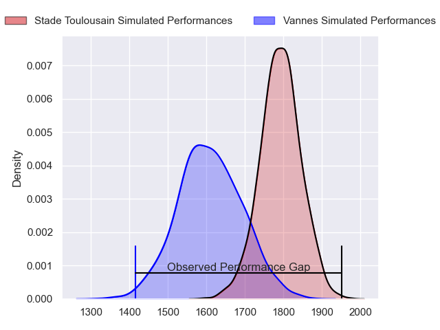
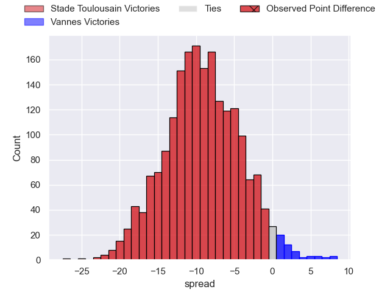
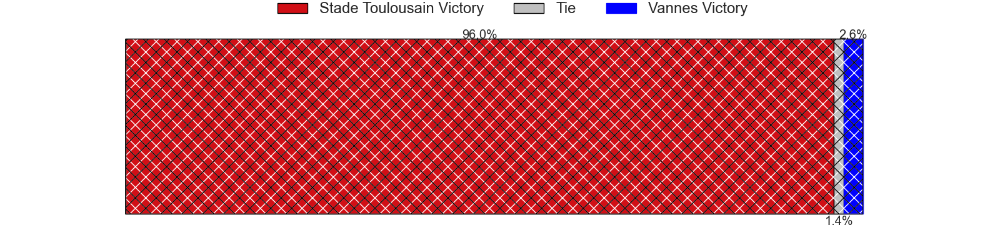
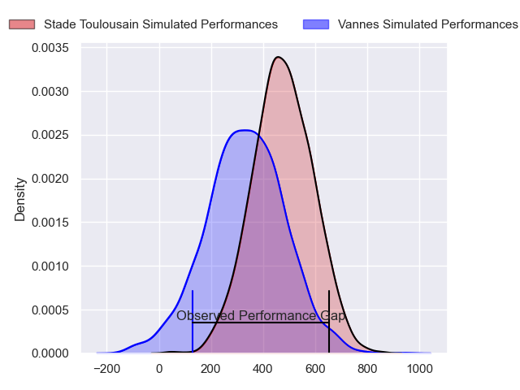
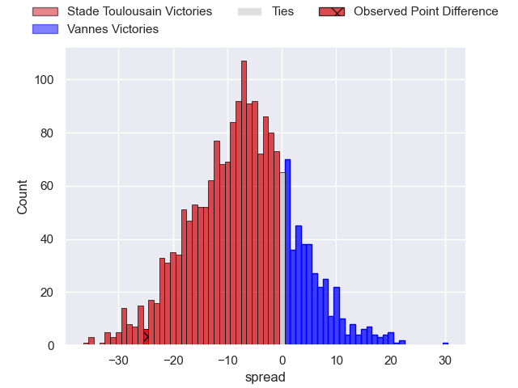
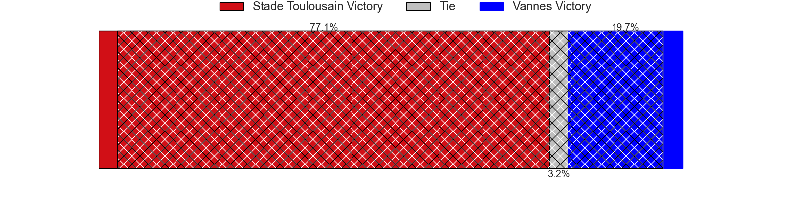

---  
layout: page  
title: Stade Toulousain at Vannes; 43-18  
date: 2024-09-08 18:00:00 -0500  
categories: "Top 14 Orange 2024" match review  
---
# Stade Toulousain at Vannes; 43-18

# Club Level Predictions

The first set of predictions treats a club as the smallest object, as the club develops its members, organizes a gameplan, and deploys its players as needed for each match. This club model has a prediction of 0.259, which translates to predicting Stade Toulousain to win by 9.2.

Our Over/Under is 43.5 - and combined with the spread above, we have a predicted scoreline of 26 to 17

Each club has a rating and a rating deviation (similar to a Glicko rating), and expected performances can be generated. This allows for simulated matches and spreads like the ones below.
## Projected Performances - Club Model

## Projected Spreads - Club Model

## Projected Results - Club Model

# Player Level Predictions

Treating teams instead as an entity made up of the currently active players, I have ratings for each player in an altogether different system. These can be combined to form team ratings once teamsheets are announced, weighting starters a bit higher than the reserves. After the match is played, players can be weighted by their minutes on the field, allowing for an accurate measure of the team's composition. With these compiled team ratings, we can make predictions, measure inaccuracy, and update the individual player ratings.
## Prediction without Player Minutes: Stade Toulousain by 6.5

Stade Toulousain by 10.5 on a neutral pitch

## Projected Performances - Player Model

## Projected Spreads - Player Model

## Projected Results - Player Model

|   Away Minutes | Away Player       |   Away Percentile |   Number |   Home Percentile | Home Player              |   Home Minutes |
|---------------:|:------------------|------------------:|---------:|------------------:|:-------------------------|---------------:|
|             80 | Rodrigue Neti     |             78.4  |        1 |             99.74 | Mako Vunipola            |             57 |
|             13 | Julien Marchand   |             99.13 |        2 |             79.72 | Pat Leafa                |             80 |
|             80 | Dorian Aldegheri  |             97.62 |        3 |              5.78 | Santiago Medrano         |             57 |
|             80 | Dorian Aldegheri  |             97.62 |        3 |              5.78 | Santiago Medrano         |             80 |
|             80 | Dorian Aldegheri  |             97.62 |        3 |              5.78 | Santiago Medrano         |             73 |
|             80 | Dorian Aldegheri  |             97.62 |        3 |              5.78 | Santiago Medrano         |             18 |
|             62 | Joshua Brennan    |             87.75 |        4 |             70.82 | Anton Bresler            |             57 |
|             62 | Thibaud Flament   |             96.06 |        5 |             82.43 | Fabrice Metz             |             57 |
|             80 | Francois Cros     |             98.82 |        6 |             92.74 | Joe Edwards              |             80 |
|             50 | Jack Willis       |             95.41 |        7 |             98.29 | Francisco Gorrissen      |             50 |
|             80 | Alexandre Roumat  |             96.68 |        8 |             47.12 | Sione Kalamafoni         |             62 |
|             48 | Paul Graou        |             45.09 |        9 |             92.91 | Michael Ruru             |             57 |
|             48 | Romain Ntamack    |             96.59 |       10 |             94.09 | Maxime Lafage            |             23 |
|             80 | Ange Capuozzo     |             98.6  |       11 |             85.56 | Filipo Nakosi            |             62 |
|             18 | Pita Ahki         |             65.04 |       12 |              4.2  | Alex Arrate              |             62 |
|             80 | Paul Costes       |             78.43 |       13 |             10.78 | Francis Saili            |             23 |
|             18 | Blair Kinghorn    |             99.8  |       14 |             89.37 | Salesi Rayasi            |             30 |
|             32 | Thomas Ramos      |             97.03 |       15 |             98.4  | Gwenaël Duplenne         |             30 |
|             30 | Benjamin Bertrand |              7.99 |       16 |             95.92 | Paga Tafili              |             62 |
|             18 | Guillaume Cramont |             81.12 |       17 |            nan    | Thomas Moukoro           |             18 |
|             32 | David Ainu'u      |             93.45 |       18 |             68.53 | Théo Beziat              |              7 |
|             62 | Emmanuel Meafou   |             90.73 |       19 |              5.22 | Christiaan van der Merwe |             14 |
|             18 | Clement Verge     |             71.03 |       20 |             25.85 | Léon Boulier             |             80 |
|             18 | Theo Ntamack      |             53.1  |       21 |             87.17 | Kitione Kamikamica       |             50 |
|              0 | Naoto Saito       |              9.45 |       22 |             47.82 | Jules Le Bail            |             80 |
|             12 | Matthis Lebel     |             98.8  |       23 |             61.1  | Thibault Debaes          |             80 |

