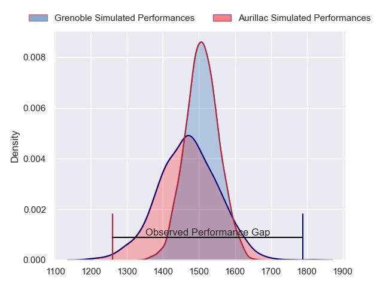
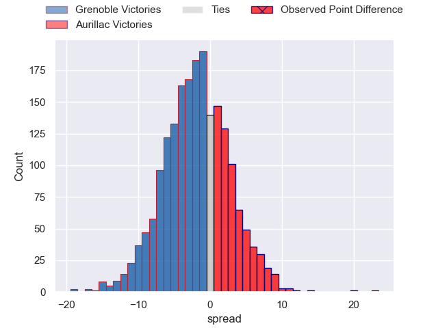
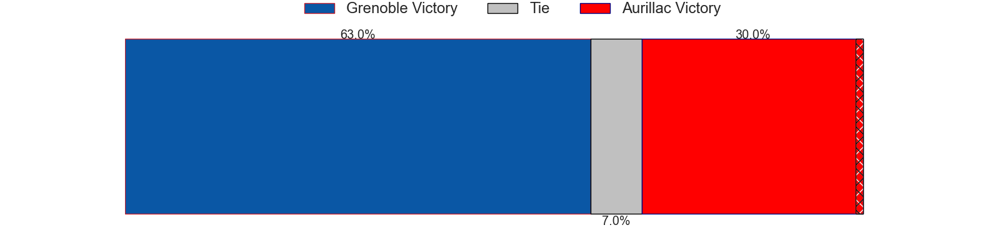
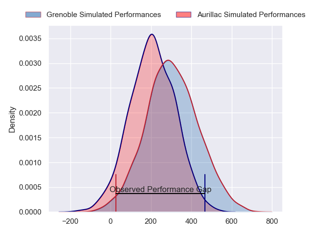
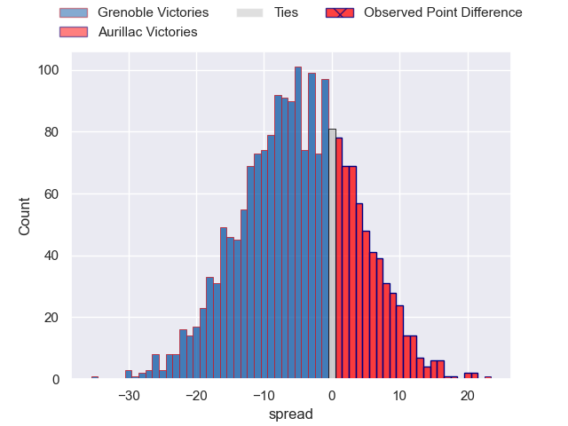
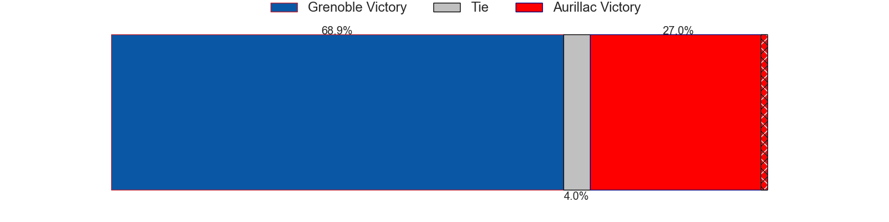

---  
layout: page  
title: Grenoble at Aurillac; 19-42  
date: 2024-09-13 18:00:00 -0500  
categories: "Pro D2 2024" match review  
---
# Grenoble at Aurillac; 19-42

# Club Level Predictions

The first set of predictions treats a club as the smallest object, as the club develops its members, organizes a gameplan, and deploys its players as needed for each match. This club model has a prediction of 0.45, which translates to predicting Grenoble to win by 1.8.

Our Over/Under is 42.5 - and combined with the spread above, we have a predicted scoreline of 22 to 20

Each club has a rating and a rating deviation (similar to a Glicko rating), and expected performances can be generated. This allows for simulated matches and spreads like the ones below.
## Projected Performances - Club Model

## Projected Spreads - Club Model

## Projected Results - Club Model

# Player Level Predictions

Treating teams instead as an entity made up of the currently active players, I have ratings for each player in an altogether different system. These can be combined to form team ratings once teamsheets are announced, weighting starters a bit higher than the reserves. After the match is played, players can be weighted by their minutes on the field, allowing for an accurate measure of the team's composition. With these compiled team ratings, we can make predictions, measure inaccuracy, and update the individual player ratings.
## Prediction without Player Minutes: Grenoble by 4.1

Grenoble by 12.1 on a neutral pitch

## Projected Performances - Player Model

## Projected Spreads - Player Model

## Projected Results - Player Model

|   Away Minutes | Away Player         |   Away Percentile |   Number |   Home Percentile | Home Player           |   Home Minutes |
|---------------:|:--------------------|------------------:|---------:|------------------:|:----------------------|---------------:|
|             80 | Zack Gauthier       |            nan    |        1 |              7.27 | Robert Rodgers        |             20 |
|             26 | Bastien Soury       |             45.97 |        2 |             48.35 | Ronan Loughnane       |             80 |
|             54 | Cody Thomas         |            nan    |        3 |             78    | Giorgi Kartvelishvili |             80 |
|             59 | Pierce Phillips     |            nan    |        4 |             22.54 | Louis Bruinsma        |             26 |
|             26 | Giorgi Javakhia     |            nan    |        5 |             48.18 | Martial Rolland       |             62 |
|             80 | Antonin Berruyer    |             47.35 |        6 |             83.19 | Eoghan Masterson      |             54 |
|             51 | Victor Guillaumond  |            nan    |        7 |             61.06 | Tim De Jong           |             57 |
|             80 | Pio Muarua          |            nan    |        8 |             52.57 | Didier Tison          |             49 |
|             80 | Eric Escande        |            nan    |        9 |             36.62 | David Delarue         |             80 |
|             59 | Max Clement         |             61.1  |       10 |             62.05 | Tedo Abzhandadze      |             18 |
|             80 | Wilfried Hulleu     |             75.26 |       11 |             44.25 | Axel Bevia            |             60 |
|             53 | Bautista Ezcurra    |            nan    |       12 |             62.88 | Karsen Talalua        |             53 |
|             80 | Giorgi Kveseladze   |             87.7  |       13 |             50.35 | Karl Martin           |             23 |
|             20 | Geoffrey Cros       |            nan    |       14 |             54.72 | Lucas Oudard          |             21 |
|             55 | Marc Palmier        |              8.14 |       15 |             42.56 | Ugo Seunes            |             20 |
|             50 | Sam Davies          |            nan    |       16 |             59.07 | Irakli Mtchedlidze    |             80 |
|             27 | Giorgi Mamaiashvili |             40.67 |       17 |              8.97 | Luka Nioradze         |             80 |
|             80 | Lilian Rossi        |             36.45 |       18 |             69.83 | Mikheil Alania        |             80 |
|             29 | Richard Hardwick    |             73.6  |       19 |             69.36 | Hugo Huurman          |             31 |
|             21 | Thomas Ployet       |             24.53 |       20 |             57.54 | Hugo Bastard          |             31 |
|             54 | Mathis Baret        |            nan    |       21 |            nan    | Valentin Welsch       |             26 |
|             80 | Romain Trouilloud   |             83.99 |       22 |             26.74 | Mehdi Slamani         |             60 |
|             27 | Giorgi Pertaia      |             86.06 |       23 |             39.12 | Mael Perrin           |             54 |

