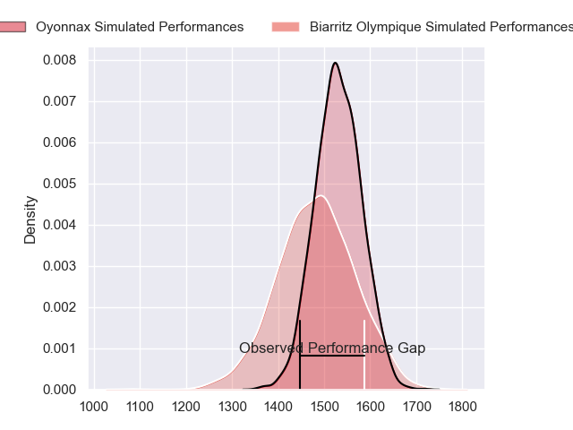
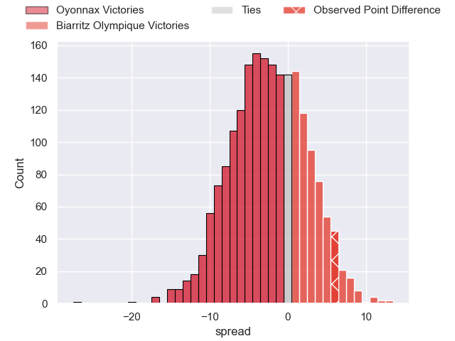
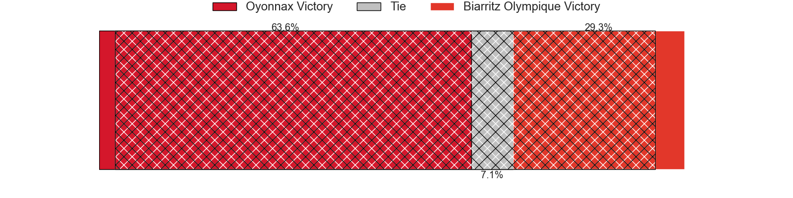
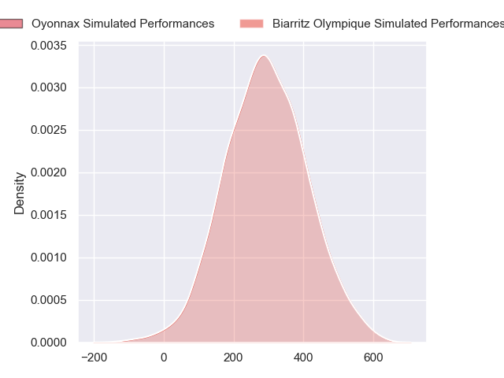
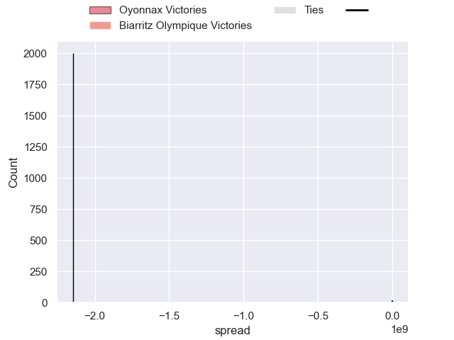

---  
layout: page  
title: Oyonnax at Biarritz Olympique; 13-19  
date: 2024-09-13 18:00:00 -0500  
categories: "Pro D2 2024" match review  
---
# Oyonnax at Biarritz Olympique; 13-19

# Club Level Predictions

The first set of predictions treats a club as the smallest object, as the club develops its members, organizes a gameplan, and deploys its players as needed for each match. This club model has a prediction of 0.429, which translates to predicting Oyonnax to win by 2.5.

Our Over/Under is 41.5 - and combined with the spread above, we have a predicted scoreline of 22 to 19

Each club has a rating and a rating deviation (similar to a Glicko rating), and expected performances can be generated. This allows for simulated matches and spreads like the ones below.
## Projected Performances - Club Model

## Projected Spreads - Club Model

## Projected Results - Club Model

# Player Level Predictions

Treating teams instead as an entity made up of the currently active players, I have ratings for each player in an altogether different system. These can be combined to form team ratings once teamsheets are announced, weighting starters a bit higher than the reserves. After the match is played, players can be weighted by their minutes on the field, allowing for an accurate measure of the team's composition. With these compiled team ratings, we can make predictions, measure inaccuracy, and update the individual player ratings.
## Prediction without Player Minutes: Biarritz Olympique by 12.7

Biarritz Olympique by 3.7 on a neutral pitch

## Projected Performances - Player Model

## Projected Spreads - Player Model

## Projected Results - Player Model

|   Away Minutes | Away Player               |   Away Percentile |   Number |   Home Percentile | Home Player         |   Home Minutes |
|---------------:|:--------------------------|------------------:|---------:|------------------:|:--------------------|---------------:|
|             80 | Oli Kebble                |            nan    |        1 |            nan    | Alexandre Plantier  |              2 |
|             20 | Teddy Durand              |            nan    |        2 |            nan    | Yohan Beheregaray   |             60 |
|             54 | Paulo Tafili              |            nan    |        3 |            nan    | Nikoloz Narmania    |             53 |
|             80 | Ewan Johnson              |             79.13 |        4 |            nan    | Charlie Matthews    |              6 |
|             18 | Manuel Leindekar          |              0.67 |        5 |            nan    | Piula Faasalele     |             80 |
|             57 | Veresa Tuqovu Ramototabua |             54.04 |        6 |            nan    | Cornell du Preez    |             80 |
|             59 | Antoine Miquel            |            nan    |        7 |            nan    | Jessy Jegerlehner   |             10 |
|             45 | Loic Godener              |            nan    |        8 |            nan    | Masivesi Dakuwaqa   |             67 |
|             45 | Vasil Lobzhanidze         |            nan    |        9 |            nan    | Kerman Aurrekoetxea |             12 |
|             80 | Chris Smith               |             70.26 |       10 |            nan    | Thomas Dolhagaray   |             38 |
|             20 | Daniel Ikpefan            |             76.02 |       11 |            nan    | Baptiste Fariscot   |             78 |
|             80 | Chris Farrell             |            nan    |       12 |            nan    | Tyler Morgan        |             80 |
|             80 | Edward Sawailau           |            nan    |       13 |            nan    | Mathieu Acebes      |             27 |
|             35 | Martin Bogado             |             67.04 |       14 |            nan    | Zach Kibirige       |             80 |
|             18 | Justin Bouraux            |            nan    |       15 |            nan    | Kylian Jaminet      |             80 |
|             23 | Kevin Lebreton            |            nan    |       16 |             19.27 | Clement Martinez    |             13 |
|             21 | Phoenix Battye            |            nan    |       17 |            nan    | Giorgi Dzmanashvili |             60 |
|             62 | Adrien Bordenave          |              3.98 |       18 |            nan    | Ekain Imaz Agirre   |             80 |
|             26 | Thibault Berthaud         |             39.61 |       19 |            nan    | Adrian Motoc        |             68 |
|             13 | Kevin Kornath             |             15.39 |       20 |             86.27 | Filimo Taofifenua   |             42 |
|             80 | Peniami Narisia           |            nan    |       21 |             74.59 | Yann David          |             20 |
|             62 | Zack Holmes               |            nan    |       22 |            nan    | Giorgi Nutsubidze   |             60 |
|             67 | Yvan David                |            nan    |       23 |             52.04 | Edgar Retiere       |             80 |

