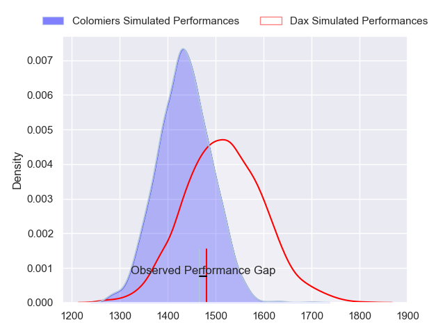
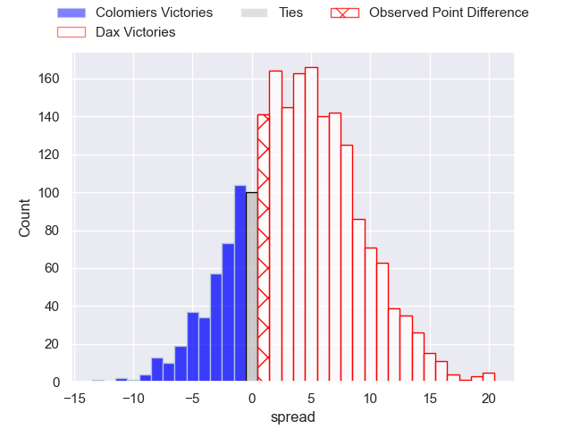
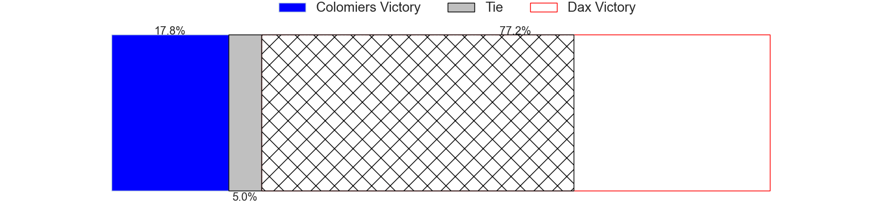
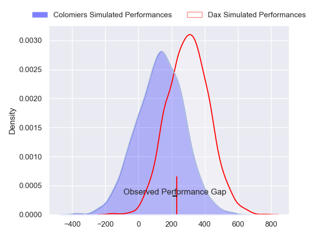
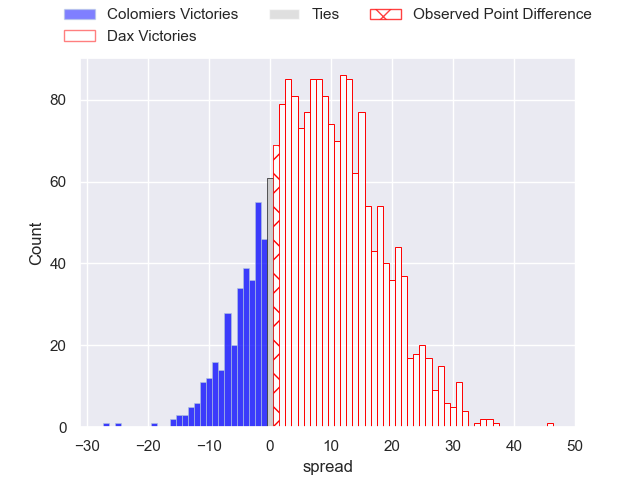
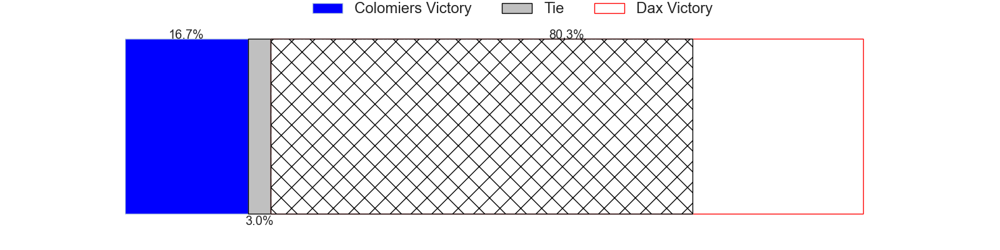

---  
layout: page  
title: Colomiers at Dax; 24-25  
date: 2024-09-13 18:00:00 -0500  
categories: "Pro D2 2024" match review  
---
# Colomiers at Dax; 24-25

# Club Level Predictions

The first set of predictions treats a club as the smallest object, as the club develops its members, organizes a gameplan, and deploys its players as needed for each match. This club model has a prediction of 0.616, which translates to predicting Dax to win by 4.2.

Our Over/Under is 37.5 - and combined with the spread above, we have a predicted scoreline of 16 to 21

Each club has a rating and a rating deviation (similar to a Glicko rating), and expected performances can be generated. This allows for simulated matches and spreads like the ones below.
## Projected Performances - Club Model

## Projected Spreads - Club Model

## Projected Results - Club Model

# Player Level Predictions

Treating teams instead as an entity made up of the currently active players, I have ratings for each player in an altogether different system. These can be combined to form team ratings once teamsheets are announced, weighting starters a bit higher than the reserves. After the match is played, players can be weighted by their minutes on the field, allowing for an accurate measure of the team's composition. With these compiled team ratings, we can make predictions, measure inaccuracy, and update the individual player ratings.
## Prediction without Player Minutes: Dax by 7.6

Colomiers by 0.0 on a neutral pitch

## Projected Performances - Player Model

## Projected Spreads - Player Model

## Projected Results - Player Model

|   Away Minutes | Away Player           |   Away Percentile |   Number |   Home Percentile | Home Player           |   Home Minutes |
|---------------:|:----------------------|------------------:|---------:|------------------:|:----------------------|---------------:|
|             32 | Guillaume Tartas      |             66.43 |        1 |             74.76 | Louis Mary            |             80 |
|             80 | Thomas Larrieu        |             30.95 |        2 |             11.54 | Louis Barrere         |             80 |
|             80 | Hugo Pirlet           |             59.42 |        3 |              9.82 | Diogo Hasse Ferreira  |             22 |
|             80 | Jean Thomas           |             53.59 |        4 |             69.61 | Étienne Loiret        |             55 |
|             46 | Janse Roux            |             44.53 |        5 |             10.5  | Jean-Baptiste Singer  |             46 |
|             52 | Anthony Coletta       |             25.44 |        6 |             33.85 | Jean-Baptiste Barrère |             46 |
|             55 | Gregoire Bazin        |             40.27 |        7 |              9.29 | Jean Despiau          |             28 |
|             80 | Jeremy Bechu          |             45.09 |        8 |             19.39 | Sam Wasley            |             46 |
|             55 | Ugo Seguela           |             41.18 |        9 |             68.12 | Simon Garrouteigt     |             55 |
|             80 | Max Auriac            |             26.25 |       10 |             68.97 | Hugo Cerisier         |             80 |
|             80 | Anzelo Tuitavuki      |             18.17 |       11 |             46.61 | Jope Naseara          |             34 |
|             67 | Dorian Laborde        |             64.97 |       12 |             42.23 | Noah Nene             |             52 |
|             24 | Rodrigo Marta         |             88.05 |       13 |             60.21 | Bastien Daguerre      |             52 |
|             80 | Vincent Pinto         |             86.55 |       14 |             40.86 | Diego Miranda         |             80 |
|             55 | Valentin Saurs        |              3.49 |       15 |             78.84 | Théo Gatelier         |             80 |
|             80 | Ugo Pacome            |             43.95 |       16 |             29.8  | Nephi Leatigaga       |             80 |
|             80 | Pablo Dimcheff        |             24.73 |       17 |             49.28 | Mattieu Bidau         |             58 |
|             80 | Pierre-Samuel Pacheco |             55.2  |       18 |             81.14 | Iban Hiriart-Urruty   |             19 |
|             25 | Robin Bellemand       |            nan    |       19 |             80.46 | Sylvère Reteau        |             80 |
|             56 | Maxime Granouillet    |             70.83 |       20 |             49.64 | Romuald Séguy         |             25 |
|             60 | Ray Nu'u              |             63.81 |       21 |             46.08 | Brice Ferrer          |             80 |
|             44 | Alexis Caumel         |             51.22 |       22 |             60.47 | Dino Casadei          |             80 |
|             15 | Arthur Diaz           |             46.49 |       23 |             88.4  | Hugo Fourquet         |             32 |

