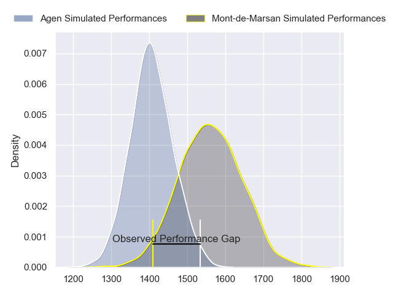
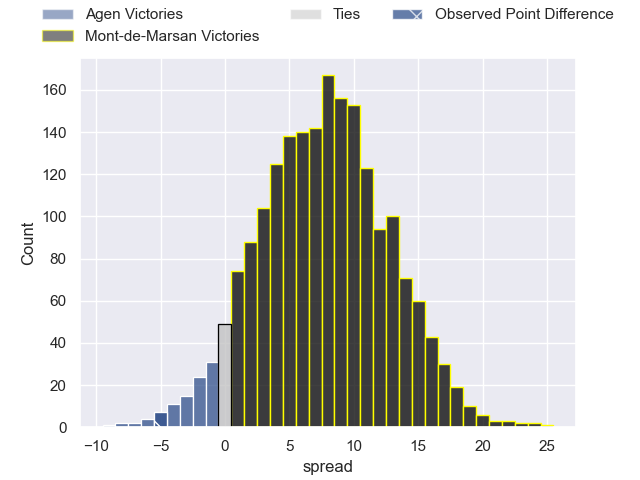
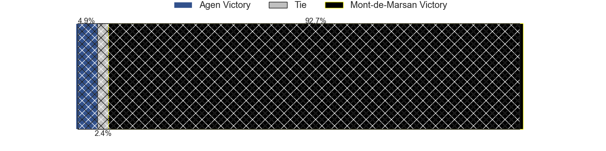
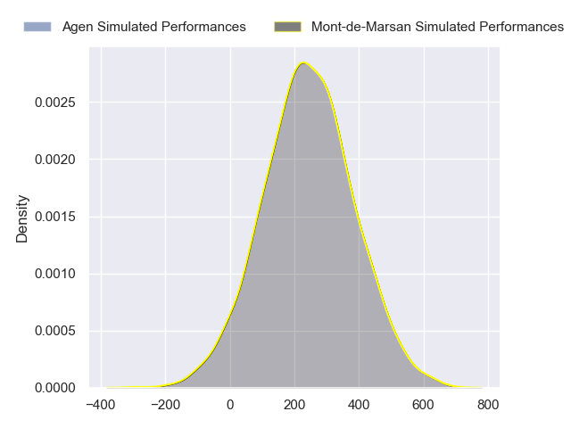
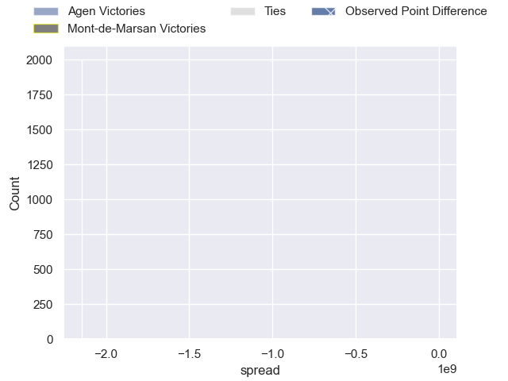

---  
layout: page  
title: Agen at Mont-de-Marsan; 28-23  
date: 2024-09-13 18:00:00 -0500  
categories: "Pro D2 2024" match review  
---
# Agen at Mont-de-Marsan; 28-23

# Club Level Predictions

The first set of predictions treats a club as the smallest object, as the club develops its members, organizes a gameplan, and deploys its players as needed for each match. This club model has a prediction of 0.708, which translates to predicting Mont-de-Marsan to win by 7.8.

Our Over/Under is 36.5 - and combined with the spread above, we have a predicted scoreline of 14 to 22

Each club has a rating and a rating deviation (similar to a Glicko rating), and expected performances can be generated. This allows for simulated matches and spreads like the ones below.
## Projected Performances - Club Model

## Projected Spreads - Club Model

## Projected Results - Club Model

# Player Level Predictions

Treating teams instead as an entity made up of the currently active players, I have ratings for each player in an altogether different system. These can be combined to form team ratings once teamsheets are announced, weighting starters a bit higher than the reserves. After the match is played, players can be weighted by their minutes on the field, allowing for an accurate measure of the team's composition. With these compiled team ratings, we can make predictions, measure inaccuracy, and update the individual player ratings.
## Prediction without Player Minutes: Mont-de-Marsan by 9.6

Mont-de-Marsan by 1.6 on a neutral pitch

## Projected Performances - Player Model

## Projected Spreads - Player Model

## Projected Results - Player Model

|   Away Minutes | Away Player         |   Away Percentile |   Number |   Home Percentile | Home Player          |   Home Minutes |
|---------------:|:--------------------|------------------:|---------:|------------------:|:---------------------|---------------:|
|             48 | Mamuka Mstoiani     |            nan    |        1 |            nan    | Luka Goginava        |             80 |
|             48 | Pierre Jouvin       |            nan    |        2 |            nan    | Florian Dufour       |             80 |
|             40 | Lasha Macharashvili |            nan    |        3 |            nan    | Anthony Alves        |             68 |
|              6 | Mathieu de Giovanni |             23.76 |        4 |            nan    | Nicolas Garrault     |             80 |
|             80 | William Demotte     |            nan    |        5 |            nan    | Myles Edwards        |             65 |
|             80 | Julien Lebian       |            nan    |        6 |            nan    | Mike Faleafa         |             48 |
|             50 | Valentin Gayraud    |            nan    |        7 |            nan    | Waël Ponpon          |             80 |
|             18 | Fotu Lokotui        |              3.5  |        8 |            nan    | Ioane Iashagashvili  |             80 |
|             80 | Dorian Bellot       |            nan    |        9 |            nan    | Christophe Loustalot |             24 |
|             62 | Franck Pourteau     |            nan    |       10 |            nan    | Willie du Plessis    |             79 |
|             40 | Lucas Martins       |             68.99 |       11 |            nan    | Simao Bento          |             48 |
|             80 | Clement Garrigues   |             62.41 |       12 |            nan    | Nacani Wakaya        |             80 |
|             23 | Theo Belan          |             47.68 |       13 |            nan    | Gatien Masse         |             15 |
|             32 | Loris Tolot         |            nan    |       14 |            nan    | Semi Lagivala        |             80 |
|             74 | Romain Darchen      |             64.19 |       15 |            nan    | Théo Cortes          |             28 |
|             40 | John Madigan        |            nan    |       16 |             74.5  | Mathis Bats          |             30 |
|             23 | Evan Olmstead       |            nan    |       17 |             49.27 | Samuel Lagrange      |             80 |
|             12 | Beau Farrance       |             33.3  |       18 |             21.99 | Aston Fortuin        |             80 |
|              6 | Hans Lombard-Buret  |            nan    |       19 |              6.31 | Jean-Luc Innocente   |             80 |
|             47 | Santiago Socino     |            nan    |       20 |             19.14 | Aurélien Laforgue    |             80 |
|             47 | Jack Maunder        |            nan    |       21 |             19.73 | Nicolas Darquier     |             71 |
|             80 | Peyo Muscarditz     |            nan    |       22 |             47.85 | Jules Dussutour      |             80 |
|            nan | nan                 |            nan    |       23 |             20.84 | Alexandre de Nardi   |             48 |

