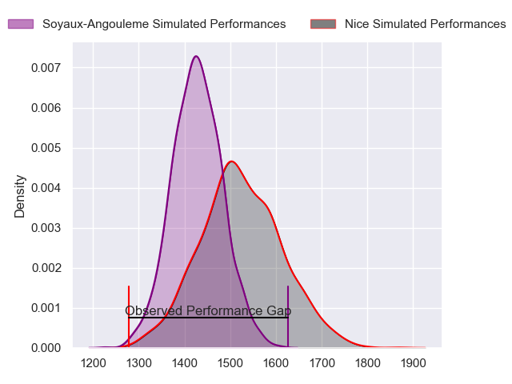
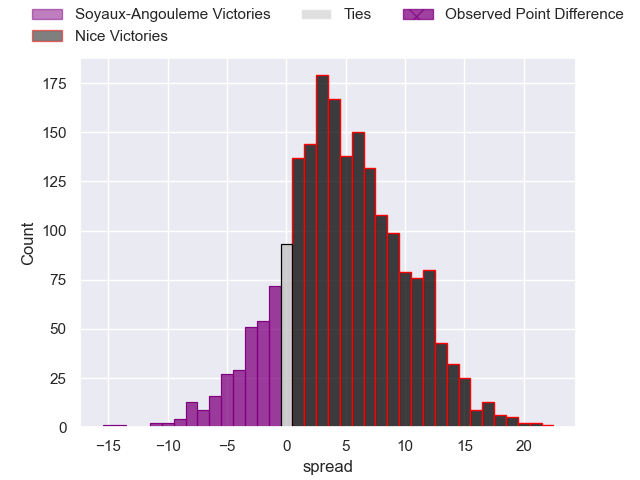
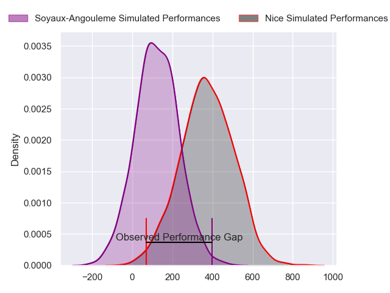
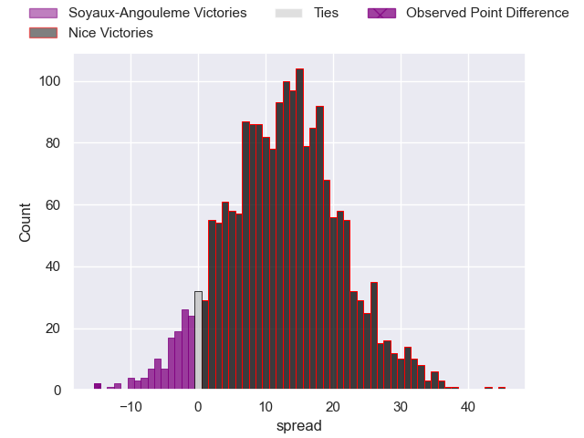
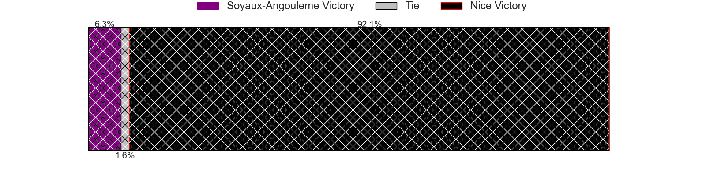

---  
layout: page  
title: Soyaux-Angouleme at Nice; 39-24  
date: 2024-09-13 18:00:00 -0500  
categories: "Pro D2 2024" match review  
---
# Soyaux-Angouleme at Nice; 39-24

# Club Level Predictions

The first set of predictions treats a club as the smallest object, as the club develops its members, organizes a gameplan, and deploys its players as needed for each match. This club model has a prediction of 0.631, which translates to predicting Nice to win by 4.7.

Our Over/Under is 29.5 - and combined with the spread above, we have a predicted scoreline of 12 to 17

Each club has a rating and a rating deviation (similar to a Glicko rating), and expected performances can be generated. This allows for simulated matches and spreads like the ones below.
## Projected Performances - Club Model

## Projected Spreads - Club Model

## Projected Results - Club Model

# Player Level Predictions

Treating teams instead as an entity made up of the currently active players, I have ratings for each player in an altogether different system. These can be combined to form team ratings once teamsheets are announced, weighting starters a bit higher than the reserves. After the match is played, players can be weighted by their minutes on the field, allowing for an accurate measure of the team's composition. With these compiled team ratings, we can make predictions, measure inaccuracy, and update the individual player ratings.
## Prediction without Player Minutes: Nice by 12.0

Nice by 9.2 on a neutral pitch

## Projected Performances - Player Model

## Projected Spreads - Player Model

## Projected Results - Player Model

|   Away Minutes | Away Player        |   Away Percentile |   Number |   Home Percentile | Home Player              |   Home Minutes |
|---------------:|:-------------------|------------------:|---------:|------------------:|:-------------------------|---------------:|
|             54 | Georgy Balakarev   |            nan    |        1 |            nan    | Julien Beaufils          |             46 |
|             36 | Patxi Bidart       |             70.33 |        2 |            nan    | Santiago Ovejero Abdala  |             80 |
|             30 | Seydou Diakité     |             22.13 |        3 |            nan    | Tom Ross                 |             80 |
|             80 | Enzo Morand-Bruyat |            nan    |        4 |             47.18 | Yann Tivoli              |             80 |
|             44 | Léo Morand-Bruyat  |            nan    |        5 |            nan    | Martin Freytes           |             68 |
|             48 | Germain Burgaud    |            nan    |        6 |            nan    | Arthur Vignolles         |             80 |
|             80 | Samuel Nollet      |             50.22 |        7 |            nan    | Louis Suaud              |             20 |
|             24 | Alexander Masibaka |            nan    |        8 |            nan    | Jordan Taufua            |             80 |
|             80 | Alexis Levron      |             69.45 |        9 |            nan    | Jules Solinas            |             80 |
|             47 | Ben Botica         |            nan    |       10 |            nan    | Mathis Viard             |             80 |
|             50 | Eoghan Barrett     |             62.94 |       11 |            nan    | David Odiete             |             80 |
|             10 | Mathis Lafon       |             27.03 |       12 |            nan    | Romain Riguet            |             71 |
|             26 | Arthur Proult      |            nan    |       13 |            nan    | Luca Cutayar             |             56 |
|             48 | Nathan Farissier   |             27.31 |       14 |            nan    | Christian Erasmus        |             33 |
|             34 | Jules Dubecq       |             67.67 |       15 |            nan    | Paul Auradou             |             80 |
|             32 | Rayne Barka        |             84.8  |       16 |              6.88 | Baptiste Lafond          |             65 |
|             80 | Maxence Lemardelet |            nan    |       17 |            nan    | Luvuyo Pupuma            |              9 |
|             28 | Manu Saubusse      |             44.59 |       18 |            nan    | Facundo Gigena           |             48 |
|             27 | Yassine Boutemane  |            nan    |       19 |            nan    | Pierre Strippoli         |             26 |
|             21 | Vivien Devisme     |            nan    |       20 |            nan    | Tom Murday               |             80 |
|             51 | Jonny May          |            nan    |       21 |             44.2  | Clément Chartier         |             33 |
|             34 | Matthew Dalton     |              4.09 |       22 |             48.83 | Ramiha Tarrel Tia Smiler |             54 |
|             80 | Rémi Brosset       |            nan    |       23 |             76.09 | Thibault Dufau           |             32 |

