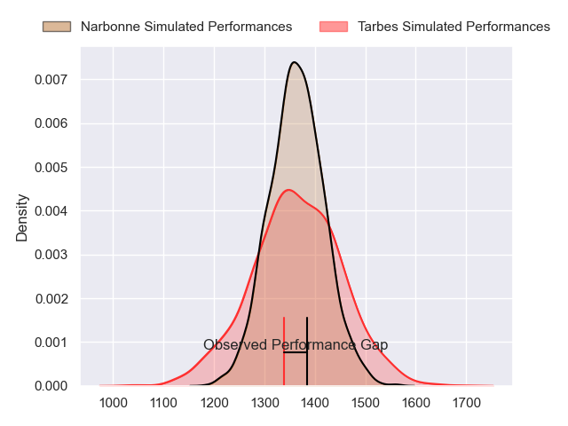
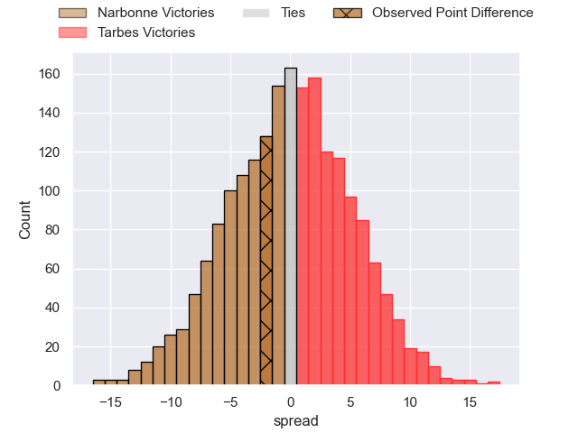
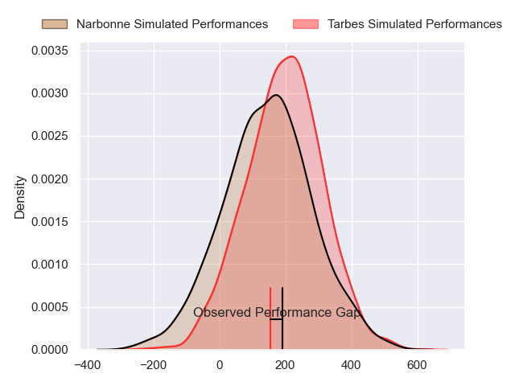
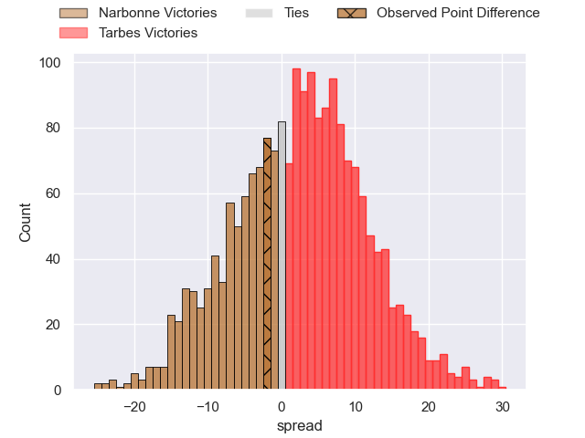
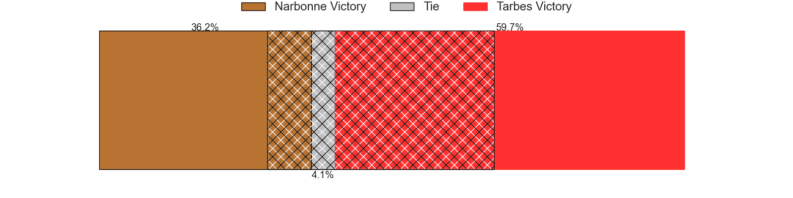

---  
layout: page  
title: Narbonne at Tarbes; 19-17  
date: 2024-09-13 18:00:00 -0500  
categories: "Nationale 2024" match review  
---
# Narbonne at Tarbes; 19-17

# Club Level Predictions

The first set of predictions treats a club as the smallest object, as the club develops its members, organizes a gameplan, and deploys its players as needed for each match. This club model has a prediction of 0.5, which translates to predicting Tarbes to win by -0.0.

Our Over/Under is 37.5 - and combined with the spread above, we have a predicted scoreline of 19 to 19

Each club has a rating and a rating deviation (similar to a Glicko rating), and expected performances can be generated. This allows for simulated matches and spreads like the ones below.
## Projected Performances - Club Model

## Projected Spreads - Club Model

## Projected Results - Club Model

# Player Level Predictions

Treating teams instead as an entity made up of the currently active players, I have ratings for each player in an altogether different system. These can be combined to form team ratings once teamsheets are announced, weighting starters a bit higher than the reserves. After the match is played, players can be weighted by their minutes on the field, allowing for an accurate measure of the team's composition. With these compiled team ratings, we can make predictions, measure inaccuracy, and update the individual player ratings.
## Prediction without Player Minutes: Tarbes by 4.4

Narbonne by 2.2 on a neutral pitch

## Projected Performances - Player Model

## Projected Spreads - Player Model

## Projected Results - Player Model

|   Away Minutes | Away Player               |   Away Percentile |   Number |   Home Percentile | Home Player                |   Home Minutes |
|---------------:|:--------------------------|------------------:|---------:|------------------:|:---------------------------|---------------:|
|             40 | Gregory Fichten           |             17.64 |        1 |             44.27 | Enzo Baggiani              |             64 |
|             62 | Mehdi Boundjema           |             91.21 |        2 |             20.33 | Florian Lamothe            |             64 |
|             46 | Chris Talakai             |             24.25 |        3 |             87.92 | Irakli Mirtskhulava        |             26 |
|             80 | Darrell Dyer              |             91.82 |        4 |             61.66 | Léo Saint-Guilhem          |             80 |
|             55 | Marius Antonescu          |             77.79 |        5 |             14.14 | Baptiste Peytavi           |             30 |
|             55 | Bill Caffo                |             43.58 |        6 |             79.65 | Alexis Armary              |             56 |
|             25 | Paul Belzons              |              7.19 |        7 |             88.27 | Spike Salman               |             75 |
|             80 | Charles Malet             |             36.45 |        8 |              1.87 | Filipe Manu                |             29 |
|             45 | James Hart                |              0.76 |        9 |             57.31 | Matias Brocal              |             24 |
|             80 | Tom Chauvet               |             56.56 |       10 |             24.82 | Alexandre Perez            |             58 |
|             71 | Pierre-Hugo Ducom         |             16.94 |       11 |              1.85 | Jone Tuva                  |             80 |
|             80 | Parataiso Silafai-Lea'ana |             73.2  |       12 |             11.02 | Savenaca Rawaca            |             80 |
|             60 | Peter Betham              |             99.65 |       13 |             19.03 | Johan Paulet               |             35 |
|             80 | Taqele Naiyaravoro        |             50    |       14 |             27.93 | Jonathan Duffau            |             51 |
|             24 | Boris Goutard             |              0.47 |       15 |              2.33 | Mathieu Berbizier          |             29 |
|             80 | Thibault Clauzade         |             49    |       16 |             13.14 | Ximun Bessonart            |             80 |
|             33 | Geoffrey Moise            |             50.79 |       17 |             84.43 | Vincent Dolier             |             80 |
|             54 | Étienne Ducom             |             29.47 |       18 |             37    | Mickael Thébault           |             80 |
|             22 | Clément Esteriola         |             16.3  |       19 |             40.84 | Clement Latorre            |             34 |
|             47 | Jamie Hagan               |             74.96 |       20 |            nan    | Lucas Santamaria Polkowska |             52 |
|             58 | Morgan Maga               |             52.15 |       21 |             28.4  | Joeli Matalaweru           |             23 |
|             80 | Pablo Barbaste            |             74.76 |       22 |             48.29 | Léo Estaque                |             25 |
|             52 | Gilles Bosch              |              4.77 |       23 |              8    | Maile Mamao                |             22 |

