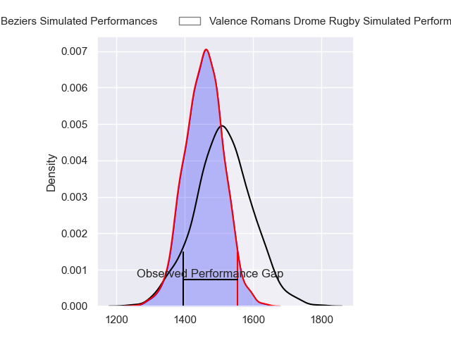
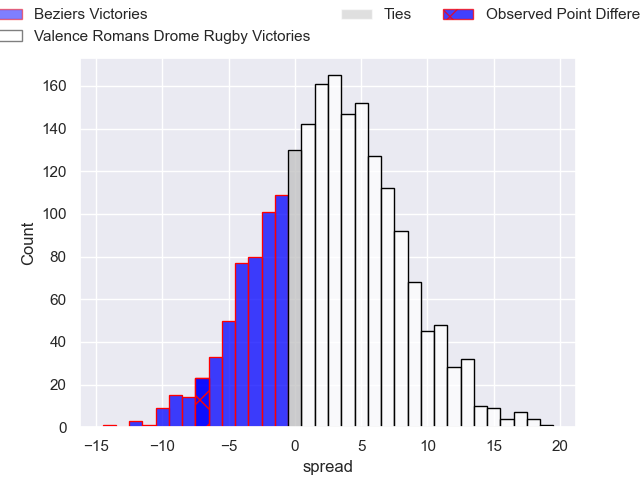
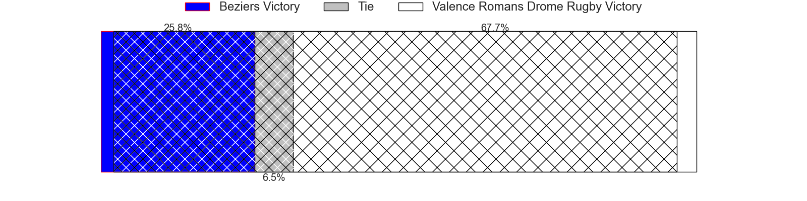
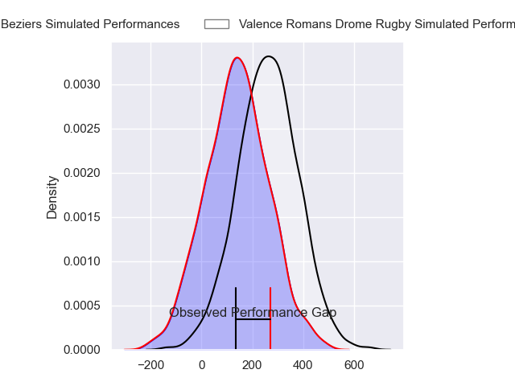
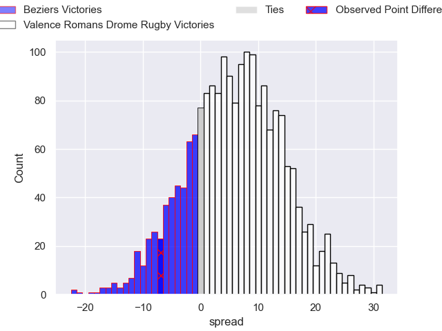
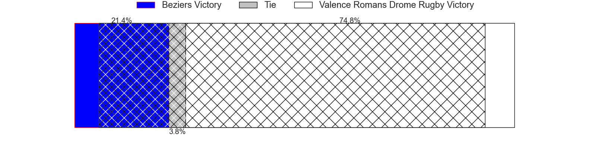

---  
layout: page  
title: Beziers at Valence Romans Drome Rugby; 29-22  
date: 2024-09-13 18:00:00 -0500  
categories: "Pro D2 2024" match review  
---
# Beziers at Valence Romans Drome Rugby; 29-22

# Club Level Predictions

The first set of predictions treats a club as the smallest object, as the club develops its members, organizes a gameplan, and deploys its players as needed for each match. This club model has a prediction of 0.579, which translates to predicting Valence Romans Drome Rugby to win by 2.8.

Our Over/Under is 39.5 - and combined with the spread above, we have a predicted scoreline of 18 to 21

Each club has a rating and a rating deviation (similar to a Glicko rating), and expected performances can be generated. This allows for simulated matches and spreads like the ones below.
## Projected Performances - Club Model

## Projected Spreads - Club Model

## Projected Results - Club Model

# Player Level Predictions

Treating teams instead as an entity made up of the currently active players, I have ratings for each player in an altogether different system. These can be combined to form team ratings once teamsheets are announced, weighting starters a bit higher than the reserves. After the match is played, players can be weighted by their minutes on the field, allowing for an accurate measure of the team's composition. With these compiled team ratings, we can make predictions, measure inaccuracy, and update the individual player ratings.
## Prediction without Player Minutes: Valence Romans Drome Rugby by 4.9

Valence Romans Drome Rugby by 1.8 on a neutral pitch

## Projected Performances - Player Model

## Projected Spreads - Player Model

## Projected Results - Player Model

|   Away Minutes | Away Player            |   Away Percentile |   Number |   Home Percentile | Home Player          |   Home Minutes |
|---------------:|:-----------------------|------------------:|---------:|------------------:|:---------------------|---------------:|
|              6 | Youssef Amrouni        |            nan    |        1 |              1.86 | Julien Royer         |             54 |
|              1 | Jose Luis Gonzalez     |            nan    |        2 |             43.85 | Dorian Marco Pena    |             54 |
|             32 | Christian Judge        |            nan    |        3 |             81.43 | Kevin Goze           |             80 |
|             54 | Gillian Benoy          |             45.84 |        4 |             23.31 | Ryan McCauley        |             48 |
|             53 | Pierre Gayraud         |            nan    |        5 |             57.27 | Florian Goumat       |             48 |
|             80 | Clement Doumenc        |             70.76 |        6 |             12.74 | Axel Bruchet         |             80 |
|             80 | Clement Ancely         |            nan    |        7 |             25.91 | Loan Real            |             58 |
|             32 | Otonuku Jr Pauta       |            nan    |        8 |             21.03 | Philippe Laville     |             44 |
|             36 | Samuel Marques         |            nan    |        9 |              5.12 | Mattéo Rodor         |             80 |
|             58 | Charly Malie           |            nan    |       10 |             17.51 | Lucas Meret          |             28 |
|             80 | Aminiasi Tuimaba       |            nan    |       11 |              9.9  | Thomas Roziere       |             46 |
|             80 | Taleta Tupuola         |            nan    |       12 |             84.73 | Louis Marrou         |             80 |
|             32 | Branden Holder         |             41.03 |       13 |             81.47 | Anatole Pauvert      |             34 |
|             80 | Pierre Courtaud        |            nan    |       14 |             92.55 | Adam Vargas          |             26 |
|             52 | Victor Dreuille        |            nan    |       15 |             86.68 | Charles Bouldoire    |             65 |
|             60 | Sias Koen              |             60.98 |       16 |             41.12 | Joris De Moura       |             48 |
|             48 | Yanis Boulassel        |             19.45 |       17 |             74.53 | Sven Bernat Girlando |             80 |
|             65 | Hans N'kinsi           |            nan    |       18 |             76.52 | Thembelani Bholi     |             80 |
|             32 | Francisco Fernandes    |             15.21 |       19 |             31.03 | Gareth Milasinovich  |             45 |
|             80 | Taylor Gontineac       |             82.52 |       20 |             78.18 | Thomas Lhusero       |             54 |
|             32 | Damien Añon            |             25.93 |       21 |             85.13 | Darren O'Shea        |             65 |
|             80 | Baptiste Abescat-Leroy |             61.02 |       22 |              2.75 | Cyril Deligny        |             33 |
|             22 | John Henry Fincham     |            nan    |       23 |            nan    | nan                  |            nan |

