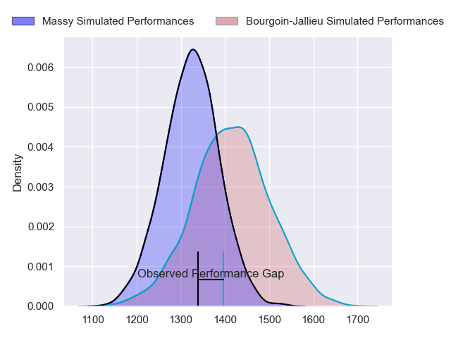
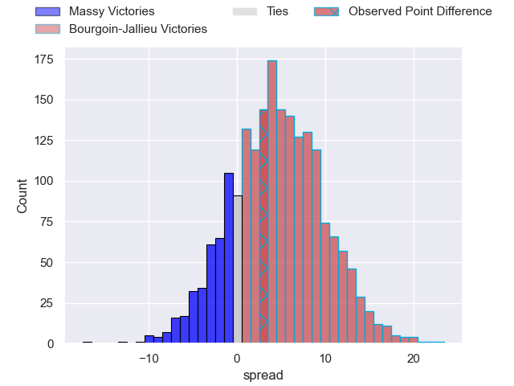
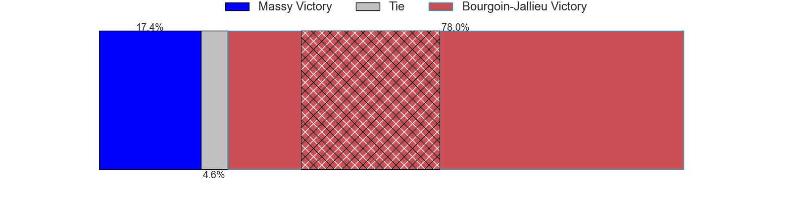
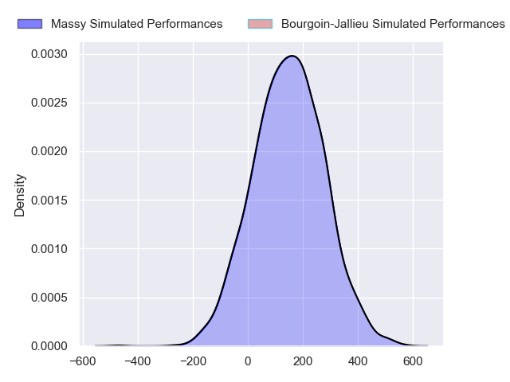
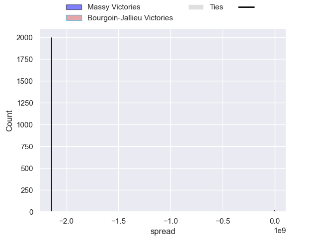

---  
layout: page  
title: Massy at Bourgoin-Jallieu; 16-19  
date: 2024-09-14 18:00:00 -0500  
categories: "Nationale 2024" match review  
---
# Massy at Bourgoin-Jallieu; 16-19

# Club Level Predictions

The first set of predictions treats a club as the smallest object, as the club develops its members, organizes a gameplan, and deploys its players as needed for each match. This club model has a prediction of 0.622, which translates to predicting Bourgoin-Jallieu to win by 4.4.

Our Over/Under is 34.5 - and combined with the spread above, we have a predicted scoreline of 15 to 19

Each club has a rating and a rating deviation (similar to a Glicko rating), and expected performances can be generated. This allows for simulated matches and spreads like the ones below.
## Projected Performances - Club Model

## Projected Spreads - Club Model

## Projected Results - Club Model

# Player Level Predictions

Treating teams instead as an entity made up of the currently active players, I have ratings for each player in an altogether different system. These can be combined to form team ratings once teamsheets are announced, weighting starters a bit higher than the reserves. After the match is played, players can be weighted by their minutes on the field, allowing for an accurate measure of the team's composition. With these compiled team ratings, we can make predictions, measure inaccuracy, and update the individual player ratings.
## Prediction without Player Minutes: Bourgoin-Jallieu by 1.2

Massy by 6.4 on a neutral pitch

## Projected Performances - Player Model

## Projected Spreads - Player Model

## Projected Results - Player Model

|   Away Minutes | Away Player            |   Away Percentile |   Number |   Home Percentile | Home Player       |   Home Minutes |
|---------------:|:-----------------------|------------------:|---------:|------------------:|:------------------|---------------:|
|             40 | Fernandez Correa       |            nan    |        1 |             60.48 | Rémy Gaborit      |             40 |
|             80 | Pierre Trassoudaine    |            nan    |        2 |            nan    | Julien Ratajczak  |             80 |
|             10 | Tijde Visser           |            nan    |        3 |            nan    | Keynan Knox       |             63 |
|             52 | Saba Pesvianidze       |            nan    |        4 |            nan    | Robin Gascou      |             80 |
|             17 | Andrei Mahu            |            nan    |        5 |            nan    | Thomas Adélaïde   |             32 |
|             59 | Tony Tissot            |            nan    |        6 |            nan    | Sam Daly          |             65 |
|             80 | Clément Vidoni         |            nan    |        7 |            nan    | Kamil Bouregba    |             80 |
|              5 | Alexandre Loubiere     |            nan    |        8 |            nan    | Poutasi Luafutu   |             21 |
|             68 | Lucas Rubio            |            nan    |        9 |            nan    | Martin Doan       |             49 |
|             80 | Christian Lacombe      |            nan    |       10 |            nan    | Tom Danovaro      |             80 |
|             80 | Martin Carre           |            nan    |       11 |             53.57 | Hugo Desgrange    |             63 |
|             80 | Luca Mignot            |            nan    |       12 |            nan    | Isaiah Leota      |             80 |
|             59 | Arthur Seigneuret      |            nan    |       13 |            nan    | Christopher Bosch |             21 |
|             12 | Giorgi Gogoladze       |            nan    |       14 |            nan    | Paul-Hugo Champ   |             70 |
|             80 | Alexandre Borie        |            nan    |       15 |              7.94 | Nicolas Cachet    |             63 |
|             80 | Julien Blanc           |            nan    |       16 |            nan    | Lucas Dycke       |             21 |
|             15 | Robin Poipy            |            nan    |       17 |            nan    | Dimitri Tchapnga  |             80 |
|             75 | Adrien Sonzogni        |            nan    |       18 |            nan    | Maxime Castant    |             80 |
|             17 | Diego Pinheiro Ruiz    |             38.76 |       19 |            nan    | Aviata Silago     |             80 |
|             65 | Nolan Pienaar          |             45    |       20 |            nan    | Tala Gray         |             17 |
|             48 | Gonzalo Lopez Bontempo |              1.44 |       21 |             45.54 | Liam Rimet        |             80 |
|             52 | Alex Preira            |             90    |       22 |              0.89 | Morgan Eames      |             40 |
|             28 | Lilian Rousset         |             53.16 |       23 |              1.94 | Remi Bouet        |             28 |

