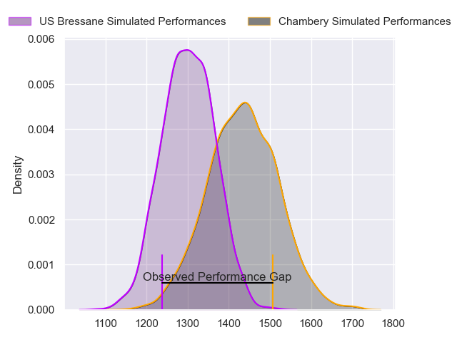
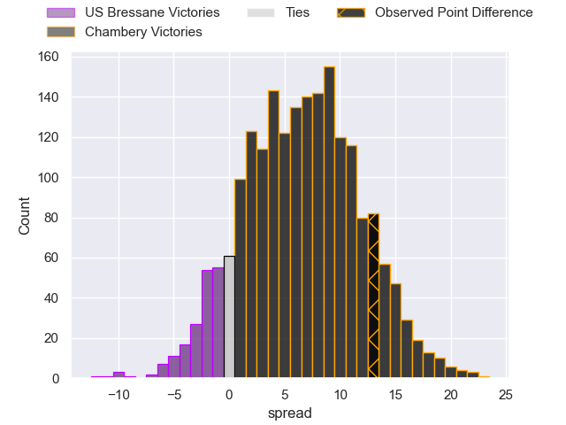
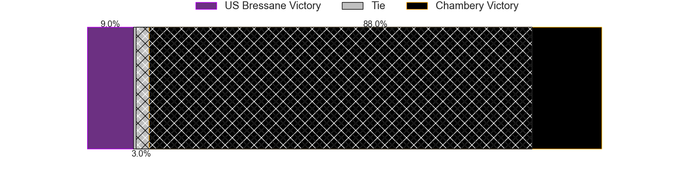
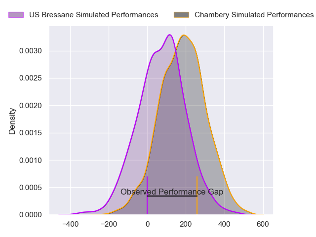
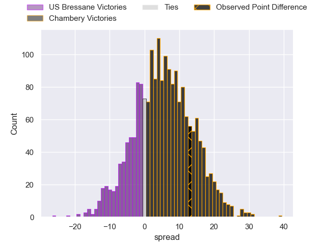

---  
layout: page  
title: US Bressane at Chambery; 6-19  
date: 2024-09-14 18:00:00 -0500  
categories: "Nationale 2024" match review  
---
# US Bressane at Chambery; 6-19

# Club Level Predictions

The first set of predictions treats a club as the smallest object, as the club develops its members, organizes a gameplan, and deploys its players as needed for each match. This club model has a prediction of 0.68, which translates to predicting Chambery to win by 6.7.

Our Over/Under is 38.5 - and combined with the spread above, we have a predicted scoreline of 16 to 22

Each club has a rating and a rating deviation (similar to a Glicko rating), and expected performances can be generated. This allows for simulated matches and spreads like the ones below.
## Projected Performances - Club Model

## Projected Spreads - Club Model

## Projected Results - Club Model

# Player Level Predictions

Treating teams instead as an entity made up of the currently active players, I have ratings for each player in an altogether different system. These can be combined to form team ratings once teamsheets are announced, weighting starters a bit higher than the reserves. After the match is played, players can be weighted by their minutes on the field, allowing for an accurate measure of the team's composition. With these compiled team ratings, we can make predictions, measure inaccuracy, and update the individual player ratings.
## Prediction without Player Minutes: Chambery by 8.5

Chambery by 5.7 on a neutral pitch

## Projected Performances - Player Model

## Projected Spreads - Player Model

## Projected Results - Player Model

|   Away Minutes | Away Player          |   Away Percentile |   Number |   Home Percentile | Home Player                  |   Home Minutes |
|---------------:|:---------------------|------------------:|---------:|------------------:|:-----------------------------|---------------:|
|             57 | Vazha Kapanadze      |             28.57 |        1 |             85.36 | Nugzar Somkhishvili          |             80 |
|             60 | Louis Dasalmartini   |             37.18 |        2 |             56.04 | Quentin Beaudaux             |             48 |
|             80 | Lasha Mchelidze      |             90.56 |        3 |             21.43 | Osman Dimen                  |             57 |
|             80 | Thomas Déliance      |             32.82 |        4 |             80.11 | Ahmed Tidiane Kane           |             57 |
|             48 | Victor Fromenteze    |              0.11 |        5 |             68.95 | Fabien Witz                  |             80 |
|             80 | Pierre Reynaud       |             33.52 |        6 |             90.71 | Jean-Baptiste Grenod         |             48 |
|             57 | Nail Ait Naceur      |             55.97 |        7 |             65.49 | Colin Lebian                 |             80 |
|             80 | Quentin Witt         |              3.74 |        8 |             43.22 | Taniela Matakaiongo          |             23 |
|             80 | Jeremie Martin       |             14.04 |        9 |              6.83 | Sonatane Takulua             |             32 |
|             23 | Nathan Azais         |             20.29 |       10 |             51.79 | Joseph Exshaw                |             80 |
|             80 | Élie De Fleurian     |             51.33 |       11 |             71.05 | Paul Baptiste Florent Altier |             49 |
|             32 | Benjamin Doy         |             47.22 |       12 |             45.94 | Youenn Floch                 |             23 |
|             48 | Alexandre Badet      |             15.43 |       13 |             74.94 | Bastien Reymond              |             23 |
|             32 | Thibaut Perrette     |             30.49 |       14 |             72.9  | Va'aufauese Apelu Maliko     |             80 |
|             32 | Florent Massip       |             78.14 |       15 |             54.88 | Enzo Marzocca                |             80 |
|             31 | Atonio Ulutuipalelei |              6    |       16 |            nan    | Leonard Reis                 |             80 |
|             23 | Josh Peters          |             12.38 |       17 |              2.2  | Yan Tabarot                  |             80 |
|             57 | Jeremy Valencot      |             59.58 |       18 |             43.92 | Gela Murusidze               |             57 |
|             23 | Joe Margetts         |             48.03 |       19 |            nan    | Antoine Ferreira             |             57 |
|             80 | Clement Jullien      |             87.73 |       20 |             51.63 | Thomas Hecquet               |             23 |
|             80 | Wael May             |             71.26 |       21 |             37.23 | Arwel Robson                 |             23 |
|            nan | nan                  |            nan    |       22 |            nan    | Kelian Boissier              |             57 |

