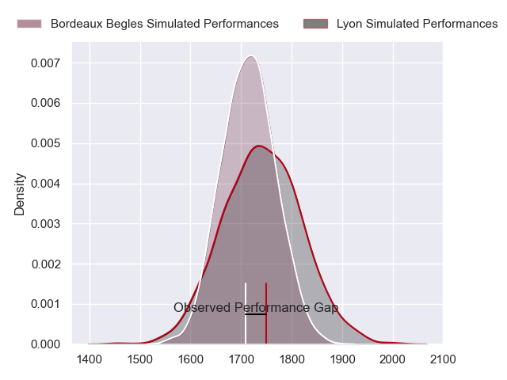
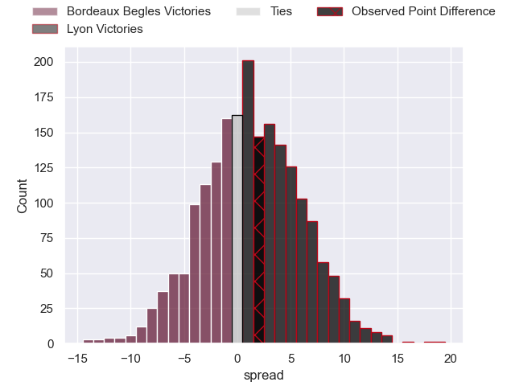
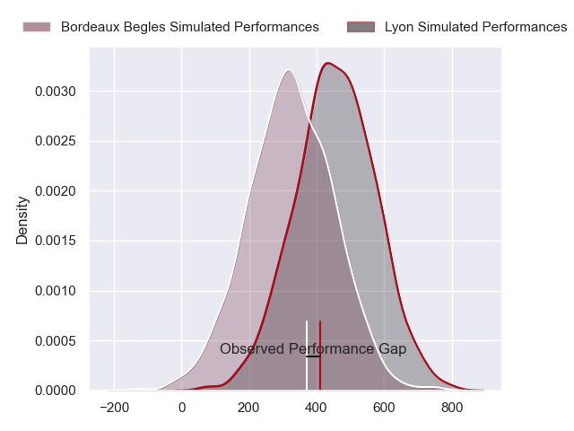
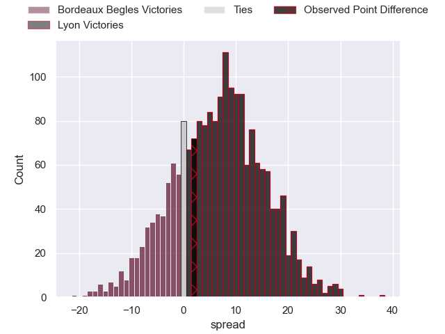
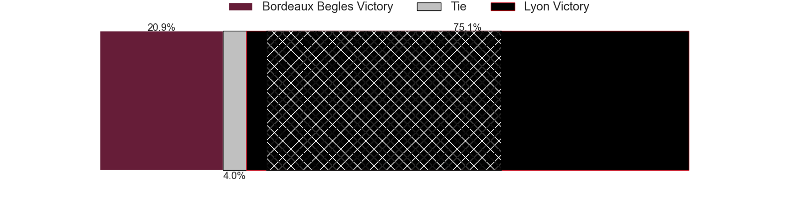

---  
layout: page  
title: Bordeaux Begles at Lyon; 26-28  
date: 2024-09-14 18:00:00 -0500  
categories: "Top 14 Orange 2024" match review  
---
# Bordeaux Begles at Lyon; 26-28

# Club Level Predictions

The first set of predictions treats a club as the smallest object, as the club develops its members, organizes a gameplan, and deploys its players as needed for each match. This club model has a prediction of 0.535, which translates to predicting Lyon to win by 1.2.

Our Over/Under is 41.5 - and combined with the spread above, we have a predicted scoreline of 20 to 21

Each club has a rating and a rating deviation (similar to a Glicko rating), and expected performances can be generated. This allows for simulated matches and spreads like the ones below.
## Projected Performances - Club Model

## Projected Spreads - Club Model

## Projected Results - Club Model

# Player Level Predictions

Treating teams instead as an entity made up of the currently active players, I have ratings for each player in an altogether different system. These can be combined to form team ratings once teamsheets are announced, weighting starters a bit higher than the reserves. After the match is played, players can be weighted by their minutes on the field, allowing for an accurate measure of the team's composition. With these compiled team ratings, we can make predictions, measure inaccuracy, and update the individual player ratings.
## Prediction without Player Minutes: Lyon by 8.0

Lyon by 0.3 on a neutral pitch

## Projected Performances - Player Model

## Projected Spreads - Player Model

## Projected Results - Player Model

|   Away Minutes | Away Player        |   Away Percentile |   Number |   Home Percentile | Home Player          |   Home Minutes |
|---------------:|:-------------------|------------------:|---------:|------------------:|:---------------------|---------------:|
|             52 | Matis Perchaud     |             19.66 |        1 |             31.04 | Jerome Rey           |             52 |
|             80 | Romain Latterrade  |            nan    |        2 |             91.39 | Sam Matavesi         |             80 |
|             52 | Sipili Falatea     |            nan    |        3 |             84.48 | Jermaine Ainsley     |             74 |
|              6 | Jonny Gray         |            nan    |        4 |             85.3  | Felix Lambey         |             80 |
|             52 | Cyril Cazeaux      |            nan    |        5 |             80.22 | Mickael Guillard     |             56 |
|             80 | Mahamadou Diaby    |            nan    |        6 |             73.56 | Steeve Blanc-Mappaz  |             67 |
|             39 | Pierre Bochaton    |            nan    |        7 |             84.96 | Beka Saghinadze      |             56 |
|             80 | Marko Gazzotti     |            nan    |        8 |             87.38 | Arno Botha           |             80 |
|             69 | Yann Lesgourgues   |            nan    |        9 |             96.2  | Baptiste Couilloud   |             67 |
|             80 | Joey Carbery       |             79.24 |       10 |             84.49 | Leo Berdeu           |             80 |
|             56 | Arthur Retiere     |             94.56 |       11 |             97.64 | Monty Ioane          |             13 |
|             80 | Ben Tapuai         |             56.84 |       12 |             78.65 | Theo Millet          |             80 |
|             29 | Nicolas Depoortere |            nan    |       13 |             11.72 | Josiah Maraku        |             49 |
|             28 | Damian Penaud      |            nan    |       14 |             95.28 | Vincent Rattez       |             31 |
|             80 | Romain Buros       |            nan    |       15 |             78.37 | Davit Niniashvili    |             24 |
|             80 | Romain Buros       |            nan    |       15 |             78.37 | Davit Niniashvili    |             31 |
|             11 | Matthieu Jalibert  |            nan    |       16 |             19.6  | Guillaume Marchand   |             24 |
|             51 | Ugo Boniface       |             92.95 |       17 |             19.31 | Sebastien Taofifenua |             20 |
|             80 | Maxime Lamothe     |            nan    |       18 |             80.97 | Dylan Cretin         |             13 |
|             60 | Maxime Lucu        |            nan    |       19 |             22.43 | Killian Geraci       |             28 |
|             28 | Temo Matiu         |             23.36 |       20 |             88.05 | Martin Page-Relo     |             28 |
|             49 | Pablo Uberti       |             10.21 |       21 |             59.96 | Ethan Dumortier      |             80 |
|             63 | Toma Taufa         |             32.1  |       22 |              7.16 | Martin Meliande      |             41 |
|             20 | Alexandre Ricard   |             61.55 |       23 |             83.33 | Cedate Gomes Sa      |             80 |

