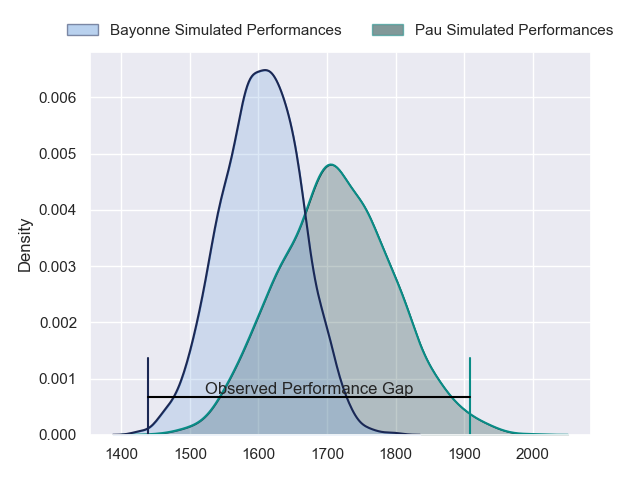
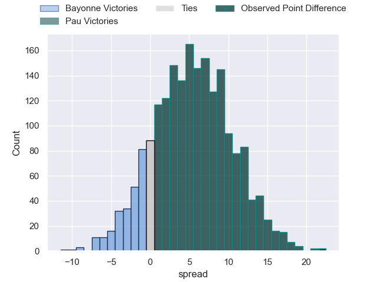
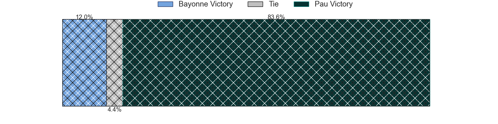
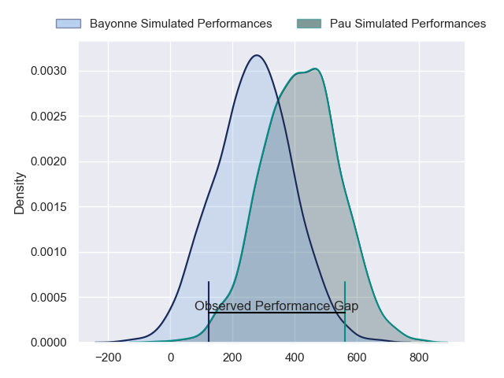
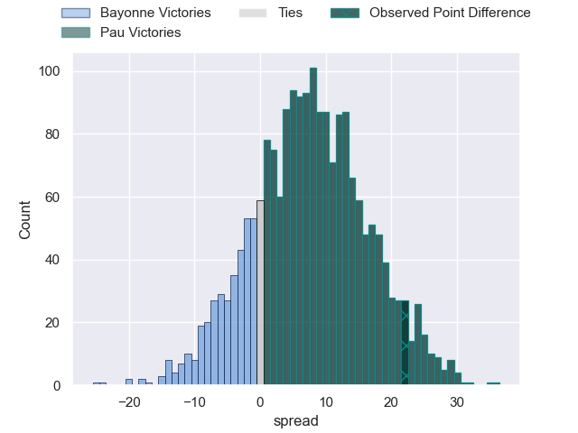
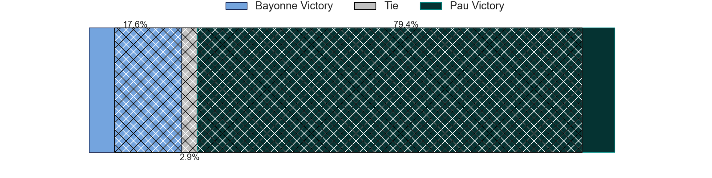

---  
layout: page  
title: Bayonne at Pau; 29-51  
date: 2024-09-14 18:00:00 -0500  
categories: "Top 14 Orange 2024" match review  
---
# Bayonne at Pau; 29-51

# Club Level Predictions

The first set of predictions treats a club as the smallest object, as the club develops its members, organizes a gameplan, and deploys its players as needed for each match. This club model has a prediction of 0.653, which translates to predicting Pau to win by 5.6.

Our Over/Under is 46.5 - and combined with the spread above, we have a predicted scoreline of 20 to 26

Each club has a rating and a rating deviation (similar to a Glicko rating), and expected performances can be generated. This allows for simulated matches and spreads like the ones below.
## Projected Performances - Club Model

## Projected Spreads - Club Model

## Projected Results - Club Model

# Player Level Predictions

Treating teams instead as an entity made up of the currently active players, I have ratings for each player in an altogether different system. These can be combined to form team ratings once teamsheets are announced, weighting starters a bit higher than the reserves. After the match is played, players can be weighted by their minutes on the field, allowing for an accurate measure of the team's composition. With these compiled team ratings, we can make predictions, measure inaccuracy, and update the individual player ratings.
## Prediction without Player Minutes: Pau by 6.1

Bayonne by 2.1 on a neutral pitch

## Projected Performances - Player Model

## Projected Spreads - Player Model

## Projected Results - Player Model

|   Away Minutes | Away Player           |   Away Percentile |   Number |   Home Percentile | Home Player         |   Home Minutes |
|---------------:|:----------------------|------------------:|---------:|------------------:|:--------------------|---------------:|
|             53 | Andy Bordelai         |             36.52 |        1 |             64.28 | Hugo Parrou         |             80 |
|             57 | Vincent Giudicelli    |              7.52 |        2 |             15.78 | Lucas Rey           |             80 |
|             53 | Luke Tagi             |             76.22 |        3 |             96.11 | Harry Williams      |             80 |
|             49 | Arthur Iturria        |             64.15 |        4 |             25.75 | Thomas Jolmes       |             61 |
|             57 | Alex Moon             |             97.56 |        5 |             67.59 | Remi Picquette      |             80 |
|             19 | Rodrigo Bruni         |             99.22 |        6 |             39.53 | Sacha Zegueur       |             53 |
|             55 | Baptiste Chouzenoux   |             90.37 |        7 |             53.93 | Loic Credoz         |             80 |
|             49 | Uzair Cassiem         |             58.88 |        8 |             70.79 | Beka Gorgadze       |             20 |
|             80 | Baptiste Germain      |              6.26 |        9 |             94.12 | Thibault Daubagna   |             80 |
|             80 | Camille Lopez         |             87.53 |       10 |             85.37 | Joe Simmonds        |              4 |
|             80 | Nadir Megdoud         |             73.88 |       11 |             37.24 | Aymeric Luc         |             53 |
|             80 | Arnaud Erbinartegaray |             10.02 |       12 |             78.55 | Nathan Decron       |             62 |
|             31 | Sireli Maqala         |             63.05 |       13 |             84.38 | Emilien Gailleton   |             57 |
|             80 | Xan Mousques          |             67.65 |       14 |             52.65 | Theo Attissogbe     |             80 |
|             54 | Tom Spring            |              7.01 |       15 |             85.98 | Jack Maddocks       |             48 |
|             45 | Facundo Bosch         |             93.03 |       16 |              8.84 | Daniel Bibi Biziwu  |             80 |
|             80 | Tevita Tatafu         |             28.29 |       17 |             57.06 | Youri Delhommel     |             80 |
|             80 | Maxime Machenaud      |             93.17 |       18 |             84.5  | Lekima Tagitagivalu |             22 |
|             32 | Joris Segonds         |             77.94 |       19 |             96.97 | Tumua Manu          |             25 |
|             27 | Guillaume Martocq     |             15.85 |       20 |             73.92 | Jon Zabala Arrieta  |             23 |
|             27 | Denis Marchois        |             97.45 |       21 |             74.2  | Joel Kpoku          |             71 |
|             31 | Baptiste Heguy        |             89.26 |       22 |             98.29 | Dan Robson          |             80 |
|             31 | Pierre Castillon      |            nan    |       23 |            nan    | nan                 |            nan |

