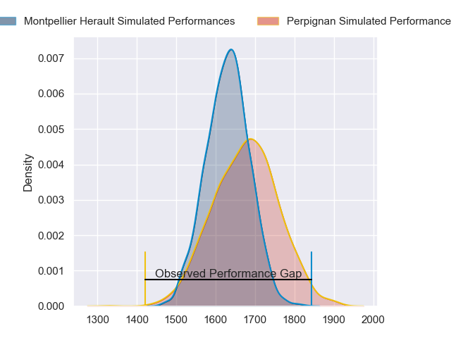
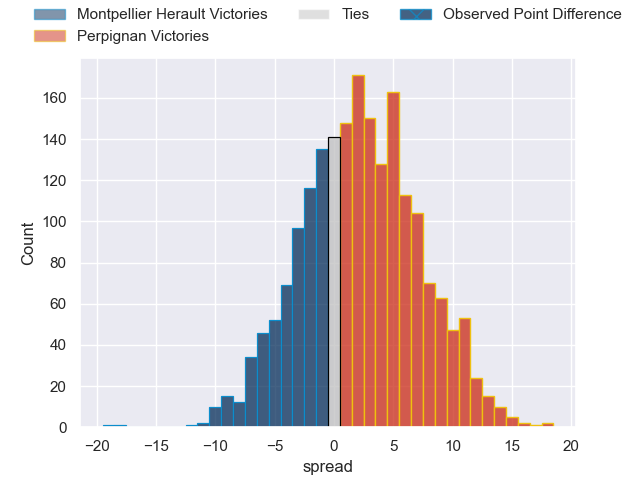
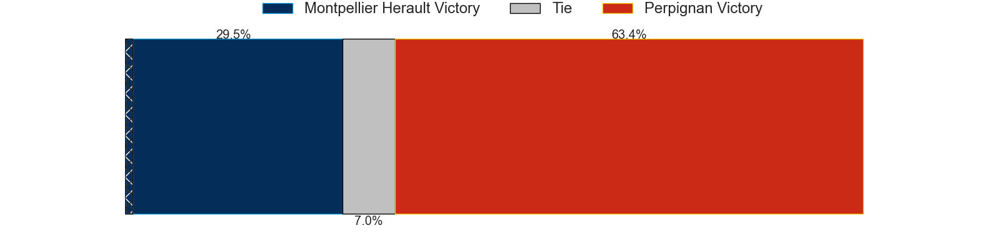
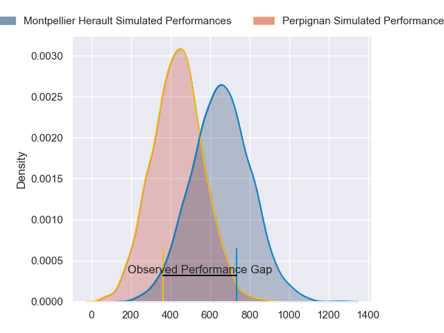
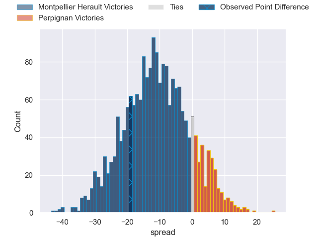
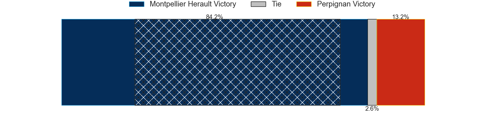

---  
layout: page  
title: Montpellier Herault at Perpignan; 26-7  
date: 2024-09-14 18:00:00 -0500  
categories: "Top 14 Orange 2024" match review  
---
# Montpellier Herault at Perpignan; 26-7

# Club Level Predictions

The first set of predictions treats a club as the smallest object, as the club develops its members, organizes a gameplan, and deploys its players as needed for each match. This club model has a prediction of 0.566, which translates to predicting Perpignan to win by 2.4.

Our Over/Under is 39.5 - and combined with the spread above, we have a predicted scoreline of 19 to 21

Each club has a rating and a rating deviation (similar to a Glicko rating), and expected performances can be generated. This allows for simulated matches and spreads like the ones below.
## Projected Performances - Club Model

## Projected Spreads - Club Model

## Projected Results - Club Model

# Player Level Predictions

Treating teams instead as an entity made up of the currently active players, I have ratings for each player in an altogether different system. These can be combined to form team ratings once teamsheets are announced, weighting starters a bit higher than the reserves. After the match is played, players can be weighted by their minutes on the field, allowing for an accurate measure of the team's composition. With these compiled team ratings, we can make predictions, measure inaccuracy, and update the individual player ratings.
## Prediction without Player Minutes: Perpignan by 2.4

Montpellier Herault by 6.6 on a neutral pitch

## Projected Performances - Player Model

## Projected Spreads - Player Model

## Projected Results - Player Model

|   Away Minutes | Away Player         |   Away Percentile |   Number |   Home Percentile | Home Player           |   Home Minutes |
|---------------:|:--------------------|------------------:|---------:|------------------:|:----------------------|---------------:|
|             80 | Enzo Forletta       |             83.82 |        1 |             12.02 | Bruce Devaux          |             60 |
|             46 | Vano Karkadze       |             66.61 |        2 |             82.39 | Seilala Lam           |             26 |
|             12 | Luka Japaridze      |             82.49 |        3 |             71.09 | Pietro Ceccarelli     |             60 |
|             50 | Yacouba Camara      |             91.45 |        4 |             88.12 | Marvin Orie           |             80 |
|             52 | Tyler Duguid        |             53.05 |        5 |             17.98 | Posolo Tuilagi        |             80 |
|             50 | Lenni Nouchi        |             82.28 |        6 |             83.94 | Jacobus van Tonder    |             32 |
|             62 | Alexandre Becognee  |             35.55 |        7 |             93.69 | Patrick Sobela        |             48 |
|             23 | Billy Vunipola      |             96.5  |        8 |             93.93 | So'otala Fa'aso'o     |             80 |
|             80 | Leo Coly            |             54.08 |        9 |             85.39 | Tom Ecochard          |             30 |
|             32 | Domingo Miotti      |             87.29 |       10 |             89.21 | Jake McIntyre         |             80 |
|             20 | George Bridge       |             99.08 |       11 |             24.9  | Ali Crossdale         |             80 |
|             58 | George Bridge       |             99.08 |       11 |             24.9  | Ali Crossdale         |             80 |
|             80 | George Bridge       |             99.08 |       11 |             24.9  | Ali Crossdale         |             80 |
|             10 | George Bridge       |             99.08 |       11 |             24.9  | Ali Crossdale         |             80 |
|             55 | Arthur Vincent      |             56.64 |       12 |             99.42 | Jeronimo de la Fuente |             25 |
|             30 | Thomas Darmon       |             14.1  |       13 |             10.84 | Alivereti Duguivalu   |             80 |
|             30 | Madosh Tambwe       |             91.12 |       14 |             72.04 | Tavite Veredamu       |             44 |
|             48 | Thomas Vincent      |             51.64 |       15 |             70.56 | Tommaso Allan         |             80 |
|             18 | Christopher Tolofua |             87.71 |       16 |              3.3  | Victor Montgaillard   |             27 |
|             15 | Baptiste Erdocio    |              1.41 |       17 |             87.09 | Giorgi Beria          |             80 |
|             65 | Wilfrid Hounkpatin  |             54.47 |       18 |             30.33 | Kieran Brookes        |              9 |
|             68 | Sam Simmonds        |             50.72 |       19 |            nan    | Jefferson-Lee Joseph  |             80 |
|             80 | Auguste Cadot       |             17.72 |       20 |             24.64 | Adrien Warion         |             80 |
|             80 | Bastien Chalureau   |             81.24 |       21 |             76.3  | Lucas Bachelier       |             53 |
|             49 | Alexis Bernadet     |             51.04 |       22 |             62.43 | Gela Aprasidze        |             76 |
|             80 | Marco Tauleigne     |             92.76 |       23 |              3.96 | Eneriko Buliruarua    |             27 |

