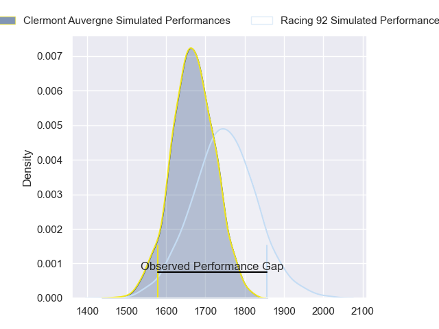
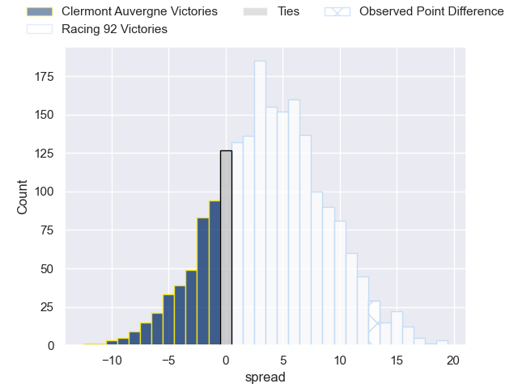
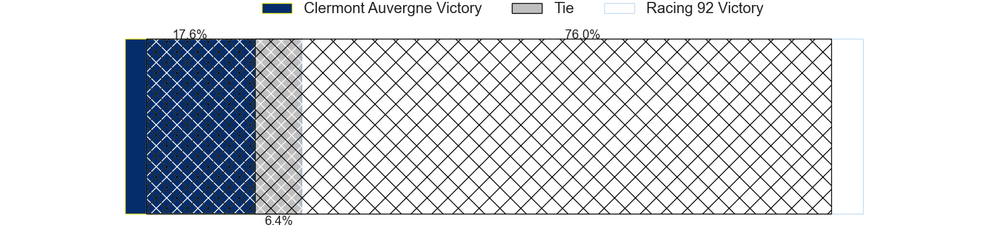
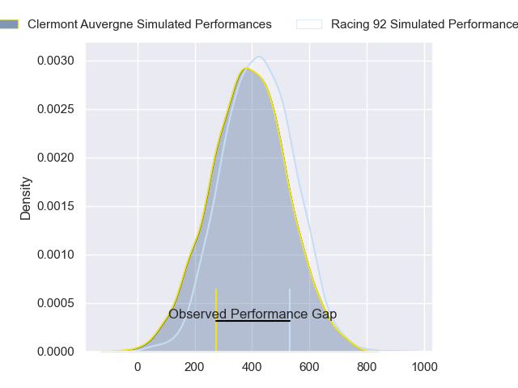
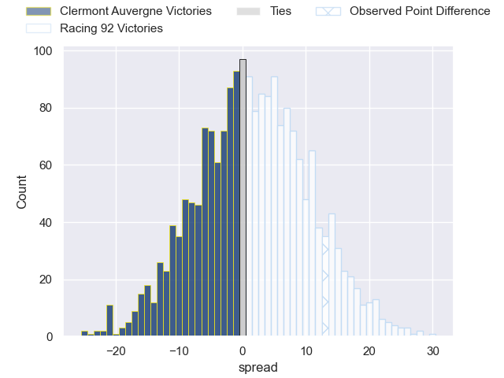

---  
layout: page  
title: Clermont Auvergne at Racing 92; 20-33  
date: 2024-09-14 18:00:00 -0500  
categories: "Top 14 Orange 2024" match review  
---
# Clermont Auvergne at Racing 92; 20-33

# Club Level Predictions

The first set of predictions treats a club as the smallest object, as the club develops its members, organizes a gameplan, and deploys its players as needed for each match. This club model has a prediction of 0.612, which translates to predicting Racing 92 to win by 4.0.

Our Over/Under is 42.5 - and combined with the spread above, we have a predicted scoreline of 19 to 23

Each club has a rating and a rating deviation (similar to a Glicko rating), and expected performances can be generated. This allows for simulated matches and spreads like the ones below.
## Projected Performances - Club Model

## Projected Spreads - Club Model

## Projected Results - Club Model

# Player Level Predictions

Treating teams instead as an entity made up of the currently active players, I have ratings for each player in an altogether different system. These can be combined to form team ratings once teamsheets are announced, weighting starters a bit higher than the reserves. After the match is played, players can be weighted by their minutes on the field, allowing for an accurate measure of the team's composition. With these compiled team ratings, we can make predictions, measure inaccuracy, and update the individual player ratings.
## Prediction without Player Minutes: Racing 92 by 6.6

Clermont Auvergne by 0.3 on a neutral pitch

## Projected Performances - Player Model

## Projected Spreads - Player Model

## Projected Results - Player Model

|   Away Minutes | Away Player          |   Away Percentile |   Number |   Home Percentile | Home Player         |   Home Minutes |
|---------------:|:---------------------|------------------:|---------:|------------------:|:--------------------|---------------:|
|             80 | Sacha Lotrian        |             30.06 |        1 |             46.07 | Guram Gogichashvili |             35 |
|             27 | Folau Fainga'a       |             90.09 |        2 |             44.04 | Robin Couly         |             36 |
|             32 | Cristian Ojovan      |             71.97 |        3 |             84.62 | Thomas Laclayat     |             80 |
|             80 | Thibaud Lanen        |             82.8  |        4 |             53.61 | Will Rowlands       |             80 |
|             32 | Thomas Ceyte         |             68.37 |        5 |             55.83 | Romain Taofifenua   |              9 |
|             58 | Killian Tixeront     |             75.53 |        6 |             90.7  | Cameron Woki        |             80 |
|             65 | Alexandre Fischer    |             75.3  |        7 |             95.35 | Hacjivah Dayimani   |             22 |
|             59 | Pita Gus Sowakula    |             85.75 |        8 |             83.64 | Jordan Joseph       |             28 |
|             58 | Baptiste Jauneau     |             72.11 |        9 |             79.51 | Nolann Le Garrec    |             50 |
|             80 | Anthony Belleau      |             94.72 |       10 |             99.04 | Owen Farrell        |             15 |
|             27 | Joris Jurand         |             89.39 |       11 |             31.33 | Henry Arundell      |             76 |
|             27 | Joris Jurand         |             89.39 |       11 |             31.33 | Henry Arundell      |             80 |
|             80 | Leon Darricarrere    |             87.41 |       12 |              2.45 | Dan Lancaster       |              8 |
|             80 | Lucas Tauzin         |             65.03 |       13 |             98.14 | Gael Fickou         |             70 |
|             80 | Yerim Fall           |             46.12 |       14 |             93.88 | Josua Tuisova       |             27 |
|             48 | Kylan Hamdaoui       |             43.93 |       15 |             91.82 | Sam James           |             46 |
|             80 | Anthime Hemery       |             72.65 |       16 |             51.61 | Ibrahim Diallo      |             34 |
|             80 | Regis Montagne       |             88.24 |       17 |             98.05 | Eddy Ben Arous      |             72 |
|             21 | Giorgi Akhaladze     |             72.59 |       18 |             95.84 | Lucio Sordoni       |             80 |
|             23 | George Moala         |             95.34 |       19 |             79.47 | Boris Palu          |             22 |
|             53 | Etienne Fourcade     |             75.96 |       20 |             99.18 | Henry Chavancy      |             80 |
|             34 | Sebastien Bezy       |             90.51 |       21 |             48.37 | Vinaya Habosi       |              4 |
|             80 | Peceli Yato Senibitu |             88.79 |       22 |             63.38 | Clovis Le bail      |             71 |
|             18 | Théo Giral           |            nan    |       23 |            nan    | nan                 |            nan |

