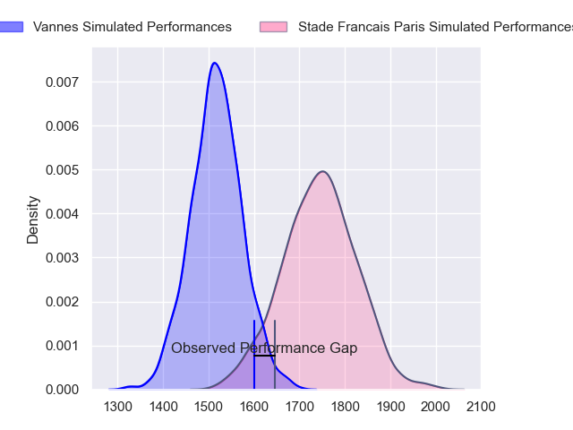
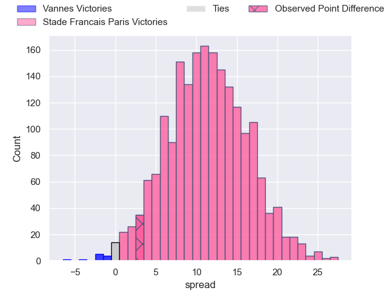
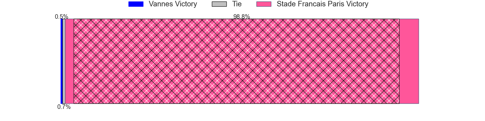
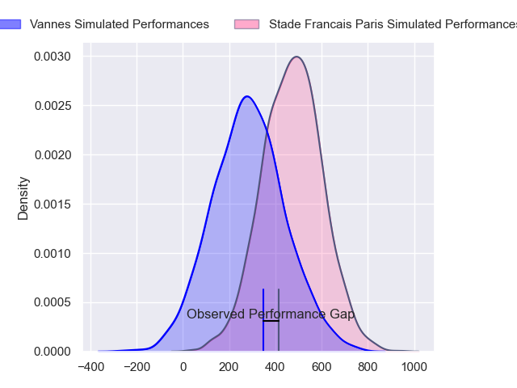
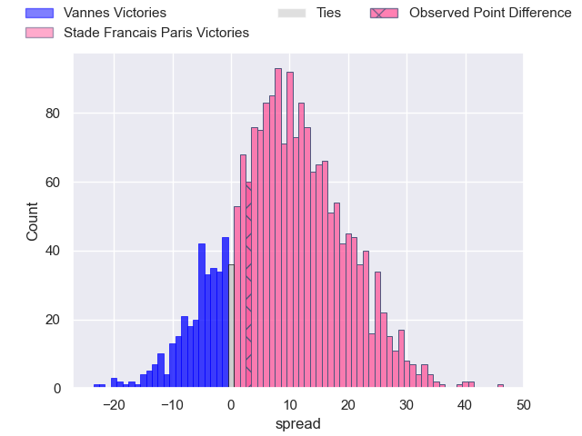
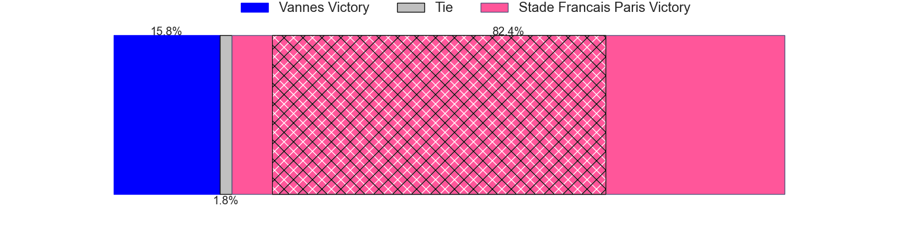

---  
layout: page  
title: Vannes at Stade Francais Paris; 31-34  
date: 2024-09-14 18:00:00 -0500  
categories: "Top 14 Orange 2024" match review  
---
# Vannes at Stade Francais Paris; 31-34

# Club Level Predictions

The first set of predictions treats a club as the smallest object, as the club develops its members, organizes a gameplan, and deploys its players as needed for each match. This club model has a prediction of 0.783, which translates to predicting Stade Francais Paris to win by 11.3.

Our Over/Under is 51.5 - and combined with the spread above, we have a predicted scoreline of 20 to 31

Each club has a rating and a rating deviation (similar to a Glicko rating), and expected performances can be generated. This allows for simulated matches and spreads like the ones below.
## Projected Performances - Club Model

## Projected Spreads - Club Model

## Projected Results - Club Model

# Player Level Predictions

Treating teams instead as an entity made up of the currently active players, I have ratings for each player in an altogether different system. These can be combined to form team ratings once teamsheets are announced, weighting starters a bit higher than the reserves. After the match is played, players can be weighted by their minutes on the field, allowing for an accurate measure of the team's composition. With these compiled team ratings, we can make predictions, measure inaccuracy, and update the individual player ratings.
## Prediction without Player Minutes: Stade Francais Paris by 1.0

Vannes by 7.3 on a neutral pitch

## Projected Performances - Player Model

## Projected Spreads - Player Model

## Projected Results - Player Model

|   Away Minutes | Away Player              |   Away Percentile |   Number |   Home Percentile | Home Player            |   Home Minutes |
|---------------:|:-------------------------|------------------:|---------:|------------------:|:-----------------------|---------------:|
|             44 | Mako Vunipola            |             99.74 |        1 |             29.19 | Clement Castets        |             80 |
|             40 | Pat Leafa                |             85.53 |        2 |            nan    | Lucas Peyresblanques   |             62 |
|             80 | Paga Tafili              |             94.97 |        3 |             41.09 | Hugo Ndiaye            |             40 |
|             80 | Anton Bresler            |             78.56 |        4 |            nan    | Paul Gabrillagues      |             80 |
|             29 | Fabrice Metz             |             85.41 |        5 |            nan    | Baptiste Pesenti       |             80 |
|              5 | Léon Boulier             |             21.68 |        6 |              5.2  | Tanginoa Halaifonua    |             26 |
|             68 | Francisco Gorrissen      |             98.45 |        7 |             56.31 | Romain Briatte         |             80 |
|             80 | Sione Kalamafoni         |             60.51 |        8 |            nan    | Sekou Macalou          |             80 |
|             22 | Michael Ruru             |             93.74 |        9 |            nan    | Brad Weber             |             80 |
|             80 | Maxime Lafage            |             94.51 |       10 |            nan    | Louis Carbonel         |             62 |
|             46 | Filipo Nakosi            |             87.89 |       11 |            nan    | Lester Etien           |             80 |
|             34 | Alex Arrate              |              6.5  |       12 |            nan    | Julien Delbouis        |             28 |
|             58 | Theo Costosseque         |             41.18 |       13 |            nan    | Joe Marchant           |             36 |
|             75 | Salesi Rayasi            |             88.81 |       14 |            nan    | Joe Jonas              |             53 |
|             30 | Gwenaël Duplenne         |             98.84 |       15 |            nan    | Leo Barre              |             27 |
|             34 | Thibault Debaes          |             60.7  |       16 |             74.34 | Moses Alo-Emile        |             12 |
|             34 | Joe Edwards              |             94.14 |       17 |            nan    | JJ van der Mescht      |             18 |
|             34 | Cyril Blanchard          |             43.77 |       18 |             99.27 | Giacomo Nicotera       |             80 |
|             34 | Christiaan van der Merwe |              5.08 |       19 |             82.87 | Pierre-Henri Azagoh    |             80 |
|             80 | Santiago Medrano         |              6.26 |       20 |            nan    | Yoan Tanga             |             46 |
|             55 | Santiago Medrano         |              6.26 |       20 |            nan    | Yoan Tanga             |             46 |
|             31 | Santiago Medrano         |              6.26 |       20 |            nan    | Yoan Tanga             |             46 |
|             34 | Santiago Medrano         |              6.26 |       20 |            nan    | Yoan Tanga             |             46 |
|             80 | Thomas Moukoro           |            nan    |       21 |            nan    | Samuel Ezeala          |             80 |
|             46 | Kitione Kamikamica       |             86.68 |       22 |             92.06 | Francisco Gomez Kodela |             80 |
|             80 | Jules Le Bail            |             47.44 |       23 |            nan    | nan                    |            nan |

