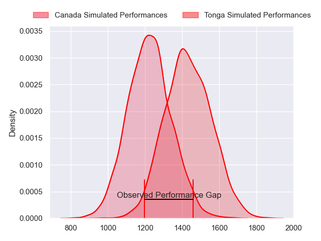
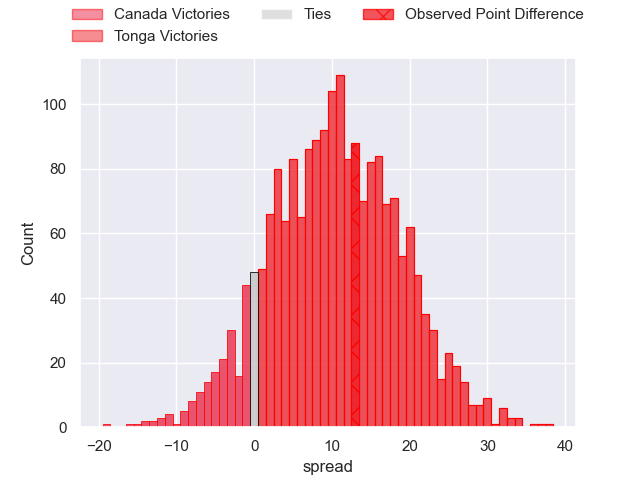
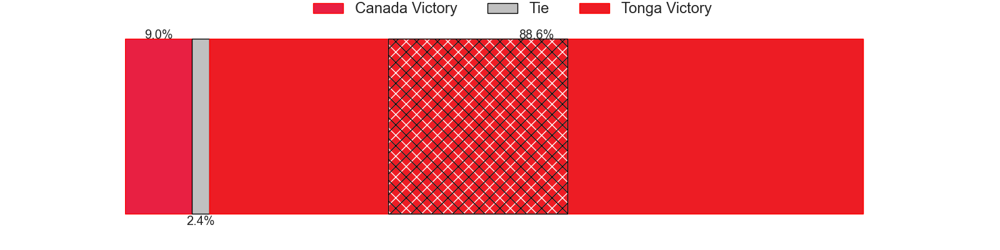
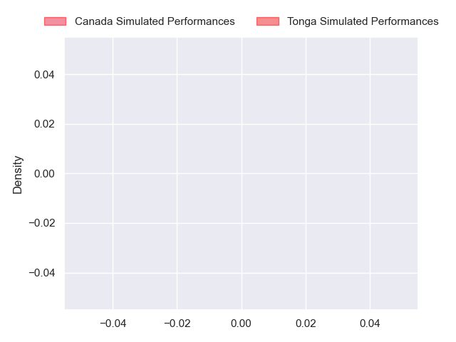
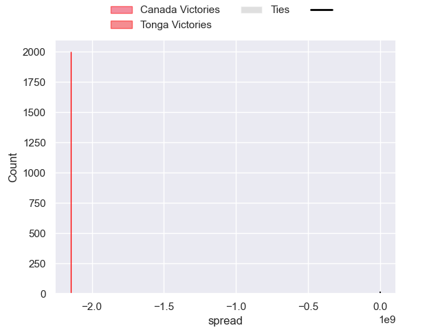

---  
layout: page  
title: Canada at Tonga; 17-30  
date: 2024-09-14 18:00:00 -0500  
categories: "Pacific Nations Cup 2024" match review  
---
# Canada at Tonga; 17-30

# Club Level Predictions

The first set of predictions treats a club as the smallest object, as the club develops its members, organizes a gameplan, and deploys its players as needed for each match. This club model has a prediction of 0.756, which translates to predicting Tonga to win by 10.5.

Our Over/Under is 50.5 - and combined with the spread above, we have a predicted scoreline of 20 to 31

Each club has a rating and a rating deviation (similar to a Glicko rating), and expected performances can be generated. This allows for simulated matches and spreads like the ones below.
## Projected Performances - Club Model

## Projected Spreads - Club Model

## Projected Results - Club Model

# Player Level Predictions

Treating teams instead as an entity made up of the currently active players, I have ratings for each player in an altogether different system. These can be combined to form team ratings once teamsheets are announced, weighting starters a bit higher than the reserves. After the match is played, players can be weighted by their minutes on the field, allowing for an accurate measure of the team's composition. With these compiled team ratings, we can make predictions, measure inaccuracy, and update the individual player ratings.
## Prediction without Player Minutes: Tonga by 4.9

Tonga by 2.5 on a neutral pitch

## Projected Performances - Player Model

## Projected Spreads - Player Model

## Projected Results - Player Model

|   Away Minutes | Away Player     |   Away Percentile |   Number |   Home Percentile | Home Player           |   Home Minutes |
|---------------:|:----------------|------------------:|---------:|------------------:|:----------------------|---------------:|
|             21 | Cali Martinez   |            nan    |        1 |            nan    | Jethro Felemi         |             80 |
|              4 | AJ Quattrin     |            nan    |        2 |            nan    | Sefo Sakalia          |             80 |
|             67 | Conor Young     |            nan    |        3 |            nan    | Ben Tameifuna         |             53 |
|             80 | Kaden Duguid    |            nan    |        4 |            nan    | Harrison Mataele      |             80 |
|             59 | Mason Flesch    |            nan    |        5 |            nan    | Tevita Ahokovi        |             74 |
|             61 | Matthew Oworu   |            nan    |        6 |            nan    | Siosiua Moala         |              7 |
|             70 | Ethan Fryer     |            nan    |        7 |            nan    | Tupou Ma'afu-Afungia  |             53 |
|             80 | Lucas Rumball   |            nan    |        8 |            nan    | Lotu Inisi            |             80 |
|             59 | Jason Higgins   |            nan    |        9 |            nan    | Aisea Halo            |             73 |
|             80 | Peter Nelson    |            nan    |       10 |            nan    | Patrick Pellegrini    |              1 |
|             80 | Josiah Morra    |            nan    |       11 |            nan    | John Tapueluelu       |             80 |
|             80 | Ben LeSage      |            nan    |       12 |            nan    | Fetuli Paea           |             72 |
|             74 | Talon McMullin  |            nan    |       13 |            nan    | Fine Inisi            |              6 |
|             19 | Andrew Coe      |            nan    |       14 |            nan    | Nikolai Foliaki       |              6 |
|             80 | Cooper Coats    |            nan    |       15 |            nan    | Josiah Unga           |             23 |
|              4 | Cole Keith      |             88.77 |       16 |            nan    | Salesi Tuifua         |              8 |
|             74 | Talon McMullin  |            nan    |       17 |            nan    | Kelemete Finau        |             64 |
|             76 | Sion Parry      |            nan    |       18 |            nan    | Tau Koloamatangi      |             76 |
|             49 | Dewald Kotze    |             69.17 |       19 |            nan    | Penisoni Fineanganofo |             27 |
|             31 | Tyler Matchem   |            nan    |       20 |            nan    | Matani Puloka         |             80 |
|             21 | Brock Gallagher |            nan    |       21 |            nan    | Latu Akauloa          |             16 |
|             13 | Callum Botchar  |             58.38 |       22 |             21.82 | Manu Paea             |             57 |
|             80 | Mark Balaski    |            nan    |       23 |            nan    | Kafa Vaea             |             27 |

