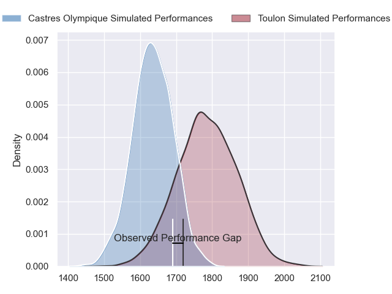
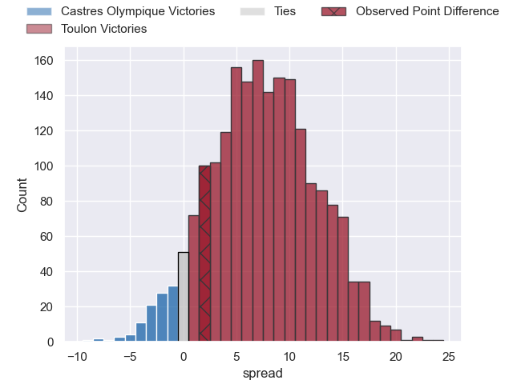
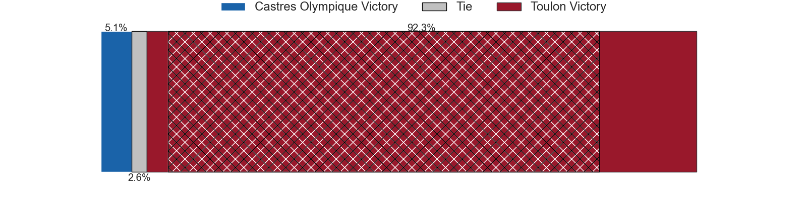
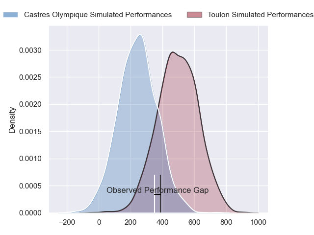
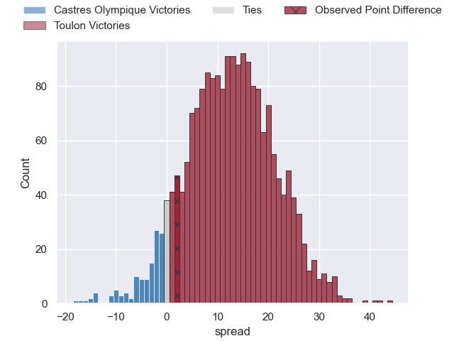
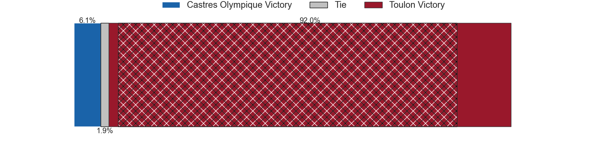

---  
layout: page  
title: Castres Olympique at Toulon; 28-30  
date: 2024-09-14 18:00:00 -0500  
categories: "Top 14 Orange 2024" match review  
---
# Castres Olympique at Toulon; 28-30

# Club Level Predictions

The first set of predictions treats a club as the smallest object, as the club develops its members, organizes a gameplan, and deploys its players as needed for each match. This club model has a prediction of 0.7, which translates to predicting Toulon to win by 7.5.

Our Over/Under is 41.5 - and combined with the spread above, we have a predicted scoreline of 17 to 25

Each club has a rating and a rating deviation (similar to a Glicko rating), and expected performances can be generated. This allows for simulated matches and spreads like the ones below.
## Projected Performances - Club Model

## Projected Spreads - Club Model

## Projected Results - Club Model

# Player Level Predictions

Treating teams instead as an entity made up of the currently active players, I have ratings for each player in an altogether different system. These can be combined to form team ratings once teamsheets are announced, weighting starters a bit higher than the reserves. After the match is played, players can be weighted by their minutes on the field, allowing for an accurate measure of the team's composition. With these compiled team ratings, we can make predictions, measure inaccuracy, and update the individual player ratings.
## Prediction without Player Minutes: Toulon by 13.2

Toulon by 6.1 on a neutral pitch

## Projected Performances - Player Model

## Projected Spreads - Player Model

## Projected Results - Player Model

|   Away Minutes | Away Player           |   Away Percentile |   Number |   Home Percentile | Home Player            |   Home Minutes |
|---------------:|:----------------------|------------------:|---------:|------------------:|:-----------------------|---------------:|
|             80 | Quentin Walcker       |             80.55 |        1 |             98.67 | Jean-Baptiste Gros     |             13 |
|             80 | Gaetan Barlot         |             92.29 |        2 |             91.74 | Mickael Ivaldi         |             59 |
|             80 | Will Collier          |             94.08 |        3 |             89.21 | Kyle Sinckler          |             64 |
|             80 | Guillaume Ducat       |             27.86 |        4 |             74.92 | David Ribbans          |             43 |
|             47 | Florent Vanverberghe  |             82.91 |        5 |             90.23 | Brian Alainu'uese      |             16 |
|             54 | Mathieu Babillot      |             17.39 |        6 |             43.19 | Jules Coulon           |             75 |
|             58 | Tyler Ardron          |             93.8  |        7 |             59.58 | Esteban Abadie         |             80 |
|             48 | Abraham Papali'i      |             51.64 |        8 |             34.81 | Lewis Ludlam           |             64 |
|             27 | Jeremy Fernandez      |             26.19 |        9 |             97.91 | Baptiste Serin         |             36 |
|             52 | Louis Le Brun         |             73.14 |       10 |             84.65 | Paolo Garbisi          |             43 |
|             34 | Remy Baget            |             85.41 |       11 |             88.57 | Gabin Villiere         |             37 |
|             30 | Jack Goodhue          |             97.79 |       12 |             12.94 | Jérémy Sinzelle        |             80 |
|             40 | Vilimoni Botitu       |             64.57 |       13 |             88    | Leicester Fainga'anuku |             70 |
|             80 | Nathanael Hulleu      |             82.14 |       14 |             13.88 | Gael Drean             |             80 |
|             62 | Théo Chabouni         |             47.9  |       15 |             38.08 | Marius Domon           |             80 |
|             22 | Yann Peysson          |             74.77 |       16 |             92.13 | Dany Priso             |             80 |
|             80 | Lois Guerois-Galisson |             47.57 |       17 |             74.86 | Teddy Baubigny         |             44 |
|             21 | Gauthier Maravat      |              1.88 |       18 |             76.73 | Seta Tuicuvu           |             37 |
|             21 | Santiago Arata        |             57.31 |       19 |             94.69 | Emerick Setiano        |             80 |
|             54 | Levan Chilachava      |             86.65 |       20 |             70.26 | Yannick Youyoutte      |             80 |
|             52 | Josaia Raisuqe        |             80.2  |       21 |             89.7  | Selevasio Tolofua      |             80 |
|             29 | Pierre Popelin        |             72.42 |       22 |             68.69 | Jules Danglot          |             33 |
|            nan | nan                   |            nan    |       23 |             81.53 | Enzo Herve             |             80 |

