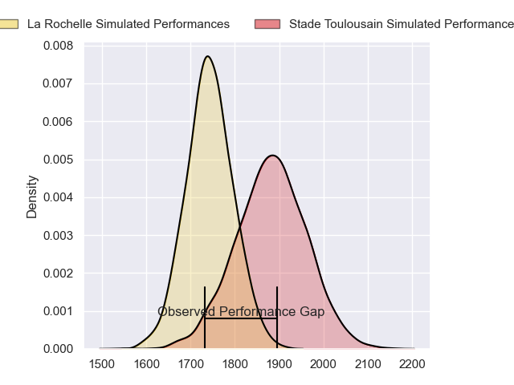
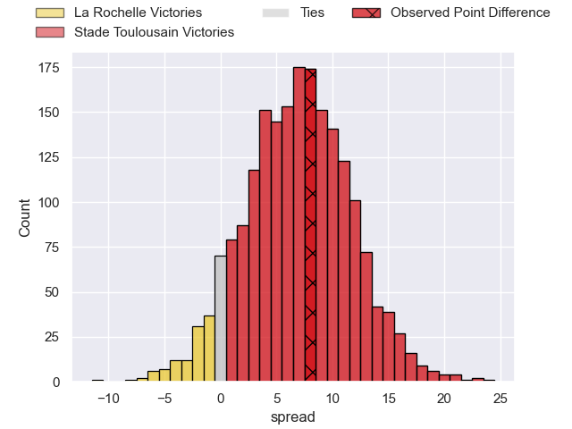
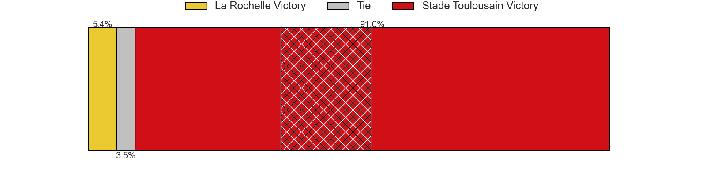
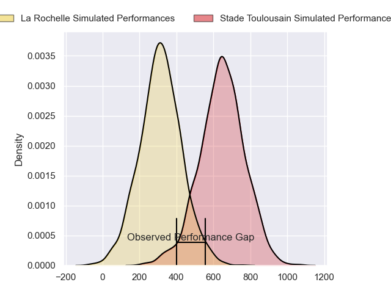
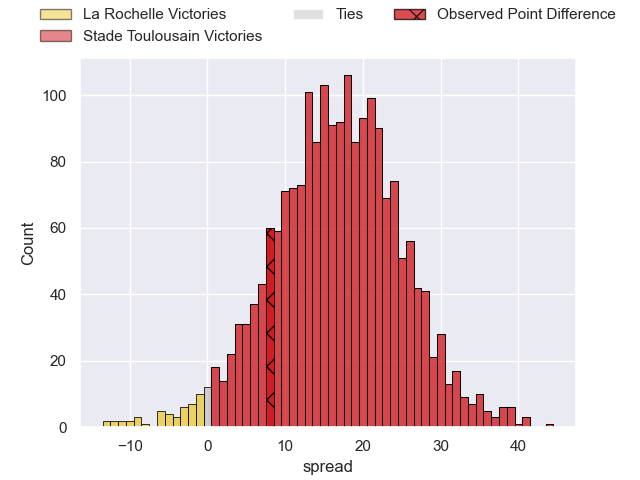
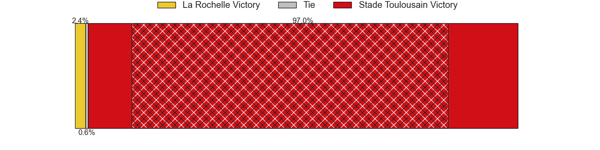

---  
layout: page  
title: La Rochelle at Stade Toulousain; 27-35  
date: 2024-09-15 18:00:00 -0500  
categories: "Top 14 Orange 2024" match review  
---
# La Rochelle at Stade Toulousain; 27-35

# Club Level Predictions

The first set of predictions treats a club as the smallest object, as the club develops its members, organizes a gameplan, and deploys its players as needed for each match. This club model has a prediction of 0.688, which translates to predicting Stade Toulousain to win by 7.0.

Our Over/Under is 40.5 - and combined with the spread above, we have a predicted scoreline of 17 to 24

Each club has a rating and a rating deviation (similar to a Glicko rating), and expected performances can be generated. This allows for simulated matches and spreads like the ones below.
## Projected Performances - Club Model

## Projected Spreads - Club Model

## Projected Results - Club Model

# Player Level Predictions

Treating teams instead as an entity made up of the currently active players, I have ratings for each player in an altogether different system. These can be combined to form team ratings once teamsheets are announced, weighting starters a bit higher than the reserves. After the match is played, players can be weighted by their minutes on the field, allowing for an accurate measure of the team's composition. With these compiled team ratings, we can make predictions, measure inaccuracy, and update the individual player ratings.
## Prediction without Player Minutes: Stade Toulousain by 21.1

Stade Toulousain by 13.5 on a neutral pitch

## Projected Performances - Player Model

## Projected Spreads - Player Model

## Projected Results - Player Model

|   Away Minutes | Away Player           |   Away Percentile |   Number |   Home Percentile | Home Player          |   Home Minutes |
|---------------:|:----------------------|------------------:|---------:|------------------:|:---------------------|---------------:|
|             17 | Reda Wardi            |            nan    |        1 |             59.52 | Rodrigue Neti        |             68 |
|             68 | Quentin Lespiaucq     |             73.44 |        2 |             98.9  | Julien Marchand      |             80 |
|              0 | Georges-Henri Colombe |            nan    |        3 |             96.83 | Dorian Aldegheri     |             12 |
|             80 | Thomas Lavault        |            nan    |        4 |             84.2  | Joshua Brennan       |             80 |
|             80 | Kane Douglas          |            nan    |        5 |             95.03 | Thibaud Flament      |             80 |
|             68 | Judicael Cancoriet    |            nan    |        6 |             98.23 | Francois Cros        |             80 |
|             80 | Matthias Haddad       |            nan    |        7 |             94.69 | Jack Willis          |             45 |
|             40 | Gregory Alldritt      |            nan    |        8 |             95.56 | Alexandre Roumat     |             66 |
|             80 | Thomas Berjon         |            nan    |        9 |             32.07 | Paul Graou           |             80 |
|             80 | Ihaia West            |            nan    |       10 |             96.18 | Romain Ntamack       |             58 |
|             80 | Dillyn Leyds          |            nan    |       11 |             98.46 | Matthis Lebel        |             56 |
|             40 | Ulupano Seuteni       |            nan    |       12 |             64.15 | Pita Ahki            |             80 |
|             40 | Teddy Thomas          |            nan    |       13 |             90.02 | Pierre-Louis Barassi |             35 |
|             40 | Jack Nowell           |            nan    |       14 |             99.9  | Blair Kinghorn       |             24 |
|             40 | Antoine Hastoy        |            nan    |       15 |             96.98 | Thomas Ramos         |             24 |
|             40 | Pierre Bourgarit      |            nan    |       16 |             90.72 | Emmanuel Meafou      |             22 |
|             40 | Louis Penverne        |             30.86 |       17 |             98.36 | Ange Capuozzo        |             14 |
|             12 | Alexandre Kuntelia    |            nan    |       18 |             10.06 | Naoto Saito          |             12 |
|             40 | Will Skelton          |            nan    |       19 |             93.03 | David Ainu'u         |             80 |
|             12 | Ultan Dillane         |             80.33 |       20 |             89.28 | Richie Arnold        |             40 |
|             12 | Teddy Iribaren        |             86.15 |       21 |             51.87 | Theo Ntamack         |             40 |
|             13 | Jules Favre           |            nan    |       22 |             80.4  | Guillaume Cramont    |             68 |
|            nan | nan                   |            nan    |       23 |             73.46 | Hugo Reilhes         |             80 |

