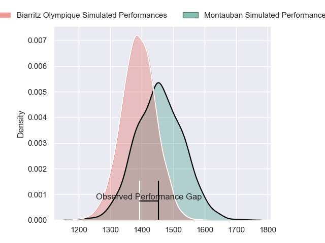
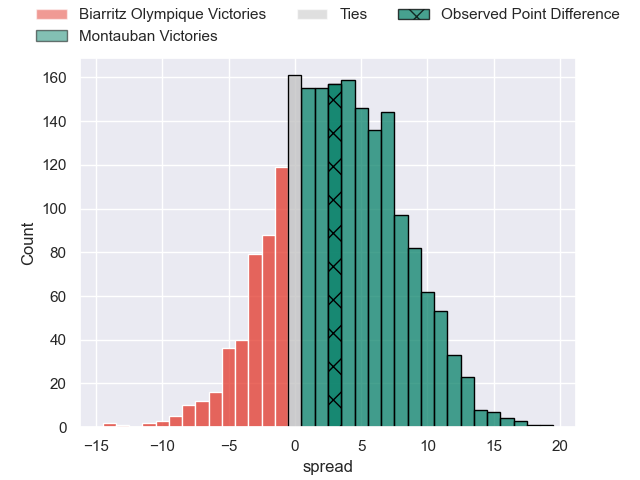
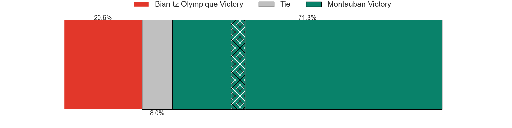
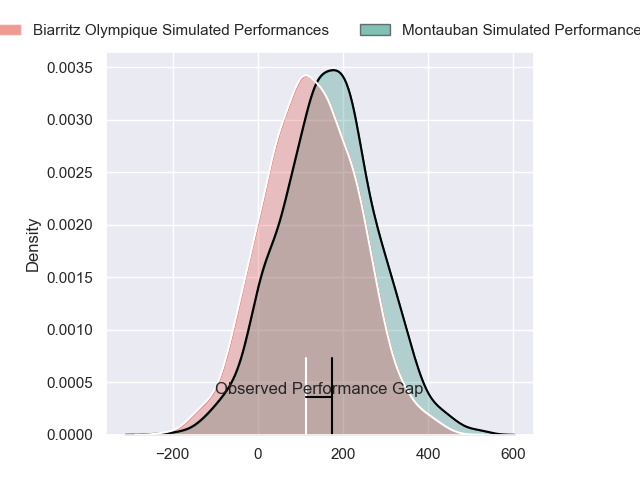
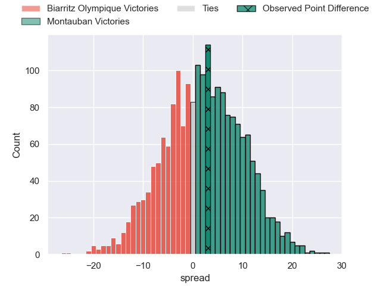
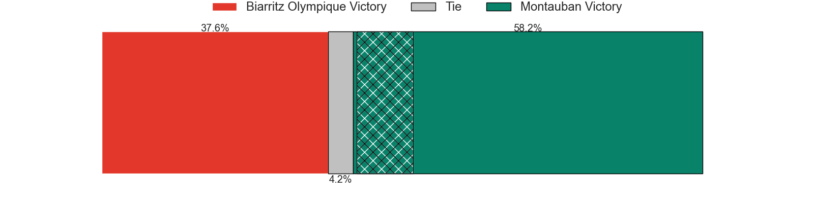

---  
layout: page  
title: Biarritz Olympique at Montauban; 26-29  
date: 2024-09-20 18:00:00 -0500  
categories: "Pro D2 2024" match review  
---
# Biarritz Olympique at Montauban; 26-29

# Club Level Predictions

The first set of predictions treats a club as the smallest object, as the club develops its members, organizes a gameplan, and deploys its players as needed for each match. This club model has a prediction of 0.591, which translates to predicting Montauban to win by 3.2.

Our Over/Under is 36.5 - and combined with the spread above, we have a predicted scoreline of 16 to 20

Each club has a rating and a rating deviation (similar to a Glicko rating), and expected performances can be generated. This allows for simulated matches and spreads like the ones below.
## Projected Performances - Club Model

## Projected Spreads - Club Model

## Projected Results - Club Model

# Player Level Predictions

Treating teams instead as an entity made up of the currently active players, I have ratings for each player in an altogether different system. These can be combined to form team ratings once teamsheets are announced, weighting starters a bit higher than the reserves. After the match is played, players can be weighted by their minutes on the field, allowing for an accurate measure of the team's composition. With these compiled team ratings, we can make predictions, measure inaccuracy, and update the individual player ratings.
## Prediction without Player Minutes: Montauban by 6.2

Biarritz Olympique by 0.5 on a neutral pitch

## Projected Performances - Player Model

## Projected Spreads - Player Model

## Projected Results - Player Model

|   Away Minutes | Away Player         |   Away Percentile |   Number |   Home Percentile | Home Player         |   Home Minutes |
|---------------:|:--------------------|------------------:|---------:|------------------:|:--------------------|---------------:|
|             56 | Giorgi Nutsubidze   |            nan    |        1 |             21.81 | Leo Aouf            |             80 |
|             52 | Clement Martinez    |            nan    |        2 |            nan    | Kevin Firmin        |             59 |
|             45 | Giorgi Dzmanashvili |            nan    |        3 |            nan    | Facundo Pomponio    |             80 |
|             21 | Charlie Matthews    |            nan    |        4 |              6.29 | Tjuee Uanivi        |             56 |
|             32 | Adrian Motoc        |            nan    |        5 |            nan    | Lewis Bean          |             80 |
|             28 | Filimo Taofifenua   |            nan    |        6 |            nan    | Frédéric Quercy     |             80 |
|             32 | Ekain Imaz Agirre   |            nan    |        7 |             60.08 | Kyllian Ringuet     |             45 |
|             48 | Masivesi Dakuwaqa   |            nan    |        8 |             85.71 | Sikhumbuzo Notshe   |             48 |
|             48 | Pierre Pages        |             11.8  |        9 |            nan    | Hugo Zabalza        |             80 |
|             45 | Edgar Retiere       |            nan    |       10 |            nan    | Jérôme Bosviel      |             32 |
|             25 | Arthur Bonneval     |             85.87 |       11 |             46.79 | Yvan Reilhac        |             56 |
|             25 | Yann David          |            nan    |       12 |            nan    | JT Jackson          |             80 |
|             80 | Mathieu Acebes      |            nan    |       13 |            nan    | Maxime Espeut       |             80 |
|             21 | Zach Kibirige       |            nan    |       14 |            nan    | Stephane Ahmed      |             24 |
|             80 | Gervais Cordin      |             14.8  |       15 |            nan    | Baptiste Mouchous   |             48 |
|             11 | Zakaria El Fakir    |             10.45 |       16 |             58.4  | Noa Kanika          |             24 |
|             53 | Piula Faasalele     |            nan    |       17 |             18.33 | Tyrone Viiga        |             24 |
|             80 | Nikoloz Narmania    |            nan    |       18 |             72.1  | Yoan Cottin         |             80 |
|             80 | Kerman Aurrekoetxea |            nan    |       19 |             27.09 | Thomas Fortunel     |             35 |
|             21 | Jessy Jegerlehner   |            nan    |       20 |            nan    | Thomas Bue          |             35 |
|             59 | Brendan Lebrun      |             66.67 |       21 |             10.27 | Badri Alkhazashvili |             35 |
|             80 | Enzo Selponi        |             93.3  |       22 |            nan    | Simon Renda         |             24 |
|             56 | Yohan Tapie         |            nan    |       23 |              1.72 | Luka Azariashvili   |             35 |

